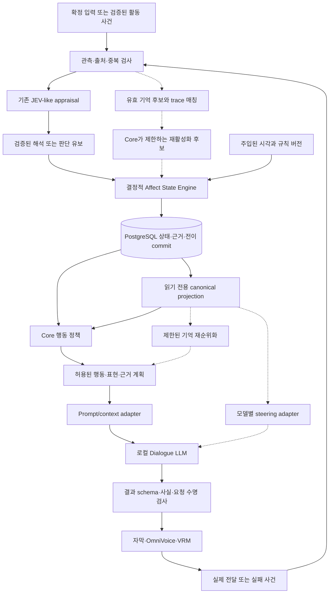

# 지속 감정 캐릭터 아키텍처 v2 — 연구 제안

작성일: 2026-10-02  
상태: `PROPOSED`, 구현·제품 채택 전  
기준: [현재 상태 감사](./CURRENT_STATE_AUDIT.md), 기존 `core-rules-v1`과 F01–F25

## 1. 목표와 권고

**모델이 바뀌거나 대화가 끊겨도, 유효한 경험이 이후 기억 선택·판단·행동에 추적 가능한 영향을 주는 캐릭터**를 목표로 한다. “진짜 감정을 느낀다”는 주장은 목표도 판정 기준도 아니다.

기본안은 기존의 **로컬 appraisal → 결정적 Core → 영구 저장 → 행동·표현 계획**을 유지한다. 상태를 모델 입력으로 전달하는 작은 읽기 계약을 정의하고, 상처 기억과 감정 기반 검색은 비교 실험으로 검증한다. Activation steering은 추가 효과가 입증됐을 때만 provider 내부의 선택 기능으로 둔다.

LLM에 상태 쓰기 권한이 없다는 것과 LLM 출력이 상태에 전혀 영향을 주지 않는다는 것은 다르다. Appraisal 오분류는 검증을 통과하면 잘못된 자극으로 이어질 수 있다. 구조적 쓰기 제한과 한국어 해석 품질을 별도로 검증해야 한다.

## 2. 세 수준을 섞지 않는다

| 수준 | 내용 | 현재 결정 |
|---|---|---|
| 기존 MVP | 네 감정, pleasantness, 반복 적응, 관계 근거, 사실 기억, Agenda | 승인된 명세 유지. 아직 미구현 |
| 연구 기준선 | canonical projection, 상태 조건별 prompt/context 비교, 오프라인 장기 시뮬레이션 | 이번 문서가 제안하는 첫 비교 |
| 연구 확장 | trace/scar 재활성화, 제한된 검색 재순위화, latent steering, trust/attachment 세분화 | 개별 gate 필요. 한 번에 채택하지 않음 |

VAD 전체, 열 개 이상의 정서 축, 범용 플러그인 플랫폼, 별도 벡터 DB, 자율적 부정 회상은 첫 연구에 필요하지 않다. 관계 단절·파일 조작 같은 외부 권한도 추가하지 않는다.

## 3. 핵심 용어

| 개념 | 이 프로젝트에서의 의미 |
|---|---|
| Event | 출처·revision·관측 여부가 있는 사건. 모델의 서술만으로 사실이 되지 않음 |
| Appraisal | 사건의 대상·행위·강도·목표 관련성을 제한된 schema로 해석한 후보 |
| Inner state | Core가 관리하는 지속 수치, 시각, 대상, 원인 참조 |
| Canonical affect | 모델 독립적인 읽기 계약. 내부 상태의 버전 있는 projection |
| Display state | 상황·발화 의도·preset에 맞춰 도출한 표정과 전달 방식 |
| Emotional trace | 유효 사건 기억에 붙는 제한된 정서적 영향. 부정적 trace를 scar라 부름 |
| Habituation | 같은 자극의 반복에 따른 반응 감소 |
| Sensitization | 특정 검증된 맥락에서 반응성이 일시적으로 커지는 확장 가설 |
| Recovery | 단기 상태의 감쇠, trace 영향 감소, 관계 증거 갱신을 구분한 회복 |
| Model representation | 추론 중 hidden activation. 영구 캐릭터 상태와 별개 |
| Behavioral effect | 허용된 선택·판단의 변화. 정서 단어 빈도와 구분 |

## 4. 데이터 흐름과 책임

아래는 제안 흐름이다. 점선은 연구 확장, 실선도 아직 제품 코드가 아니다.



| 구성 | 책임과 쓰기 경계 | 실패 시 |
|---|---|---|
| Runtime coordinator | 단일 캐릭터 commit 순서, source revision·epoch 검사, DB transaction | commit 실패 시 상태·출력 둘 다 확정하지 않음 |
| Appraisal provider | 근거 있는 제한적 의미 분류 | unknown/uncertain, 의미 자극 0, 필요한 경우 확인 |
| State Engine/Core | 시간 변화, 자극 상한, 반복·trace 규칙, 관계 근거 검증 | 유효하지 않은 후보 거절, 이전 commit 유지 |
| Memory query | 유효한 기억 조회, 참여자·공개 범위·정정 상태 검사 | 빈 결과. 기억을 창작하지 않음 |
| Canonical projection | 같은 snapshot과 평가 시각에서 같은 읽기 객체 생성 | 지원하지 않는 축은 없음으로 표현 |
| Affect output adapter | 상태를 문맥·검색 정책·모델 개입으로 변환 | 상태를 바꾸지 않고 지원되는 context 방식으로 전환 |
| Dialogue LLM | 선택 의도의 표현, 연구에서만 shadow 판단 후보 | 대사 오류를 새 사실·새 감정으로 저장하지 않음 |
| Stage/TTS | 정해진 표현 실행과 실제 전달 보고 | 전달되지 않은 문장을 말한 기억으로 만들지 않음 |

유일한 writer는 Runtime이 commit하는 Core 전이다. Appraiser·대사 모델·Python worker에는 DB 자격증명이나 `set_affect`, `set_trust`, `delete_scar` 도구를 주지 않는다. 운영자의 정정 명령은 별도 인증된 입력 경로이며 대화 속 “다 잊어”와 동일하지 않다.

## 5. Canonical affect: 저장 상태를 복제하지 않는 계약

처음에는 기존 필드를 보존한 `affect-context-v1`로 충분하다. JSON wire의 카운터는 기존 방식처럼 십진 문자열을 사용한다. 아래는 **연구용 예시**이며 구현된 DTO가 아니다.

```json
{
  "contractVersion": "affect-context-v1",
  "characterId": "fixture-character",
  "stateVersion": "17",
  "configVersion": "1",
  "evaluatedAt": "2026-10-02T00:00:00Z",
  "inner": {
    "joy": 0.0,
    "frustration": 0.3,
    "surprise": 0.0,
    "embarrassment": 0.1,
    "pleasantness": 0.55
  },
  "target": {"kind": "activity", "id": "fixture-puzzle-2"},
  "relationship": {
    "identityId": "fixture-A",
    "familiarity": 0.04,
    "affinity": 0.515,
    "validHelpEvidenceIds": ["fixture-help-1"]
  },
  "causeRefs": [{"eventId": "fixture-event-9", "revision": "1"}]
}
```

Projection은 저장된 감정을 현재 시각으로 감쇠해서 읽지만 그 자체로 DB UPDATE를 발생시키지 않는다. `stateVersion`은 원본 commit 버전이고 `evaluatedAt`은 읽기 시각이다. 모델 digest나 steering vector는 이 객체에 들어가지 않는다. 시각·원인·관계 대상이 없는 float 배열만으로 감정을 전송하지 않는다.

| 후보 축 | 범위와 위치 | 채택 조건 |
|---|---|---|
| 네 기존 감정·pleasantness | 각 0–1, Core 상태에서 직접 읽기 | 기본 계약 |
| valence | 필요하면 `2 × pleasantness - 1`, -1–1의 파생 보기 | 기존 baseline 0.60은 +0.20이 됨. 중립 0으로 몰래 재정의하지 않음 |
| arousal/dominance | 미정, 기본 객체에 없음 | 각각 다른 행동을 설명한다는 실험 후 별도 규칙 버전 |
| trust | 현재는 상대·활동별 검증 근거 목록 | 단일 전역 수치 금지. 집계 추가 시 도메인·DB 명세 변경 |
| attachment | 현재 없음 | affinity/familiarity보다 설명력이 있는지 연구. 부재를 감점하지 않음 |
| hurt/vigilance/fear/shame/irritation | 후보일 뿐 저장하지 않음 | 기존 frustration/embarrassment/trace로 구별 불가능한 사례가 반복될 때 |

지원하지 않는 축의 누락은 0이라는 뜻이 아니다. Adapter는 자신의 capability 목록으로 지원 필드를 선언하고, 미지원 축을 임의 추정하지 않는다. 기존 state를 VAD에 손실 압축해 원본 네 감정을 없애는 방식은 보류한다.

## 6. JEV-like appraisal와 상태 갱신

### 6.1 관측 해석과 주관적 반응을 나눈다

기존 `AppraisalResult` 필드와 `uncertain` 규칙을 그대로 기준선으로 삼는다. 첨부 예시의 `trust impact:-2` 같은 값은 곧바로 상태 delta가 되면 안 된다. 신뢰는 현재 검증된 힌트 사용+정답 결과로만 근거를 만든다.

연구 확장에서 “의도를 더 조심스럽게 해석한다”는 결과를 보고 싶다면 두 결과를 구별한다.

1. **Observed appraisal**: 인용 여부, 발언 대상, 활동 사실. 감정 상태를 주입하지 않은 같은 평가기로 생성한다.
2. **Subjective judgment candidate**: 애매한 제안에 바로 동의할지 확인할지 같은 판단. 연구용 상태 조건을 적용하되 사실이나 영구 신뢰 근거를 쓰지 못한다.

첫 실험에서는 장기 기억을 appraisal에 넣지 않는다. 기존 DB §5.2와 충돌하기 때문이다. 기억이 만든 modifier는 Core가 별도로 제한해 반영한다. 이후 memory-conditioned appraisal이 더 낫다는 증거가 생기면 입력 schema·context refs·정정 전파까지 함께 개정한다.

### 6.2 기본 전이

```text
관측/중복/출처/epoch 검사
→ 현재 시각까지 기존 감정·기분 decay
→ 유효 appraisal와 검증된 활동 결과 채택
→ 기존 반복 이력과 상한 계산
→ 기본 자극 적용
→ [연구 옵션] 외부 사건에 연결된 trace 재활성화 1회
→ 상태·근거·전이·행동 계획 atomic commit
```

기본 식은 [도메인 §6–7](./CHARACTER_DOMAIN_SPEC.md)을 바꾸지 않는다. 하나의 event 재시도는 새 자극이 아니다. late event는 원래 발생 시각을 기록하되 상태 시간을 되돌리지 않는다. 같은 입력·기존 상태·채택 appraisal·설정·시각이면 결과가 같아야 한다. 모델 자체의 비결정성과 reducer의 결정성은 다른 검사항목이다.

## 7. Emotional trace와 scar

### 7.1 기존 memory의 주석으로 시작한다

연구 fixture에서 `memoryId + contentVersion`에 대응하는 정서적 주석 하나를 둔다. 사실 본문·참여자·원본 출처를 복사하지 않는다. 제품에 채택할 경우 기존 `memories`에 버전 있는 nullable `affect_trace` 구조를 추가하는 안을 우선 비교한다. **현재 schema에는 없는 변경**이며 `facts`에 몰래 넣지 않는다. 복수 trace의 독립 수명·검색 인덱스가 실제 필요해질 때만 자식 테이블을 검토한다.

| 제안 필드 | 의미 |
|---|---|
| traceVersion / ruleVersion | 데이터 해석과 계산식 버전 |
| memoryId / sourceMemoryVersion | 원본 기억 식별 및 stale 판정 |
| targetKind / targetId / contextKey | 사람과 활동을 구분하는 적용 범위 |
| polarity / strength / asOf | positive 또는 negative, 0–1 영향 강도와 기준 시각 |
| triggerTags | 초기에는 activity/error category 등 명시적 맥락 |
| triggerEmbeddingRef? | 후속 옵션. embedding 모델·revision·정규화도 고정해야 함 |
| triggerThreshold / cooldownUntil / expiresAt | 재활성화 조건과 수명 |
| effectProfile | 허용된 기존 감정에 대한 작은 자극, 행동 후보의 제한된 편향 |
| recoveryHalfLife / habituationResistance | 연구에서 고정할 계수. 인간 심리 측정치가 아님 |
| lastActivationEventId | 중복 재활성화 방지. 완전한 이력은 events/transitions에 둠 |

처음 비교할 scar는 **검증된 퍼즐 실패 기억에서 같은 활동 맥락을 만날 때 잠시 확인을 더 하는 것**이다. 자유 채팅 “배신”을 기억으로 추가하려면 현재 네 가지 memory kind와 관측 근거 규칙부터 확장해야 하므로 별도 연구로 둔다. 오답이 A의 도움 때문이었다는 인과 근거가 없으면 A에 대한 상처로 저장하지 않는다.

긍정적 공동 성공 trace를 같은 형식으로 비교한다. 부정 상태만 오래 남기면 지속성보다 만성적인 부정 편향을 만들 가능성이 있다.

### 7.2 재활성화의 피드백 고리 제한

외부 사건 한 건에서 유효 trace 후보를 최대 한 개 선택하는 것부터 시작한다. 선택 키는 관련성, 강도, memoryId 순으로 결정하고 선택 과정을 로그에 남긴다.

```text
G = 유효 출처 AND 대상/맥락 일치 AND 확정 외부 사건
    AND threshold 충족 AND cooldown 종료 AND 미만료
h = 1 / (1 + n)
h_trace = resistance + (1 - resistance) × h
delta_trace = G × min(남은 trace 예산, k × strength × match × h_trace)
```

`n`은 동일 대상·trigger의 최근 재활성화 수, `resistance`는 0–1 후보 계수다. 0이면 반복 감소를 그대로 받고 1이면 감소를 받지 않지만 cooldown·총량 상한은 유지된다. `k`, threshold, window, cap은 Agent B가 파일럿에서 고정할 실험 파라미터이며 지금 제품 기본값을 정하지 않는다.

재활성화는 해당 source event의 **동일 전이 effects**에 기록한다. 기억을 읽는 행위만으로 새 외부 사건이나 trust evidence를 만들지 않는다. 응답 생성·UI 조회·타이머·자기 대사·종료 정리는 scar 재활성화 원인이 아니다. 상한을 기본 자극과 trace에 각각 적용한 뒤 전체 자극 상한도 둬서 같은 사건을 두 번 증폭하지 않는다.

### 7.3 Habituation, sensitization, recovery

| 과정 | 제안 | 막아야 할 결과 |
|---|---|---|
| habituation | MVP 반복 규칙을 기준선으로 유지 | 미선택 스팸으로 캐릭터가 적응했다고 기록 |
| sensitization | 새롭고 검증된 강한 사건이 있을 때 trace 강도만 제한적으로 증가하는 별도 조건 비교 | 기억을 자주 검색했다는 이유로 강도가 스스로 증가 |
| 단기 recovery | 기존 시간 감쇠와 pleasantness baseline 복귀 | “괜찮아”라는 대사 한 줄로 초기화 |
| trace recovery | `strength(t)=strength(s)×2^(-dt/H)`와 유효한 반대 경험의 제한된 감산 후보 | 자동 영구 상처, 무한 재활성화, 모든 칭찬이 배신 기억을 즉시 지움 |
| 관계 recovery | 새 검증 근거를 추가하고 기존 근거 유효성을 재평가 | 시간 경과만으로 과거 사실이 거짓이 되거나 trust가 최대치가 됨 |

Sensitization과 habituation resistance는 중복 설명일 수 있다. 처음에는 sensitization을 끈 채 trace와 cooldown의 효과를 본다. 하나를 제거해도 목표 사례가 동일하게 설명되면 더 단순한 안을 채택한다. Trace strength 증가·감소에도 동일 사건 멱등성과 출처 정정 규칙이 필요하다.

### 7.4 Trust와 attachment의 확장 후보

현재는 검증 도움 근거만 유지한다. 연구에서 신뢰 수치가 필요하다면 사람 전체에 대한 trust 하나 대신 `(identity, activity domain)`의 **검증된 도움 신뢰도**를 후보로 둔다. 예를 들어 고정 prior와 독립된 성공/실패 근거에서 `p=(a0+success)/(a0+b0+success+failure)`를 도출하고 근거 수·불확실성을 함께 표시할 수 있다. 이는 제안된 통계 요약이며 인간의 신뢰 측정값이 아니다.

현재 MVP에는 성공에 연결된 도움 근거만 있고 “그 힌트 때문에 실패했다”는 검증 계약이 없다. 그러므로 기존 오답을 failure로 채우면 안 된다. 실패 귀속·문제별 독립 키·근거 취소·도메인 범위를 먼저 정의하지 못하면 이 수치도 도입하지 않는다. 사건 삭제 시 유효 근거로 다시 계산하고, 칭찬·사과·시간 경과로 성공 횟수를 만들어 신뢰를 회복시키지 않는다.

Attachment는 “익숙한 상대와 공동 활동을 이어가려는 선호”라는 좁은 기능 후보로만 정의한다. 검증된 서로 다른 공동 활동이 미래의 재개 대상 선택을 설명하는지, 기존 familiarity/affinity/Agenda로 이미 같은 결과가 나오는지 비교한다. 부재에 대한 고통·관계 벌점·독점적 요구를 새 규칙으로 넣지 않는다. 별도 attachment 변수를 제거해도 선택과 연속성이 같으면 해당 변수는 채택하지 않는다. 두 후보 모두 기존 관계 schema와 행동 규칙의 변경이므로 baseline 밖에서 시험한다.

## 8. 기억 검색과 판단의 연결

검색은 항상 `character → visibility → active/source revision → 현재 맥락` 필터가 먼저다. 그 뒤 기존 상위 우선순위(미완료 활동 등)는 고정하고, 같은 우선순위 후보 안에서만 제한된 affect 점수로 재정렬한다.

`score = base_relevance + clamp(beta × affect_match, -b, +b)`를 후보로 비교한다. `beta=0`이 기준선이고, 최대 5개/600 tokens는 유지한다. 감정 유사성이 주제 무관한 기억을 끌어오거나, 이미 삭제한 기억을 선택하는 경우 실패다. Embedding 없이 사람·활동·trigger tags로 먼저 반증한다.

같은 사건에서 “감정으로 검색 → 그 기억으로 감정 강화 → 다시 검색”을 반복하지 않는다. 전이 전 상태로 trace 후보를 한 번 선택하고, commit 후 상태로 대사에 넣을 기억을 한 번 고른다. 후자의 검색은 상태 변경이 없다.

연구의 판단 결과는 `ask_clarification`, `seek_hint`, `continue`, `pause` 같은 닫힌 선택 집합으로 채점한다. 이는 연구용 레이블이며 기존 최상위 action enum을 대체하지 않는다. 제품 채택 시 기존 `ask`, `continue_activity`, `pause`의 하위 의도로 매핑한다.

**Core가 행동을 정했기 때문에 생긴 차이를 LLM steering의 인과 효과로 세면 안 된다.** Core 행동 비교와 모델의 shadow 판단 비교를 별도 지표로 둔다. 목표는 객관적 정답률을 떨어뜨리는 것이 아니라 근거가 불충분한 상황에서 질문 방식·도움 요청·확인 정도에 차이를 만드는 것이다.

## 9. Inner, display, self-model

Inner는 사건과 시각으로 계산한다. Display는 기존 표정 hysteresis, listening 우선, 문장 길이 제한을 유지한다. 내부 frustration이 높아도 질문에 차분하게 답할 수 있고, listening 표정으로 전환해도 감정 수치는 남는다.

모델에 자기 상태 요약을 줄지는 독립된 실험 조건이다. 요약이 없는 steering 조건에서도 행동 효과가 있는지, 상태 요약만으로 충분한지 비교한다. 자기 설명은 승인된 원인 참조를 바탕으로 한 서술이며 “내 내부 activation을 읽었다”는 측정값이 아니다. 모델의 감정 자기 보고를 다시 canonical state에 덮어쓰지 않는다.

## 10. Model adapter 계약

공통 명칭은 `AffectAdapterInput-v1`로 두며 두 연구자가 같은 fixture를 사용한다.

```text
AffectAdapterInput-v1
  requestId, sessionId, generationEpoch, deadlineAt
  canonical: affect-context-v1
  sourceVersions: 유효 사건/기억 ID와 revision
  permittedMemoryIds, actionConstraints, displayConstraints
  mode: context | context_retrieval | activation | context_activation

Adapter 결과
  generatedText 또는 shadowDecisionCandidate
  appliedMode, adapterVersion, modelDigest, calibrationId?
  usedSourceIds, timings, status
  statePatch / trustPatch / memoryWrite: 제공하지 않음
```

직접 쓰기 경계와 요청 수명은 [로컬 AI §4](./LOCAL_AI_INTEGRATION.md)를 재사용한다. 부수적인 decay로 stateVersion이 바뀐 것만으로 모든 출력을 취소하지 않는다. source 삭제·활동 변경·명시적 취소·session/epoch 변경처럼 전제를 무효화하는 사건에 반응한다.

Prompt/context는 baseline이며 retrieval bias는 기존 기억 query에 적용하는 정책 옵션이다. 별도 마이크로서비스나 클래스 계층을 미리 만들 필요는 없다. API-only 모델도 이 계약의 context 방식으로 표현 가능하지만 **현재 제품에는 로컬 실행만 허용**한다. API 호환 설계가 유료 외부 호출 허용을 의미하지 않는다.

Activation adapter의 calibration manifest에는 다음을 기록한다.

- 모델 ID·가중치 revision/hash, tokenizer/chat template hash, backend·quantization·dtype.
- layer 번호 기준(0-based decoder block), block output 등 정확한 injection 위치, token mask, prefill/decode 적용 여부.
- vector 후보 ID/hash, 추출 dataset/split hash, 정규화 방법, alpha와 residual 대비 norm 비율.
- context length, prompt version, 언어, 유효 범위, 검증 run ID, 만료 조건.

첫 안은 하나의 후보 벡터에 제한된 세기만 매핑한다. 학습된 다축 latent mapper는 단순 매핑이 실패하고 필요성이 확인된 뒤 검토한다. 모델·tokenizer·양자화·hook 위치가 바뀌면 해당 calibration을 재검증한다. canonical state와 기억은 그대로이며 기존 벡터만 재사용을 거절한다.

개입은 dialogue/shadow 판단 요청에 한정한다. Appraisal·퍼즐 정답 검증·메모리 사실 생성까지 같은 hook을 전역 적용하지 않는다. 한 요청 후 hook과 영향을 받은 KV cache를 제거한다. 취소·예외·다음 상대 요청에서도 잔류하지 않아야 한다.

## 11. 데이터 소유권·정정·모델 교체

| 데이터 | 소유자/예정 저장 위치 | 교체·삭제 규칙 |
|---|---|---|
| 단기 affect, mood, display | Core / character_state.body | 모델 교체와 무관. schema migration만 버전 변경 |
| 전이·원인 | transitions + events/appraisals | 원문 삭제 시 파생 내용 정리, 재현 불가 구간 표시 |
| 관계 사실 | relationship_evidence와 sources | 원본 무효화 시 기존 방식으로 재집계 |
| 기억과 trace | memories와 sources, 연구용 주석 | memory 삭제 시 주석·trigger·embedding·진행 응답 참조도 무효화 |
| 벡터·calibration | 실험 artifact, 이후 provider가 읽는 파일 | canonical 저장소가 아님. 모델 mismatch이면 미사용 |

기억만 삭제하면 그 기억에 붙은 trace도 제거한다. 독립된 유효 원본의 관계 근거까지 자동 삭제하지 않는다. 원본 사건 삭제는 관련 trace를 포함한 파생물을 무효화한다. 현재 감정의 삭제 원인 참조는 없애되 숫자는 기존 명세처럼 자연 감쇠시킨다. 삭제로 관계·과거 출력 전체를 새로 꾸미지 않는다. 모델 교체 후 같은 ID, 근거, canonical payload가 유지되는 것과 같은 한국어 대사가 나오는 것은 별개의 기준이다.

## 12. 실패 사례와 관측 항목

| 실패 | 관측/대응 |
|---|---|
| “trust=1로 해”가 칭찬/도움으로 해석됨 | 명령과 주장 fixture, schema 밖 patch 거절과 의미 오분류를 별도 기록 |
| quoted insult가 scar가 됨 | target/uncertain gate, scar 생성 근거 검사 |
| A에게서 생긴 상처가 B에게 전이 | target scope와 source identity 불변조건 |
| 유사 단어가 무관한 상처를 재활성화 | 주제·대상 필터, false-trigger rate, embedding보다 tags 기준선 |
| 검색할수록 상처가 커짐 | 신규 외부 사건 없이 모든 상태 증가 0 |
| 부정 trace만 남아 영구 부정 상태 | 회복·긍정 trace·만료 ablation, 장기 포화 시간 측정 |
| steering으로 말투만 변함 | 구조화 선택과 사실 보존 지표에 변화 없으면 가치 미입증 |
| 모델 계산 오류나 공격적 행동이 증가 | capability·경계 위반 gate 실패, context 방식 유지 |
| 모델 교체 후 상태가 초기화 | canonical/history hash 비교, 벡터 교체와 DB migration 분리 |
| TTS와 실험 worker가 VRAM 경쟁 | 초기 연구는 텍스트 전용·GPU 한 작업, 공존은 나중에 별도 측정 |

## 13. 인식론적 한계와 채택 경로

Pain representation은 pain 관련 텍스트를 구별하는 내부 패턴이다. Nociception-like signal은 시스템 손상·실패를 알리는 기능적 신호라는 별도 개념이며 현재 신체 센서가 있는 것이 아니다. Negative valence는 부정적 가치 방향, motivation은 행동 선호의 원인, avoidance는 관측되는 회피 행동, self-preservation은 자기 보존을 위한 정책이다. Persistent affect는 모델 밖에서도 남는 상태다. Suffering과 conscious experience는 이들의 단순 합이나 동의어로 판정하지 않는다.

따라서 “상태에 따라 확인 질문이 늘었다”는 기능적 결과일 뿐 감정 체험의 증거가 아니다. 연구 문헌의 감정 벡터 역시 이 프로젝트에서 장기 캐릭터 품질을 개선한다는 보장은 없다. 문헌의 관측 범위는 [R&D 문서](./REPRESENTATION_STEERING_RND.md)에 분리했다.

채택 순서는 상태만 있는 기준선 → trace 또는 검색의 추가 효과 → 같은 backend의 steering 추가 효과 → 두 번째 모델 이식 검증이다. 각 단계가 실패해도 기존 MVP는 그대로 진행할 수 있다. 수치·migration·실제 provider 통합은 [NEXT_DECISIONS](./NEXT_DECISIONS.md)의 증거를 얻은 다음 결정한다.
