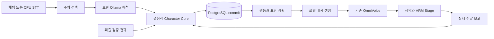

# 현재 상태 감사 — 감정 아키텍처 R&D 기준선

확인일: 2026-10-02, 로컬 Windows 작업 공간  
대상: `C:\Users\ltk90\vibe_coding_projects\ai-character-runtime`  
상태: 코드와 명세 조사 완료. 감정 엔진과 모델 실험은 미실행.

## 1. 결론

**현재 프로젝트는 설계 문서와 P00–P01 기반 코드가 있는 단계다. 지속 감정, 기억, DB, JEV 또는 대화 모델이 작동하는 런타임은 아직 없다.** 첨부 요청의 “JEV를 이용한 초기 개발 프로젝트”는 방향 설명이며 실제 통합 상태와 다르다. 현재 승인된 MVP는 Jev를 필수 구성에서 제외하고, 로컬 Ollama 해석과 결정적 TypeScript Core를 계획한다.

새 방향의 핵심인 “모델 밖에 상태를 두고 LLM에 쓰기 권한을 주지 않는다”는 기존 설계와 일치한다. 연구가 필요한 부분은 그 원칙 자체보다 **감정이 판단과 검색에 주는 추가 효과, 상처 기억의 비용 대비 효과, activation steering의 필요성**이다. 이번 문서는 이를 구현 완료로 바꾸거나 기존 MVP를 확대하지 않는다.

상태 표기:

- **코드 확인**: 실제 소스 또는 이번 명령 실행으로 확인.
- **명세 확인**: 문서가 요구하는 동작. 실행 증거는 아님.
- **제안/가설**: 새 R&D에서 비교할 후보. 제품 계약 변경은 아님.
- **미확인**: 설치, 논문 재현, 성능 등 증거가 부족한 항목.

## 2. 실제 파일과 책임

외부 의존성 디렉터리 `node_modules`, `.pnpm-store`는 제품 구현으로 세지 않았다. 루트에 `.git`, 별도 `AGENTS.md`, decision log 파일은 관측되지 않았다. 이번 대화에 제공된 AGENTS 지침을 적용했다. 의사결정과 진행 기록은 아래 명세와 IMPLEMENTATION_PLAN에 분산되어 있다.

| 실제 경로 | 확인 내용 | 증명하지 않는 것 |
|---|---|---|
| [package.json](./package.json), [pnpm-workspace.yaml](./pnpm-workspace.yaml), [tsconfig.json](./tsconfig.json), pnpm-lock.yaml | pnpm workspace, TypeScript, Vitest 구성 | 앱 실행·모델 연결 |
| [packages/contracts/package.json](./packages/contracts/package.json) | contracts에 Zod 4.6.5 의존성 | 감정 DTO 구현 |
| [local-config.ts](./packages/contracts/src/local-config.ts) `configSchema`, `parseConfig` | 로컬 URL, 유료 사용 거부, 모델 이름·음성 경로 설정 | provider의 실제 네트워크 격리·추론 가능성 |
| [wire-counter.ts](./packages/contracts/src/wire-counter.ts) | 음수가 아닌 십진 문자열과 bigint 변환 | DB 범위 제한·epoch 운영 |
| [index.ts](./packages/contracts/src/index.ts) | 설정과 카운터 export만 존재 | appraisal·state·memory 계약 |
| [contracts.test.ts](./packages/contracts/src/contracts.test.ts) | 카운터 및 일부 로컬 설정 검사 9개 | D/AI/DB/RT 제품 검증 |
| [scripts/diagnose.ts](./scripts/diagnose.ts) | 경로, Ollama 목록 API, DB TCP 연결 진단 | DB 인증·migration·모델 로딩·STT/TTS 추론 |
| [.env.example](./.env.example), [.gitignore](./.gitignore) | 예시 설정과 제외 경로 | 실행 중 서버에 설정 적용 |

`apps/runtime`, `apps/studio`, `packages/character-core`, `packages/database`, `packages/adapters`, `workers`, `evals`는 [구현 계획 §3](./IMPLEMENTATION_PLAN.md)의 **생성 예정 경로**다. 현재 코드 디렉터리로 인용하면 안 된다.

문서별 기준:

| 문서 | 소유하는 결정 |
|---|---|
| [기획 발전안](./jev_ai_character_runtime_plan_v2.md) | 장기 목표, 정서적 흔적 등 확장 아이디어 |
| [기술 설계](./technical_architecture_v1.md) | 무료 로컬 스택과 계층 분리 |
| [MVP_SPEC](./MVP_SPEC.md) | F01–F25, 제외 기능, 완료 범위 |
| [CHARACTER_PRESET](./CHARACTER_PRESET.md) | curious-puzzle-v1의 성격과 표현 원칙 |
| [CHARACTER_DOMAIN_SPEC](./CHARACTER_DOMAIN_SPEC.md) | core-rules-v1의 의미·수치·행동 순서 |
| [LOCAL_AI_INTEGRATION](./LOCAL_AI_INTEGRATION.md) | provider 계약, 취소, GPU 직렬 실행 |
| [DATABASE_SPEC](./DATABASE_SPEC.md) | 계획된 23개 테이블, 근거·중복·정정·트랜잭션 |
| [RUNTIME_PROTOCOL](./RUNTIME_PROTOCOL.md) | HTTP/WS, 출력 소유권, 실제 전달 보고 |
| [VALIDATION_PLAN](./VALIDATION_PLAN.md) | 검증 절차와 성능 문턱의 고정 조건 |
| [IMPLEMENTATION_PLAN](./IMPLEMENTATION_PLAN.md), [README](./README.md) | P00–P01 완료, 나머지 미착수와 실행 방법 |

요구사항은 의도를, 소스는 현재 동작을 증명한다. 구현이 없다는 이유로 요구사항을 삭제하지 않으며, 넓은 초기 기획의 항목을 구체적인 MVP 제외 규칙보다 우선하지 않는다.

## 3. 기존 아키텍처: 전부 계획 상태

Node 런타임은 캐릭터별 상태 변경을 직렬화하고 추론은 밖에서 실행한다. Core는 DB나 모델을 직접 호출하지 않는 순수 계산 계층이다. PostgreSQL + Drizzle을 영구 저장 경로로, Ollama/Qwen을 해석과 대사 후보로, 기존 OmniVoice Python을 음성 worker로 사용할 계획이다. React/Vite, Three/VRM, OBS 연결도 미구현이다.

## 4. 요청의 12가지 질문에 대한 답

| 질문 | 현재 답과 근거 |
|---|---|
| 1. emotion system 구현 범위 | 없음. contracts에는 affect 타입·reducer도 없다. 도메인 §2, §6–7에 네 감정과 pleasantness 규칙만 명세되어 있다. |
| 2. JEV가 담당하는 결정 | 현재 담당하는 결정 없음. 로컬 AI §6의 해석 결과로 target/act/strength/hostility/goal_relation/uncertain/evidence_refs를 받을 계획. JEV-like는 역할 명칭이며 Jev 제품 연결을 뜻하지 않는다. |
| 3. 상태의 source of truth | 실제 저장소 없음. DB §5의 character_state와 transitions, §7의 관계 근거가 계획된 기준이다. LLM 문장·KV cache·벡터 파일은 기준이 아니다. |
| 4. LLM의 직접 수정 경로 | 현재 LLM 연결 자체가 없다. 그러므로 “접근 방지가 검증됐다”는 결론도 불가. 명세는 모델 결과를 검증해 Core만 쓰도록 제한한다. |
| 5. inner/display 분리 | 명세상 분리. 도메인 §11의 표정 점수·임계값·최소 유지 시간, listening 우선 표시가 내부 감정을 지우지 않는다. 코드 없음. |
| 6. memory scar 표현 | 기획 §11의 정서적 흔적 확장 아이디어만 존재. MVP §6에서 명시 제외. DB memories에는 scar 메타데이터가 없다. |
| 7. decay/habituation/sensitization/recovery | decay와 habituation, 기분의 기준값 복귀는 식까지 정의됨. sensitization·scar 회복·배신 후 신뢰 복구는 미정·미구현. |
| 8. 기억과 감정의 상호 영향 | 활동·도움 사실이 감정과 기억을 함께 만들 계획. 기억 검색은 현재 상대·활동·최신순이며 감정 재순위화 없음. 검색·회고가 감정을 재가산하지 않는 규칙이 있다. |
| 9. canonical state의 최소 위치 | 기존 Core 상태에서 도출하는 읽기 전용 projection으로, 상태 계산 이후 provider 입력 조립 전에 둔다. 두 번째 상태 DB는 필요 없다. |
| 10. steering adapter의 변경 면적 | 현재 바꿀 완성 런타임은 없다. 먼저 오프라인 연구 worker에서 비교 가능. 제품 채택 시 provider·자원 예약·요청 수명·검증 명세에 영향. Stage나 영구 기억을 모델 벡터 형식으로 바꿀 이유는 없다. |
| 11. 충돌점 | VAD·attachment·통합 trust·scar·감정 기반 검색을 즉시 넣는 것은 MVP 제외 규칙과 충돌. 기억을 appraisal에 공급하면 DB §5.2의 제한과도 충돌. 모델이 최종 행동을 결정하면 Core 행동 소유권과 충돌. |
| 12. 유지할 것 | 0원 로컬 실행, Core 결정성, 검증된 사실 우선, 상대 ID와 출처, 중복 방지, 삭제 전파, 출력 전달 구분, 모델 교체 가능성, 순차 GPU 실행. |

## 5. 수식과 기억에서 이미 정한 것

다음은 구현 결과가 아니라 [도메인 명세](./CHARACTER_DOMAIN_SPEC.md)의 현재 계약이다.

- joy/frustration/surprise/embarrassment는 0–1. hold/반감기는 각각 4/45초, 6/90초, 1/8초, 3/30초다.
- 감쇠는 `value × 2^(-max(0,t-max(as_of,hold_until))/half_life)`다. 반복 입력으로 hold를 계속 연장하지 않는다.
- 칭찬·직접 비하에 상대별 최근 600초 `1/(1+n)` 반복 감소와 누적 상한을 적용한다. 강한 칭찬 네 번의 자극은 0.18, 0.09, 0.03, 0이다.
- pleasantness는 0.60을 기준으로 반감기 900초에 복귀한다. 기분 때문에 객관적 hostility나 신뢰 근거를 바꾸지 않는다.
- familiarity/affinity와 도움 근거가 분리되어 있다. 통합 trust 점수, attachment, 관계 단계는 없다.
- 기억은 관측된 활동 사실의 템플릿이다. 유효 출처를 먼저 검사하고 최대 5개/600 tokens로 공급한다. 감정 때문에 무효 기억을 되살리지 않는다.
- 기억만 삭제하는 것과 원본 사건을 삭제하는 것은 다르다. 관계 근거는 유효 출처로 재집계하지만 이미 발생한 단기 감정은 원인 참조를 제거하고 자연 감쇠시킨다.

## 6. 불일치와 미검증 지점

| 항목 | 실제 차이 | 이번 작업의 처리 |
|---|---|---|
| “JEV를 이용”이라는 요청의 배경 | 현재 MVP는 Jev 제외, Ollama 대체 계획 | 제품과 역할 명칭 분리 |
| 초기 기획의 arousal | 구체 도메인 §2와 MVP에서는 제외 | 기본 canonical에서 값을 만들어 채우지 않음 |
| 상처·애착·배신 | 초기 비전에는 있으나 MVP와 DB에는 없음 | 독립된 연구 가설과 채택 gate로 명시 |
| 대화 모델이 판단·행동까지 변화 | 현재 대화 모델은 Core가 고른 의도를 표현 | 연구용 shadow 판단과 실제 실행을 구분 |
| 로컬 강제 | parseConfig가 설정 문자열을 검사할 뿐 설치 모델·서버 설정을 보증하지 않음 | provider 구현 단계 검증 필요, 코드 변경 안 함 |
| 진단 결과 | DB는 TCP, TTS는 메타데이터, Ollama는 목록 API | 준비 완료·추론 성공으로 확대하지 않음 |
| VAD latent와 영구 상태 | 관련 논문이 있어도 외부 DB 상태와 동일 객체가 아님 | 영구 상태와 모델별 임시 intervention 분리 |

설정 검사에서 경로 존재·절대 경로 여부는 전부 보장되지 않으며, 모델명 패턴 검사는 실제 local-only 실행의 증거가 아니다. `parseWireCounter`는 PostgreSQL bigint 최대 범위를 검사하지 않는다. 이들은 현재 감정 R&D의 구현 대상이 아니며, 해당 provider/DB 계약을 구현할 때 확인할 경계다.

## 7. 이번 실행 증거와 한계

2026-10-02에 기존 코드 그대로 아래 명령을 실행했다.

| 검사 | 실제 결과 | 범위 |
|---|---|---|
| `pnpm typecheck` | PASS, exit 0 | 존재하는 contracts와 diagnose의 정적 타입 검사 |
| `pnpm test:unit` | PASS, 1파일 9개 | 카운터 7개와 설정 2개 테스트 |
| `pnpm diagnose` | exit 0, 진단 출력 성공 | 구성요소 성공 판정과 구분 |

진단값: Node v22.19.0, DB `not_configured`, Ollama `unavailable`, OmniVoice Python 존재 및 snapshot 메타데이터 후보 2개지만 snapshot 미선택, STT `not_configured`, Studio/Stage `not_implemented`.

Ollama unreachable 결과는 이번 프로세스의 실행 환경에서 얻은 관측이며 설치 부재를 뜻하지 않는다. RTX 5070 Ti 16GB/약 32GB RAM과 설치 모델 목록은 기존 기술 설계의 과거 확인 기록이다. 이번에는 GPU 정보·가중치 완전성·모델 로딩을 다시 측정하지 않았다. 모든 모델 R&D와 D/AI/DB/RT 통합 검증은 미실행이며 성능 gate도 `UNFROZEN`이다.

## 8. 다음 문서의 위치

[AFFECTIVE_ARCHITECTURE_V2](./AFFECTIVE_ARCHITECTURE_V2.md)는 확장 후보와 경계를, [REPRESENTATION_STEERING_RND](./REPRESENTATION_STEERING_RND.md)는 문헌과 반증 실험을 정의한다. [TWO_AGENT_RND_HANDOFF](./TWO_AGENT_RND_HANDOFF.md)는 이후 연구자에게 전달할 작업 패키지이며 이번에 에이전트를 실행했다는 뜻이 아니다. [NEXT_DECISIONS](./NEXT_DECISIONS.md)의 gate를 통과하기 전에는 기존 MVP·DB·도메인 계약을 바꾸지 않는다.
