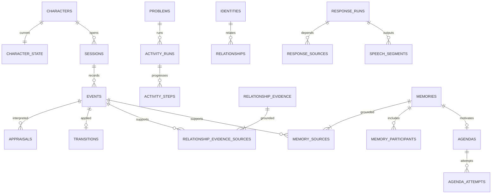

# AI Character Runtime — DB 설계 명세

작성일: 2026-09-27  
계약 버전: `database-v1`  
상태: 구현 전 저장 계약. SQL 예시는 전체 migration이 아니며 실제 PostgreSQL 실행 검증은 아직 하지 않았다.

관련 문서: [MVP 범위](./MVP_SPEC.md), [도메인 규칙](./CHARACTER_DOMAIN_SPEC.md), [로컬 AI 연동](./LOCAL_AI_INTEGRATION.md), [기술 설계](./technical_architecture_v1.md)

브라우저 메시지·출력 소유권·전달 ACK는 [런타임 통신 명세](./RUNTIME_PROTOCOL.md)를 따른다.

## 1. 설계 결정과 완료 기준

**로컬 PostgreSQL 하나에 사건·현재 상태·관계 근거·기억·실행 기록을 저장한다.** TypeScript에서 Drizzle과 pg를 사용한다. Redis, 별도 벡터 DB, 클라우드 DB는 사용하지 않는다. pgvector와 의미 기억은 MVP에서 제외한다.

이 문서는 저장 구조·키·원자적 변경의 기준이다. 감정 계산식과 행동 선택은 도메인 문서, 모델·worker 계약은 로컬 AI 문서를 따른다. 기술 설계의 넓은 후보 테이블을 모두 구현하지 않고 아래 MVP 테이블만 단계별로 만든다. 구현 후에는 검토된 schema 코드와 migration을 함께 원본으로 관리하고 계약 변경 시 이 문서를 갱신한다.

설계가 충족해야 할 조건:

1. 동일 입력·해석 결과·재생 보고의 재전송이 경험을 중복 생성하지 않는다.
2. 상태·관계 근거·필수 기억·실행 계획이 함께 commit되거나 함께 취소된다.
3. 모델 생성, 출력 시작, 전달 완료, 불명확한 전달을 구분한다.
4. 재시작해도 관계 일일 상한·퍼즐 진행·Agenda 시도 예산이 유지된다.
5. 원본 삭제와 기억 삭제를 구분하고, 관련 근거·제안·진행 출력을 일관되게 무효화한다.
6. 숨겨진 퍼즐 정답과 미관측 채팅을 캐릭터의 경험 조회에 섞지 않는다.

## 2. 공통 자료형과 규칙

| 항목 | 저장 계약 |
|---|---|
| 식별자 | 앱에서 생성한 UUID. 문제 ID·preset ID 등 고정 업무 키만 text |
| 시각 | `timestamptz`, UTC. 사용자 원래 시각과 서버 수신·적용 시각 분리 |
| 한국 날짜 | `date`, 해당 효과의 적용 시각을 `Asia/Seoul`로 변환 |
| 버전·순번 | `bigint`, 0 이상. JS에서는 bigint, JSON 전송에서는 십진 문자열 |
| 감정·관계 수치 | `double precision`, 유한값·범위 검사. 저장 시 반올림하지 않음 |
| 상태값 | `text` + CHECK. 허용 enum은 schema 코드와 함께 유지 |
| 가변 자료 | `jsonb` + `schema_version`, Zod 검증. 검색·FK에 필요한 ID는 컬럼으로 분리 |
| NULL | 아래 목록에서 `?` 표시한 컬럼만 nullable. 그 외 NOT NULL |
| 공통 생성 시각 | 조인 테이블 외 모든 테이블에 `created_at timestamptz` 기본 현재 시각 |
| 삭제 | 기본 FK `ON DELETE RESTRICT`. 명시적 정리 절차로 내용 제거·tombstone 유지 |

테이블의 `id`는 PK다. 별도 PK를 표기한 테이블은 그 복합 키를 사용한다. `character_id`가 있는 엔터티 테이블은 부모 참조를 위해 `UNIQUE(character_id, id)`도 둔다. 자식의 동일 캐릭터 참조는 `(character_id, parent_id)` 복합 FK로 강제한다. 단순 FK만으로 다른 캐릭터의 행을 연결할 수 있게 두지 않는다.

sessions·response_runs처럼 세션 소속까지 같아야 하는 경우 부모에 필요한 복합 UNIQUE를 추가하고 `(character_id, session_id, parent_id)` FK를 사용한다. config는 `(character_id, config_version)`으로 참조한다. 전역 테스트 계정 identities와 정적 problems는 각각 자신의 PK를 참조한다.

CHECK는 행 내부 범위·NULL 조합에, UNIQUE는 중복·단일 활성 행에, FK는 참조 무결성에 사용한다. 다른 테이블의 현재 유효성을 CHECK 함수로 조회하지 않는다. 그러한 검사는 캐릭터 상태 행을 잠근 트랜잭션에서 한다. [PostgreSQL 제약조건](https://www.postgresql.org/docs/18/ddl-constraints.html)

## 3. 테이블 구성

| 그룹 | 테이블 | 필요 기능 |
|---|---|---|
| 설정·실행 | characters, character_configs, identities, sessions | 고정 캐릭터·상대 ID·세션 |
| 관측·상태 | events, appraisals, character_state, transitions | 입력·해석·상태 전이·복구 |
| 활동 | problems, activity_runs, activity_steps | 퍼즐 정답 판정·힌트·시도 복구 |
| 관계 | relationships, relationship_evidence, relationship_evidence_sources | 근거 중복 방지·일일 상한·재집계 |
| 기억 | memories, memory_sources, memory_participants | 사실 기억·출처·상대별 검색 |
| 제안 | agendas, agenda_attempts | 다음 세션 제안·전달·예산 |
| 출력 | response_runs, response_sources, speech_segments | 계획 유효성·실제 전달 |
| 종료 정리 | tasks | 실패·재시작에도 중복 없이 세션 정리 |

23개 테이블은 데이터의 수명이 다르거나 다대다 출처를 보존해야 해서 나뉜다. 별도의 service나 worker가 23개라는 뜻은 아니다. 감정별 테이블, trust 점수표, 일반화 기억 의존 그래프, embedding 테이블은 만들지 않는다.



그림은 핵심 관계만 표시한다. 원본과 파생 자료는 ID로 연결하며, 원문을 모든 테이블에 복사하지 않는다.

## 4. 설정·상대·세션

### 4.1 characters / character_configs / identities

| 테이블 | 컬럼 |
|---|---|
| characters | `id uuid`, `display_name text` |
| character_configs | `character_id uuid`, `version bigint`, `schema_version int`, `preset_id text`, `domain_version text`, `provider_config_version text`, `body jsonb` |
| identities | `id uuid`, `platform text`, `platform_subject_id text`, `display_name text` |

character_configs의 PK는 `(character_id, version)`이다. 사용된 설정은 덮어쓰지 않는다. body에는 말투·도메인 계수·비밀값 없는 모델 설정을 저장한다. 참조 음성 파일, 비밀번호, API key, 전체 로컬 환경 변수는 복사하지 않는다.

identities는 `UNIQUE(platform, platform_subject_id)`다. MVP platform은 `local_test`와 `local_operator`만 허용한다. A·B·C 및 운영자는 seed의 고정 subject ID를 사용하고, 표시 이름 변경으로 새로운 상대가 생기지 않는다.

### 4.2 sessions

컬럼: `id uuid`, `character_id uuid`, `config_version bigint`, `status text`, `visibility text`, `started_at timestamptz`, `ended_at? timestamptz`, `last_user_input_at? timestamptz`, `last_output_end_at? timestamptz`, `output_epoch bigint`.

- status: `active | ending | ended | interrupted`.
- visibility: MVP에서는 `test_public` 하나. 비공개 맥락·conversation_key는 만들지 않는다.
- `active/ending`은 ended_at이 NULL, `ended/interrupted`는 종료 시각 필수.
- `(character_id)`에 `WHERE status IN ('active','ending')`인 부분 UNIQUE를 둔다.
- config는 세션 중 고정한다. 설정 변경은 다음 세션부터 적용한다.
- `output_epoch`는 Stage 출력 소유자가 바뀔 때 증가한다. 응답 취소용 generation_epoch와 다르다.

기본 앱 재시작은 남아 있는 active/ending 세션을 interrupted로 닫고 새 세션을 만든다. Studio·Stage의 재접속은 같은 세션을 유지한다. 같은 session ID 재연결은 Agenda 예산이나 일일 관계 상한을 초기화하지 않는다.

## 5. 사건·해석·상태

### 5.1 events: 받은 내용과 실제 관측의 구분

컬럼:

| 필드 | 타입·의미 |
|---|---|
| id / character_id / session_id | uuid. 모든 사건은 해당 세션 또는 정정 대상의 원래 세션에 귀속 |
| identity_id? | uuid, 발언·도움 주체. 시스템 사건은 NULL |
| parent_event_id? | uuid, 선택·해석 채택·정정 등 단계의 원본 |
| source_namespace / source_key | text, 서버가 만든 안정적인 재전송 키 |
| kind | text, 등록한 사건 종류 |
| occurred_at / received_at | timestamptz, 원래 시각 / 서버 수신 시각 |
| observed_at? / applied_at? | timestamptz, 선택한 시각 / 도메인 적용 시각 |
| attention_status | pending / selected / observed / ignored / expired |
| data_status | active / superseded / deleted |
| revision / schema_version | bigint / int |
| payload? | jsonb. deleted일 때 NULL |
| superseded_by_event_id? | uuid, 정정으로 대체한 사건 |

`UNIQUE(character_id, source_namespace, source_key)`를 둔다. 두 키는 NOT NULL·빈 문자열 금지다. 동일 키가 다른 payload로 재수신되면 기존 원문을 덮어쓰지 않고 충돌을 반환한다. 동일 문구를 다시 말한 새 메시지는 새로운 source_key다.

외부 메시지와 Core 단계는 구분한다. 예를 들어 입력 E의 선택은 `attention_selected:E`, 해석 채택은 `appraisal_applied:E:revision`, 출력 ACK는 `stage:output_epoch:report_id`를 source_key로 갖는 **별도 사건 행**이다. transitions는 이 단계 사건을 참조한다. E를 여러 번 전이의 source로 써서 UNIQUE 제약을 우회하지 않는다.

attention selected/observed는 원문을 읽었는지 표시하고, 의미 효과의 적용 여부는 해석 채택 사건의 전이로 판단한다. `observed` 원문에 부분 전사·미선택 채팅을 섞지 않는다. 중립 대체 해석도 채택 기록을 남겨 뒤늦은 모델 응답이 다시 적용되지 않게 한다.

서버 적용 시각은 역행하지 않게 정한다. 현재 실행 중 단조 시계로 계산한 경과 시간을 이전 기준 UTC에 더하고, 재시작 시에는 저장 시각과 현재 UTC 차이를 0 이상으로 보정한다. 일일 상한 날짜와 반복 600초 창은 이 적용 시각을 사용한다. 사용자 supplied occurred_at으로 한도를 우회할 수 없다.

### 5.2 appraisals

컬럼: `id uuid`, `character_id uuid`, `event_id uuid`, `event_revision bigint`, `request_id uuid`, `generation_epoch bigint`, `config_version bigint`, `provider text`, `model text`, `model_digest? text`, `prompt_version text`, `status text`, `result? jsonb`, `context_refs jsonb`, `failure_code? text`, `latency_ms? int`, `usage? jsonb`, `provider_result? jsonb`.

status: `running | accepted | stale | cancelled | failed | timed_out`. request_id는 UNIQUE다. `(character_id,event_id,event_revision)`에 accepted 행 한 건만 허용하는 부분 UNIQUE를 둔다. accepted result는 로컬 AI 문서의 AppraisalResult schema를 통과해야 한다. 실패를 채택할 때는 중립 result와 failure_code를 같이 기록한다.

migration `0003_jev_appraisal.sql`은 nullable provider_result를 추가한다. 기존 행은 NULL을 유지한다. 검증된 Jev typed answers와 mappingVersion/confidenceThreshold/gateReasons만 저장하며 원문·키·header·오류 body는 저장하지 않는다. 기존 model/prompt_version/latency_ms/usage와 result를 같은 트랜잭션에서 반영한다. 원본 삭제/무효화 시 result/context_refs와 함께 provider_result도 제거한다.

context_refs에는 제공한 사건 ID·revision만 저장한다. 해석 단계에는 장기 기억 원문을 공급하지 않고 필요한 최소 관측 대화·활동 정보를 사용한다. 삭제 탐색을 위해 JSON ID만 저장했다는 이유로 이 테이블을 빠뜨리지 않는다. 작은 MVP에서는 정정 대상 캐릭터의 해석 참조를 검사하며 실제 규모가 요구할 때만 역조회 인덱스를 추가한다.

### 5.3 character_state

PK `character_id uuid`. 컬럼: `version bigint`, `config_version bigint`, `schema_version int`, `generation_epoch bigint`, `snapshot_at timestamptz`, `body jsonb`.

body는 다음 값만 가진다.

- affect: 네 감정 각각의 value·as_of·hold_until, 원인 사건·상대의 제한된 참조.
- mood: pleasantness와 as_of.
- attention: 현재 입력 ID, 마지막 선택 상대·연속 선택 횟수.
- working_memory_event_ids: 최대 20개, 원문 복사 없음.
- expression: 현재 기본 표정·유지 시작 시각.
- turn: listening 등 대화 차례 상태, 마지막 사회적 acknowledgement 시각의 제한된 캐시.

진행 퍼즐의 원본은 activity_runs, 출력은 response_runs, 상대별 관계는 relationships다. 반복 이력의 원본은 관계 근거와 원본 사건이며 snapshot의 count 하나로 대체하지 않는다. JSON 안의 ID는 갱신 트랜잭션에서 같은 캐릭터·유효 상태인지 확인한다.

body의 네 감정과 pleasantness는 유한한 0–1 값, 필수 시각은 유효한 UTC여야 한다. Zod뿐 아니라 DB CHECK로 `schema_version=1`, JSON object·필수 키·수치 타입·범위를 검사한다. NULL이면 통과하는 CHECK만 두지 않고 존재 조건도 검사한다. UI 읽기용 decay는 UPDATE하지 않는다.

### 5.4 transitions

컬럼: `id uuid`, `character_id uuid`, `source_event_id uuid`, `appraisal_id? uuid`, `state_version bigint`, `config_version bigint`, `core_version text`, `evaluated_at timestamptz`, `effects? jsonb`, `replay_status text`.

UNIQUE는 `(character_id, source_event_id)`와 `(character_id, state_version)`다. replay_status는 `available | source_redacted`다. effects에는 적용 전후 숫자, 자극, 채택 이유, 관련 ID를 저장하되 입력·기억 원문 전체를 넣지 않는다. 난수 결과 필드는 MVP에 없다.

상태 version은 commit마다 1 증가하며 전이 순서의 기준이다. UUID·동일 timestamp의 정렬에 사건 적용 순서를 맡기지 않는다. 정정·삭제 전이도 새 version이며 기존 감정·발화 역사를 없었던 일로 덮어쓰지 않는다.

## 6. 퍼즐 저장

### 6.1 problems

PK `problem_id text`. 컬럼: `content_version bigint`, `public_prompt text`, `answer_format jsonb`, `validator_spec jsonb`, `registered_hints jsonb`, `fixture_hash text`.

시연용 최소 3개 문제를 seed한다. validator_spec과 아직 공개하지 않은 registered_hints는 adapter 전용이다. LLM·브라우저 응답에는 public_prompt와 answer_format만 선택하는 명시적 DTO를 사용한다. `SELECT *`를 프롬프트에 넣지 않는다. 문제가 사용된 뒤에는 정답을 제자리 수정하지 않고 새로운 problem_id를 부여한다.

### 6.2 activity_runs

컬럼: `id uuid`, `character_id uuid`, `problem_id text`, `started_session_id uuid`, `last_session_id uuid`, `status text`, `version bigint`, `hints_used int`, `auto_attempts_used int`, `auto_attempts_granted int`, `last_step_no bigint`, `started_at timestamptz`, `ended_at? timestamptz`.

status: `ready | solving | awaiting_hint | solved | ended`. hints_used는 0–1, auto_attempts_granted 초기 3, used는 0 이상 granted 이하. 명시적 재시도는 도메인의 새 시도 기회를 **한 번의 추가 제출 권한**으로 구체화해 granted를 1 늘린다. 과거 오답·힌트는 남는다. 같은 답 자동 재제출 금지는 추가 기회에도 유지한다.

`WHERE status IN ('ready','solving','awaiting_hint')`인 `(character_id)` 부분 UNIQUE로 미완료 활동 한 개만 허용한다. 다른 문제를 시작하려면 현재 활동을 명시적으로 종료한다. 앱 종료는 활동 종료가 아니다. 재시작·다음 세션 이어가기에서 동일 activity_run_id를 사용한다.

### 6.3 activity_steps

컬럼: `id uuid`, `character_id uuid`, `activity_run_id uuid`, `step_no bigint`, `event_id uuid`, `kind text`, `identity_id? uuid`, `normalized_answer? text`, `hint_id? text`, `verdict? text`, `data_status text`, `applied_at timestamptz`.

kind: `answer_submitted | answer_judged | hint_used | retry_granted | ended`. data_status는 `active | invalidated`다. active 행에서 verdict는 judged일 때만 `correct/incorrect`, normalized_answer는 submitted일 때만, hint_id는 hint_used일 때만 필수다. invalidated 행은 삭제 대상 내용을 NULL로 제거할 수 있도록 CHECK를 구성한다. `answer_judged`의 event.parent_event_id가 해당 제출 사건을 가리킨다.

UNIQUE: `(character_id,event_id)`, `(activity_run_id,step_no)`, submitted 행의 `(activity_run_id,normalized_answer)` 및 hint_used 행의 `(activity_run_id,hint_id)`. 답 정규화는 문제의 validator 규칙을 사용하며 임의 공백 제거로 서로 다른 답을 합치지 않는다. adapter 결과 재전송은 같은 제출 ID로 동일 판정 사건을 찾아 반환한다.

모든 단계의 유효성·순서·hint_id 소속은 잠금 안에서 검사한다. 원본 삭제 시 단계는 invalidated하고 필요한 답 원문은 NULL로 제거한다. 유효한 단계로 진행 상태를 다시 구성한다. 단계 부족으로 진행을 확정할 수 없으면 활동을 ended로 두고 자동 재개·자동 추가 제출을 막는다. 소급 정정으로 실제 소비한 시도·힌트 예산을 무료로 되돌리지 않는다.

이미 solved/ended로 닫힌 활동의 정답 근거가 삭제되면 유효한 정답이 남아 있을 때만 solved를 유지하고, 그렇지 않으면 ended로 둔다. 이전 활동을 자동으로 다시 열어 새 열린 활동과 충돌시키지 않는다.

## 7. 관계 근거와 집계

### 7.1 relationships

PK `(character_id uuid, identity_id uuid)`. 컬럼: `familiarity double precision`, `affinity double precision`, `interaction_days int`, `verified_problem_count int`, `verified_help_days int`, `last_help_at? timestamptz`, `projection_version bigint`, `updated_at timestamptz`.

초기 familiarity=0, affinity=0.5. 모든 개수는 0 이상. trust 통합 점수와 관계 단계는 없다. 도움 목록은 유효한 evidence를 조회한다. 여기의 숫자는 캐시된 집계이며 출처를 대신하지 않는다.

### 7.2 relationship_evidence

컬럼: `id uuid`, `character_id uuid`, `identity_id uuid`, `evidence_key text`, `kind text`, `status text`, `problem_id? text`, `effective_at timestamptz`, `local_date date`, `order_version bigint`, `config_version bigint`, `features? jsonb`, `applied? jsonb`.

kind는 `first_observed | praise | direct_insult | verified_hint`. status는 `active | invalidated`. UNIQUE `(character_id,identity_id,evidence_key)`는 invalidated 행에도 유지한다.

| 종류 | evidence_key 구성 | 근거 |
|---|---|---|
| first_observed | `first_observed:YYYY-MM-DD` | 같은 날 관측된 상대의 확정 발언 |
| praise/direct_insult | `종류:원본_event_id` | 해당 입력의 채택된 확실한 해석 |
| verified_hint | `verified_hint:problem_id` | 등록 힌트 사용 AND 이후 같은 실행의 정답 판정 |

features에는 strength·종류·관측 사실 등 재계산 입력을 저장한다. applied에는 당시 habituation, 후보 자극·상한 적용 후 자극, familiarity/affinity 실제 변화와 양·음 예산 소비량을 구분해 저장한다. 실제 수치가 clamp돼 덜 변해도 이미 소비한 자극·일일 예산이 되살아나지 않는다.

상한 때문에 적용량이 0인 명확한 칭찬·비하도 evidence를 보존한다. 최근 600초 반복 수 n에는 이러한 채택된 입력도 포함된다. ignored·중복·불확실한 입력은 사회적 evidence로 넣지 않는다.

### 7.3 relationship_evidence_sources

PK `(evidence_id uuid, event_id uuid)`. 컬럼: `character_id uuid`, `event_revision bigint`, `role text`, `support_group text`.

단일 FK 하나로 도움을 증명하지 않는다. verified_hint는 `hint_used`와 `correct_result` 역할을 같은 support_group에 연결하고, 같은 activity_run에서 힌트 뒤에 성공했는지 검증한다. 하나의 group은 필요한 역할이 모두 유효해야 한다. 같은 문제의 다른 실행에서 독립적인 유효 도움을 확인하면 같은 evidence에 새 group을 추가할 수 있지만 관계 효과를 새로 주지 않는다.

first_observed는 같은 날 관측된 다른 발언도 각자 독립 group으로 연결할 수 있다. 최초 발언이 삭제돼도 유효한 다른 관측이 있으면 근거를 유지한다. praise/direct_insult는 원본 하나의 group이다. 유효 group이 하나라도 있어야 evidence가 active다. 가장 이른 유효 group의 완료 시각·전이 순서를 효과 시점으로 사용한다.

그날의 모든 관측 출처가 삭제된 뒤 새 유효 발언을 관측하면 같은 first_observed evidence를 재활성화하고 새 출처의 시각·전이 순서를 반영한다. 같은 날짜의 business key를 유지하므로 이후 추가 발언도 친숙함을 중복 증가시키지 않는다.

### 7.4 상한과 재계산

별도의 daily counter 테이블을 만들지 않는다. 작은 MVP에서는 evidence를 `(effective_at,order_version,id)` 순으로 읽어 600초 창·한국 날짜별 상한을 계산한다. 서버 캐시는 commit 이후에만 교체한다.

원본 정정·삭제 시 해당 상대의 유효 관측과 해석을 다시 모아 근거 연결을 갱신하고, familiarity=0/affinity=0.5에서 시간 순서대로 재계산한다. 이후 입력의 반복 계수와 일일 양·음 한도도 다시 계산한다. 저장된 delta를 단순히 빼지 않는다. 감정 자극 상한이 호감에 영향을 주므로 사회적 자극의 원래 계산을 재현하되 **현재 감정 수치는 되감지 않는다**.

재계산은 각 근거의 당시 config_version을 사용한다. 새 정책으로 과거 전체를 재평가하는 변경은 별도 명시적 migration이다. 이번 MVP의 설정 변경이 과거 관계를 조용히 다시 쓰지 않게 한다.

## 8. 기억과 출처

### 8.1 memories

컬럼: `id uuid`, `character_id uuid`, `session_id uuid`, `activity_run_id? uuid`, `memory_key text`, `kind text`, `status text`, `content_version bigint`, `fact_kind text`, `visibility text`, `content? text`, `facts? jsonb`, `occurred_at timestamptz`, `updated_at timestamptz`, `superseded_by_memory_id? uuid`.

- kind: `activity_result | verified_help | unfinished_activity | delivered_proposal`.
- fact_kind: MVP 자동 생성은 `observed`만. 검증되지 않은 주장은 events에 남기며 장기 사실 기억으로 승격하지 않음.
- visibility는 `test_public`만.
- status: `active | superseded | invalidated | deleted`.
- `UNIQUE(character_id,memory_key)`는 deleted에도 유지.
- content는 캐릭터에게 공급할 템플릿 문장, facts는 참여자·활동·결과의 구조화 자료.
- deleted는 content/facts=NULL. 삭제 표시만 하고 문장을 남겨 두지 않음.

memory_key는 텍스트 해시가 아니라 `kind:activity_run_id:업무기준ID`다. 예를 들어 도움 기억은 evidence ID, 전달 제안은 agenda attempt ID를 쓴다. unfinished_activity는 실행당 하나다. task ID·model 버전을 키에 넣어 동일 경험을 여러 기억으로 복제하지 않는다.

삭제된 행의 key를 tombstone으로 유지하여 다음 종료 정리가 같은 기억을 재생성하지 못하게 한다. 명시적인 정정은 같은 기억 ID의 content_version을 증가시키고 새 유효 출처를 연결한다. 정정 사건에는 이전 원문 전체를 복사하지 않고 대상 ID·버전·변경 범위만 기록한다. 새 사실이 원래 기억과 다른 업무 사실이라면 별도 key로 생성하고 superseded 관계를 남긴다.

### 8.2 memory_sources / memory_participants

| 테이블 | PK·컬럼 |
|---|---|
| memory_sources | PK `(memory_id,event_id)`; `character_id uuid`, `event_revision bigint`, `role text` |
| memory_participants | PK `(memory_id,identity_id)`; `character_id uuid`, `role text` |

memory_sources는 실제 관측·적용된 active 사건만 연결한다. 기억마다 필요한 출처의 역할 집합을 생성 템플릿이 정의한다. 도움 기억에는 힌트 사용·정답 판정, 제안 기억에는 실제 전달 보고가 필요하다. 내용 변경 시 관련 출처를 같은 트랜잭션에서 교체한다.

MVP 기억은 기억을 요약해서 또 다른 기억을 만드는 그래프를 사용하지 않는다. 모두 직접 원본 사건을 참조하므로 memory_dependencies 테이블은 제외한다. Agenda와 출력의 기억 의존은 각각 전용 FK로 표현한다.

사실 정정은 운영자의 주장만으로 과거 성공을 만드는 작업이 아니다. 등록된 adapter에서 재검증한 결과나 유효한 원본을 근거로 삼는다. 단순 문구 정정은 facts와 참여자를 바꾸지 않는다. 근거를 확보할 수 없다면 잘못된 기억을 invalidated로 두고 대체 사실을 꾸미지 않는다.

### 8.3 검색

active + test_public + 유효 source revision을 먼저 필터링한다. 현재 활동 미완료 기억, 현재 상대의 공유 경험, 관련 최근 사건 순으로 조회한다. 같은 활동의 중복을 제거한 뒤 최신 occurred_at·id 순으로 안정 정렬한다. 결과 최대 5개, 모델 입력 600 tokens 제한은 AI adapter가 집행한다.

memory_participants는 사실의 주체 구분이며 접근 권한 표가 아니다. B에게 A의 공개 활동을 설명할 수 있지만 이를 B와의 공유 경험으로 변환하지 않는다. 미선택 채팅은 이 쿼리에서 사건 기억으로 승격되지 않는다.

## 9. Agenda와 시도 예산

### 9.1 agendas

컬럼: `id uuid`, `character_id uuid`, `source_memory_id uuid`, `source_memory_version bigint`, `activity_run_id uuid`, `created_session_id uuid`, `status text`, `not_before timestamptz`, `expires_at timestamptz`, `offered_at? timestamptz`, `last_attempt_session_id? uuid`, `closed_reason? text`.

종류는 resume_puzzle 하나라 별도 intent JSON을 만들지 않는다. `UNIQUE(character_id,activity_run_id)`와 `UNIQUE(character_id,source_memory_id)`를 둔다. 만료·거절·수락 행도 남겨 같은 근거에서 자동 재생성되지 않게 한다.

status: `pending | reserved | offered | accepted | declined | expired`. expires_at은 최초 생성 후 7일로 고정하며 재시도·새 세션으로 연장하지 않는다. source 삭제·활동 종료는 expired + 사유로 닫는다. 시작 30초·침묵 8초·현재 참여자·사용자 발화 여부는 도메인 규칙으로 판단하고 DB에는 그 판단 근거 사건을 남긴다.

### 9.2 agenda_attempts

컬럼: `id uuid`, `character_id uuid`, `agenda_id uuid`, `session_id uuid`, `response_id uuid`, `reserved_at timestamptz`, `delivery_status text`, `resolved_at? timestamptz`.

`UNIQUE(character_id,session_id)`로 **여러 Agenda 중에서도 세션당 시도 한 번**을 보장한다. response_id도 UNIQUE다. delivery_status는 `reserved | not_delivered | delivered_text | delivered_audio | unknown`이다. 음성 완료 전 자막이 완성된 제안을 전달했다면 delivered_text를 먼저 기록하고 나중에 delivered_audio로 보완할 수 있다.

계획 commit에 attempt 생성·response 생성·agenda reserved를 함께 넣는다. attempt가 생겼으면 재생 실패·취소로 행을 지우지 않는다. 확실한 미전달은 pending으로 되돌리되 last_attempt_session_id는 남긴다. 부분 전달 또는 불명확한 전달은 unknown으로 두고 agenda를 expired로 닫는다. 완성된 제안이 전달돼야 offered이고, offered_at부터 60초 응답 없으면 expired다.

수락은 agenda accepted와 activity 재개를 같은 commit에서 수행한다. 새 운영자 요청으로 거절했던 문제를 직접 재개할 수 있지만 닫힌 Agenda를 pending으로 재활성화하지 않는다.

## 10. 응답·출처·전달

### 10.1 response_runs

컬럼: `id uuid`, `character_id uuid`, `session_id uuid`, `trigger_event_id uuid`, `generation_epoch bigint`, `config_version bigint`, `status text`, `plan? jsonb`, `segment_count? int`, `deadline_at timestamptz`, `cancel_reason? text`, `finished_at? timestamptz`.

segment_count는 생성 전 NULL, 최종 문장 확정 후 1–2다. 전체 segment 행과 함께 commit한 뒤 Stage에 전송한다. 생성된 일부 문장의 ACK만으로 전체 제안이 전달됐다고 오판하지 않는다. 자막 전용 문장의 표시 완료·표시 종료는 각각 text_shown_at과 delivery_status로 구분한다.

status: `planned | generating | synthesizing | delivering | completed | cancelled | failed | interrupted`. 초기 네 상태에 대해 `(character_id)` 부분 UNIQUE로 활성 응답 하나를 강제한다. response는 commit 후 dispatch할 실행 계획이며 별도의 메시지 broker/outbox 테이블을 추가하지 않는다.

plan은 action·purpose·대상·표현·길이 제한을 보관한다. 원문·기억 전체를 넣지 않고 ID로 참조한다. 모델 요청 ID·속도 기록은 events의 provider 완료 자료에 연결할 수 있다. 생성 결과를 받았다는 이유만으로 status=completed를 쓰지 않고, 실제 출력 종료 또는 실패 처리 후 닫는다.

### 10.2 response_sources

컬럼: `id uuid`, `character_id uuid`, `response_id uuid`, `event_id? uuid`, `memory_id? uuid`, `source_version bigint`.

event_id와 memory_id 중 정확히 하나만 NOT NULL인 CHECK를 둔다. 각각 부모에 복합 FK를 둔다. event 행은 `(response_id,event_id)`, memory 행은 `(response_id,memory_id)` 부분 UNIQUE다. 해당 원문의 revision 또는 memory.content_version을 source_version에 기록한다. 삭제·정정에서 진행 중 응답을 찾기 위한 역방향 인덱스도 각각 둔다.

입력·활동 사실·참조 기억은 빠짐없이 여기에 넣는다. 정답표는 참조 대상이 아니다. Core가 generation_epoch 또는 source version을 무효화하면 계산이 끝나도 출력에 사용할 수 없다.

대사 생성 context에는 참조 기억의 현재 `content`, `content_version`, `facts`, 참여자를 함께 넣는다. 문구 정정은 facts를 바꾸지 않지만 수정한 문구는 모델에 전달한다. active이고 source_version이 현재 content_version과 일치하는 기억만 포함한다.

### 10.3 speech_segments

컬럼: `id uuid`, `character_id uuid`, `response_id uuid`, `segment_index int`, `text? text`, `synthesis_status text`, `delivery_status text`, `duration_ms? int`, `played_ms int`, `output_epoch? bigint`, `playback_client_id? uuid`, `text_shown_at? timestamptz`, `audio_started_at? timestamptz`, `audio_completed_at? timestamptz`, `updated_at timestamptz`.

UNIQUE `(response_id,segment_index)`. index는 0–1, played_ms는 0 이상이며 duration이 있으면 그 이하. synthesis_status는 `pending | running | ready | failed | cancelled`, delivery_status는 `not_sent | sent | playing | finished | cancelled | unknown`이다. 자막 전달 여부는 text_shown_at으로 독립 관리한다.

WAV 자체와 영구 audio URL은 DB에 넣지 않는다. 임시 파일 경로도 장기 복구 수단으로 삼지 않는다. 런타임 재시작에서 생성·재생 대기 문장을 다시 합성하지 않는다.

Stage ACK는 event로 먼저 중복 수용하고 segment 전달 필드·response 결과·Agenda를 같은 트랜잭션에서 갱신한다. 같은 report ID는 한 번만 처리한다. 오래된 ACK가 도착해도 playing으로 상태가 되돌아가지 않는다. 원래 소유자의 실제 완료 보고를 확인할 수 있으면 전달 기록을 보완할 수 있으나 cancelled response나 expired Agenda를 다시 실행하지 않는다.

output_epoch와 client ID가 해당 출력에 부여된 값인지 확인한다. 전혀 다른 Stage의 보고는 거부한다. played_ms는 단조 증가시키고 단어 단위 전달의 증거로 사용하지 않는다. text_shown_at은 화면 표시 보고이며 사람이 실제 읽었다는 확인이 아니다.

## 11. 종료 정리 tasks

컬럼: `id uuid`, `character_id uuid`, `session_id uuid`, `kind text`, `dedupe_key text`, `status text`, `payload jsonb`, `result? jsonb`, `available_at timestamptz`, `lease_until? timestamptz`, `lease_token? uuid`, `attempts int`, `max_attempts int`, `last_error? text`, `completed_at? timestamptz`.

kind는 MVP에서 `consolidate_session`만 사용한다. 기술 설계의 reflect_session에 해당하는 종료 정리이며, LLM 회고 없이 템플릿으로 실행한다. `UNIQUE(character_id,kind,dedupe_key)`에서 dedupe_key는 session ID와 정리 정책 버전이다. 기억 key와 관계 evidence key도 별도로 적용하므로 정책 변경만으로 같은 사실이 복제되지 않는다.

status: `pending | running | result_ready | completed | failed | cancelled`. attempts는 0 이상 max_attempts 이하, 초기 max_attempts=3. 재시도 대기는 5초, 30초다. running에서 lease_token/lease_until 필수. lease 초기 30초, 작업 중 10초마다 갱신한다. 완료·실패 전환 시 lease를 비운다.

worker는 가능한 행을 `FOR UPDATE SKIP LOCKED`로 잡아 token·attempts를 갱신하고 즉시 commit한다. 실행 중 DB 행 잠금을 유지하지 않는다. SKIP LOCKED는 이 작업 큐 용도로만 사용하며 일반 캐릭터 상태 조회의 일관성을 대신하지 않는다. [PostgreSQL SELECT 잠금](https://www.postgresql.org/docs/18/sql-select.html)

result를 저장할 때 `status=running AND lease_token=내 토큰 AND lease_until>현재 DB 시각`을 조건으로 검사한다. 0행 갱신은 소유권 상실이므로 결과 폐기다. result_ready는 재계산 없이 적용할 수 있지만 출처 revision·현재 활동 상태·삭제 tombstone을 다시 확인한다. 출처가 바뀌었으면 stale 결과를 버리고 허용된 남은 시도 내에서 현재 유효 자료로 다시 정리한다.

Core 반영 사건 key는 `task_apply:task_id`다. 해당 사건·기억/Agenda 변경·task completed는 같은 트랜잭션이다. 이미 적용됐다면 다시 감정·관계를 올리지 않는다. 종료 정리 실패도 세션 중 이미 저장된 중요 사건·관계를 지우지 않는다.

## 12. 핵심 인덱스 예시

아래는 schema 구현 시 필요한 인덱스의 일부다. 테이블 정의·FK·모든 CHECK를 포함한 실행용 migration은 아니다. 각 절의 UNIQUE도 구현해야 한다.

```sql
CREATE UNIQUE INDEX events_source_uq
  ON events (character_id, source_namespace, source_key);
CREATE UNIQUE INDEX transitions_source_uq
  ON transitions (character_id, source_event_id);
CREATE UNIQUE INDEX transitions_version_uq
  ON transitions (character_id, state_version);
CREATE UNIQUE INDEX sessions_one_open_uq
  ON sessions (character_id) WHERE status IN ('active', 'ending');
CREATE UNIQUE INDEX responses_one_active_uq
  ON response_runs (character_id)
  WHERE status IN ('planned', 'generating', 'synthesizing', 'delivering');
CREATE UNIQUE INDEX relationship_evidence_business_uq
  ON relationship_evidence (character_id, identity_id, evidence_key);
CREATE UNIQUE INDEX agenda_one_attempt_per_session_uq
  ON agenda_attempts (character_id, session_id);
CREATE INDEX events_timeline_idx
  ON events (character_id, session_id, received_at DESC, id DESC);
CREATE INDEX evidence_rebuild_idx
  ON relationship_evidence (character_id, identity_id, effective_at, order_version, id);
CREATE INDEX evidence_sources_event_idx
  ON relationship_evidence_sources (character_id, event_id, evidence_id);
CREATE INDEX memory_sources_event_idx
  ON memory_sources (character_id, event_id, memory_id);
CREATE INDEX memory_participants_identity_idx
  ON memory_participants (character_id, identity_id, memory_id);
CREATE INDEX memories_active_recent_idx
  ON memories (character_id, occurred_at DESC, id DESC) WHERE status = 'active';
CREATE INDEX response_sources_memory_idx
  ON response_sources (character_id, memory_id, response_id) WHERE memory_id IS NOT NULL;
CREATE INDEX response_sources_event_idx
  ON response_sources (character_id, event_id, response_id) WHERE event_id IS NOT NULL;
CREATE INDEX tasks_due_idx
  ON tasks (available_at, id) WHERE status = 'pending';
CREATE INDEX tasks_expired_lease_idx
  ON tasks (lease_until, id) WHERE status = 'running';
```

목록은 `(received_at,id)` cursor pagination을 사용한다. 관계 재계산은 수신 시각 대신 효과 순서를 사용한다. UNIQUE가 만든 인덱스와 동일한 일반 인덱스를 중복 생성하지 않는다. JSON 전체 GIN 인덱스·파티셔닝은 측정된 필요가 생기기 전에는 추가하지 않는다.

## 13. 트랜잭션 계약

### 13.1 공통 잠금과 런타임 소유권

Core의 변경 경로는 캐릭터별 mailbox와 `SELECT character_state ... FOR UPDATE`로 직렬화한다. isolation은 READ COMMITTED부터 시작하며 모든 도메인 writer가 같은 규칙을 따른다. 상태 다음 session, activity, relationship, memory/agenda, response/task 순으로 잠그고 여러 행은 ID 순으로 고정한다.

tasks claim과 입력 원문 수용은 도메인 효과가 없는 짧은 별도 트랜잭션이다. 이 경로가 task/session 행을 잡은 채 뒤늦게 state 잠금을 요청하지 않게 한다. Core 반영은 앞선 트랜잭션을 끝낸 뒤 공통 순서로 새로 시작한다.

서버 인스턴스는 하나만 실행한다. 시작 시 캐릭터별 PostgreSQL session advisory lock을 전용 연결로 획득해 두 번째 서버를 거부한다. 이 연결이 끊기면 현재 프로세스는 입력·출력·worker dispatch를 멈추고 복구 절차를 거친다. 공유 pool의 임의 연결로 소유권 lock을 유지하지 않는다. 이 잠금은 MVP 중복 기동 방지이며 다중 서버 고가용성 설계가 아니다.

### 13.2 입력 수용

```text
BEGIN
  세션과 source key 검사
  events INSERT ... ON CONFLICT DO NOTHING
  충돌이면 기존 행을 조회해 같은 입력인지 확인
COMMIT
  저장된 event ID 반환, 주의 후보에 등록
```

수용 ACK는 commit 뒤 보낸다. 과부하로 거절한 입력은 저장했다고 응답하지 않는다. 이 단계는 원문 저장만 하며 감정·관계 변화는 없다.

### 13.3 해석 채택과 상태 적용

```text
BEGIN
  character_state 잠금
  입력 revision·세션·generation epoch·해석 채택 여부 검사
  고유한 해석 채택 단계 사건 생성
  transitions 중복 검사
  최신 상태로 decay·반복·일일 상한·행동 계산
  appraisals / 관계 근거·집계 / 활동 / 필수 기억 갱신
  필요한 response와 source refs, Agenda attempt 함께 생성
  transition INSERT, character_state version 증가
COMMIT
  메모리 복사본 교체, commit된 응답 dispatch
```

모델·TTS 호출은 트랜잭션 밖이다. 계산 결과를 낙관적으로 준비했더라도 잠근 최신 version과 다르면 다시 계산한다. commit 실패 시 결과를 사용자에게 전달하지 않는다. timeout으로 중립 해석을 먼저 채택한 입력은 실제 결과가 나중에 와도 다시 적용하지 않는다.

### 13.4 commit 후 dispatch 전에 종료된 경우

살아 있는 프로세스에서는 planned 응답을 조회해 한 번 실행한다. 프로세스 재시작에서는 **미완료 실시간 응답을 전부 interrupted로 닫고 자동 재생하지 않는다**. 계획의 영속 저장이 음성을 반드시 재전송하라는 뜻은 아니다. 반대로 중요 기억·활동 결과는 commit됐으므로 유지한다.

종료 정리 task는 재시도 가능하다. DB commit 성공 후 응답 ACK를 보내기 전에 통신이 끊긴 경우 동일 key 재시도로 기존 commit 결과를 돌려준다.

## 14. 정정·삭제와 데이터 수명

### 14.1 기억만 삭제

캐릭터 상태 잠금 아래 memory status=deleted, content_version 증가, content/facts 제거, 검색 제외를 수행한다. 그 기억을 참조한 Agenda는 expired, 진행 response는 cancelled로 만들고 generation_epoch를 올린다. 해당 기억을 참조하는 대사 텍스트·작업 결과의 복사 내용도 제거한다. 독립된 원본 사건과 관계 근거는 유지한다.

memory_key tombstone과 출처 연결 ID는 재생성 방지에 필요한 최소 metadata로 남긴다. 이미 들린 말은 되돌릴 수 없으며, 전달 이력에는 삭제된 내용 대신 segment ID·전달 상태만 남긴다.

### 14.2 원본 사건 정정·삭제

1. 상태 잠금 후 대상 revision을 확인한다. 이미 처리한 동일 관리 요청은 재실행하지 않는다.
2. 원본 data_status와 revision을 변경한다. 삭제면 payload 제거, 정정이면 대체 사건과 superseded 연결 생성.
3. 연결된 appraisal·관계 source group·memory source를 검사한다. 유효한 다른 독립 근거가 없으면 invalidated 처리한다.
4. 관계를 시간 순서로 재집계하고 활동 사실·미완료 여부를 재검증한다. 관련 Agenda·응답을 무효화한다.
5. snapshot 원인·작업 기억 참조, appraisal 자료, transition effects, response 계획·문장, task payload/result의 삭제 대상 파생 내용을 정리한다. 재현 불가능 구간은 source_redacted로 표시한다.
6. 정정/삭제 전이와 최신 상태를 commit한다. 캐시를 교체하고 Stage·worker에 취소를 전파한다.

해당 삭제로 감정 숫자를 과거 시점부터 다시 계산하지 않는다. 제거된 원인 참조만 없애고 현재 수치는 정상 감쇠한다. 관계는 유효 근거로 다시 계산하므로 현재 값이 달라질 수 있다.

MVP의 작은 데이터에서는 이 정리를 한 트랜잭션에서 완료한다. 실패하면 rollback하고 삭제 완료로 응답하지 않는다. 규모가 커져 나눠 처리해야 할 때는 조회·출력을 먼저 차단하는 별도 설계가 필요하며, 일부만 지우고 완료로 보고하는 구현은 허용하지 않는다.

원문 삭제는 파생 요약만 지우는 기능과 다르다. 내용이 남은 사본을 숨긴 채 물리 삭제 완료라고 부르지 않는다. 원본 사건 ID·비내용성 중복 키·삭제 시각은 tombstone으로 보존한다. 사용자 신원 전체 삭제는 MVP 기억 삭제와 별도 범위다.

### 14.3 보존·임시 파일·백업

- 원본 마이크 WAV와 합성 WAV는 처리·취소 후 제거하며 DB dump에 포함하지 않는다.
- 일반 진단 로그는 ID·상태·시간 중심이며 입력·대사·목소리를 기본 출력하지 않는다.
- 영구 events·관계 근거·기억에는 MVP에서 자동 만료를 적용하지 않는다. 용량은 Studio에서 확인하고 운영자가 명시적으로 삭제한다.
- 작업·전이의 원문 중복 저장을 줄여 삭제할 사본을 늘리지 않는다.
- 기존 backup에는 삭제 전 내용이 있을 수 있다. 실행 DB 삭제와 백업 제거는 별도 결과로 표시한다.

초기 백업은 로컬 `pg_dump`로 수동 생성하고 정해진 프로젝트 전용 디렉터리에 목록을 남긴다. 복원은 별도 임시 DB에서 먼저 확인한다. SQL dump/restore는 PostgreSQL 공식 도구를 사용한다. [PostgreSQL 백업](https://www.postgresql.org/docs/18/backup-dump.html)

삭제 후 오래된 백업에서 바로 서비스를 시작하지 않는다. 복원 DB는 격리 상태에서 삭제 요청을 다시 적용하고 확인한 뒤 사용한다. 삭제가 반영된 백업을 새로 만들고 오래된 백업을 지우는 작업은 실제 파일 목록을 확인하는 명시적 운영 작업이다. 이 문서는 기존 백업을 만들거나 지우지 않는다.

## 15. 재시작 복구

1. schema migration version과 캐릭터 소유권 잠금을 확인한다. 지원하지 않는 schema면 쓰기 시작을 거부한다.
2. 미종료 세션을 interrupted로 닫고, 실행 중 해석·활동 추론·response를 종료 기록한다.
3. 출력이 아예 dispatch되지 않았음이 확인되면 not_delivered, 그 외 미확인 전송·부분 전달은 unknown으로 둔다. 이미 확정된 자막/음성 완료 기록은 유지한다.
4. Agenda reserved는 명확한 미전달이면 pending, 불명확하면 expired로 정리한다. offered는 60초 경과·7일 기한을 확인한다. attempt 예산은 유지한다.
5. 미완료 activity_run은 보존하되 자동 풀이를 시작하지 않는다. 직접 요청 또는 다음 세션의 유효 Agenda로 재개한다.
6. 만료된 task lease를 회수하고 남은 시도 내에서 다시 실행한다. result_ready는 유효성 확인 후 반영한다.
7. 최신 감정·기분에 경과 시간을 적용한다. 중요한 종료 정리가 없던 interrupted 세션에도 같은 dedupe key로 task를 예약한다.
8. 새 세션·Stage가 준비된 뒤 새 입력을 받는다. 기존 음성 큐는 복원하지 않는다.

복구 변경도 단일 상태 트랜잭션·고유 사건 key를 사용한다. 복구 도중 다시 종료돼도 다음 실행에서 같은 처리가 중복 감정·기억을 만들지 않아야 한다.

## 16. migration·seed·검증

### 16.1 단계별 구현

| 단계 | 생성할 테이블·자료 |
|---|---|
| M1 텍스트 기반 | characters/configs/identities/sessions, events/appraisals/state/transitions, response_runs/response_sources/speech_segments |
| M2 경험 지속 | problems/activity_runs/activity_steps, 관계·기억·Agenda 테이블, tasks |
| M3 음성 연결 | 기존 segment 전달 필드와 Stage 계약 연결. 별도 음성 DB 없음 |

초기 seed는 캐릭터 1개, `curious-puzzle-v1`/`core-rules-v1` 설정, 고정 A·B·C와 운영자, 문제 3개다. 가짜 친밀도·성공 기억은 기본 seed에 넣지 않는다. 검증 fixture는 명시적인 별도 테스트 DB에서만 만든다.

Drizzle schema에서 migration을 생성하고 SQL을 검토한다. 개발 DB에 즉석 schema push로 계약을 바꾸는 방식을 정상 배포 절차로 삼지 않는다. migration 적용은 앱 시작 전 완료하며 앱은 DB 소유자 권한을 상시 사용하지 않는다. 파괴적인 변경에는 사전 백업과 복원 절차를 둔다.

### 16.2 실제 PostgreSQL에서 확인할 항목

| ID | 검증 | 기대 결과 |
|---|---|---|
| DB01 | 동일 source key 동시 INSERT, payload 충돌 | 같은 입력 한 건 또는 충돌 오류, 덮어쓰기 없음 |
| DB02 | 선택·해석·출력 단계 재전송 | 단계별 전이 한 번, 사회적 효과 한 번 |
| DB03 | 상태 commit 중 의도적 예외 | 상태·근거·기억·계획 모두 rollback |
| DB04 | 잘못된 캐릭터/세션 FK·NULL·수치 범위 | DB 제약으로 거부 |
| DB05 | 동일 칭찬 4건, 재시작, 600초 경계 | 도메인 상한·반복 계수 유지 |
| DB06 | 한국 자정 전후·여러 세션·양음 호감 혼합 | 날짜별 독립 상한, 재시작 우회 없음 |
| DB07 | 같은 문제 다른 실행의 힌트 성공 | 관계 증가 한 번, 독립 source group은 유지 |
| DB08 | 첫 관측 사건 삭제, 같은 날 다른 관측 존재 | 유효 관측으로 근거 재구성, 날짜 경험 유지 |
| DB09 | 도움 source 일부 삭제·다른 유효 group 존재 | 불완전 group 제외, 독립 근거가 있을 때만 유지 |
| DB10 | 기억 삭제 후 종료 정리 재실행 | 기억 재생성 없음, 독립 관계 근거 유지 |
| DB11 | 원본 삭제와 대사 완료 경쟁 | 참조 무효화, stale 출력 폐기, 파생 내용 제거 |
| DB12 | 서로 다른 Agenda 동시 예약 | 세션당 attempt 한 건만 성공 |
| DB13 | 제안 취소·부분 전달·60초 무응답 | 같은 세션 재시도 없음, 상태 규칙 일치 |
| DB14 | ACK 중복·역순·다른 Stage 소유자 | 중복 완료 없음, 전달 상태 역행·위조 없음 |
| DB15 | task lease 만료 뒤 이전 worker 완료 | 오래된 token 결과 거부, 효과 한 번 |
| DB16 | planned commit 직후 강제 종료 | 경험 유지, 재시작 자동 발화 없음 |
| DB17 | 정상·중단 세션에서 퍼즐 재개 | 같은 실행 ID·힌트·시도 이력 유지 |
| DB18 | 빈 DB migration·seed 재실행·dump 복원 | schema 재현, seed 중복 없음, 복원 후 제약 검사 통과 |

지금 완료한 것은 **저장 계약과 검증 계획**이다. 실제 migration 작성·설치·DB01–DB18 실행 결과는 구현 단계에서 남긴다. [런타임 통신 명세](./RUNTIME_PROTOCOL.md)에서 여기서 정한 ID·epoch·ACK·취소 의미를 브라우저와 서버 메시지에 연결한다.
