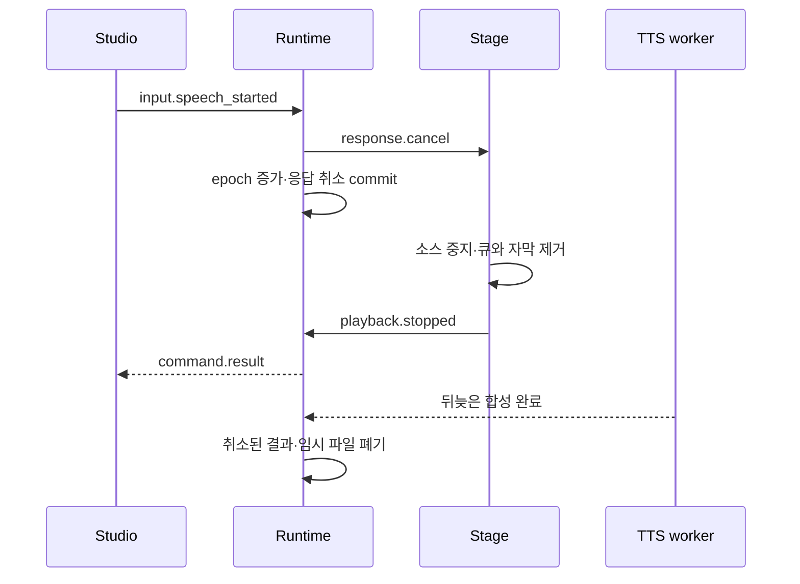

# AI Character Runtime — 런타임 통신 명세

2026-10-04 준비 상태 추가: 인증된 Studio의 `/health/ready` 응답은 `appraisal: {provider, model, status, inferenceVerified, errorCode}`로 사건 해석을 구분한다. Jev status는 blocked/configured/ready/unavailable이며 configured는 키·flags 준비만 뜻한다. 첫 유효한 Jev 응답 전에는 inferenceVerified=false다. 시작·health poll은 Jev 추론하지 않는다. `llm`/`llmDetails`는 기존 대사 생성 Qwen 상태다. 모의 해석 provider는 `jev-mock`으로 표시하고 실제 Jev ready로 표시하지 않는다. Stage 메시지와 wire version은 유지한다.

작성일: 2026-09-27  
계약 버전: `runtime-v1` / wire `protocolVersion: 1`  
상태: 구현 전 계약. 브라우저·OBS 통합과 지연·자동 재생 동작은 아직 검증하지 않았다.

관련 문서: [MVP 범위](./MVP_SPEC.md), [도메인 규칙](./CHARACTER_DOMAIN_SPEC.md), [로컬 AI 연동](./LOCAL_AI_INTEGRATION.md), [DB 설계](./DATABASE_SPEC.md), [기술 설계](./technical_architecture_v1.md)

## 1. 범위와 결정

Studio는 입력·운영, Stage는 아바타·자막·음성을 담당한다. Node 서버가 세션·캐릭터 상태·실제 출력 기록의 기준이다. 화면이 보낸 감정 수치나 완료 주장을 그대로 상태로 복사하지 않는다.

MVP 전송 경로는 다음 세 가지다.

| 경로 | 전송 내용 |
|---|---|
| `/api/*` HTTP JSON | 세션·기억·활동 조작, 조회, 출력 권한 선택 |
| `/ws/control` WebSocket JSON | 채팅·마이크 시작/종료, 상태·표현·취소·전달 보고 |
| `/api/*/audio` HTTP binary | 완성 녹음 업로드와 문장 WAV 다운로드 |

누르고 말하기와 완성 waveform을 사용하는 현재 범위에서는 별도 `/ws/audio`와 PCM frame 프로토콜을 구현하지 않는다. 기술 설계의 두 WebSocket·40ms 입력 frame 예시를 이 방식으로 구체화한다. 이후 진짜 음성 streaming이 필요하면 별도 버전으로 확장한다.

작업 성공의 기준은 연결된 화면 수가 아니라 **입력이 한 번 적용되고, 유효한 출력만 단일 Stage에서 전달되며, 취소·재접속 뒤 과거 음성이 재생되지 않는 것**이다.

## 2. 주소·역할·권한

### 2.1 같은 출처에서 제공

개발 화면은 `http://localhost:5173`, 서버는 `http://127.0.0.1:3001`이다. Vite가 `/api`, `/ws`를 proxy하므로 브라우저 코드는 상대 URL만 사용한다. 실행 모드는 Fastify가 `http://127.0.0.1:3001/studio`와 `/stage`를 제공한다. 임의 host·port·Origin을 허용하지 않는다.

Origin은 허용 목록과 정확하게 비교한다. WebSocket과 mutation의 Origin은 `null`/누락이면 거부한다. **2026-10-03 실제 브라우저 검증에 따른 GET 예외:** same-origin GET fetch는 브라우저가 Origin을 생략하므로, Origin이 없을 때 `Sec-Fetch-Site: same-origin`과 Referer origin의 정확한 allowlist 일치를 함께 요구한다. 이 경우도 역할 token 인증은 필수다. cross-site/hostile Referer/누락 Referer는 거부한다. 로컬 CLI liveness만 별도로 허용한다. Origin 검사는 인증을 대신하지 않는다. [Origin 헤더](https://developer.mozilla.org/en-US/docs/Web/HTTP/Reference/Headers/Origin)

| 자격 | 허용 | 금지 |
|---|---|---|
| studio | 세션·테스트 입력·활동·기억 관리, 진단 조회, Stage 선택 |
| stage | 공개 표현 수신, 자신에게 할당된 WAV 조회·전달 보고 | 기억·관계 원본 조회, 입력 제출, 자의적 출력 소유권 획득 |
| 미인증 | 정적 화면과 최소 liveness, 페어링 교환 | 상태·음성·운영 API |

Studio의 일반 미리보기는 음소거다. 소리가 필요한 미리보기는 별도 stage 자격을 받아 동일한 출력 소유권 절차를 거친다. Studio라는 이유로 두 번째 재생 경로를 만들지 않는다.

### 2.2 로컬 페어링

계정·비밀번호 시스템 대신 서버 메모리에서 관리하는 제한된 로컬 자격을 사용한다.

1. 런타임 시작 시 256bit 이상 난수의 일회용 Studio 코드를 로컬 실행 화면에 표시한다. 발급·토큰 원문은 일반 로그에 남기지 않는다.
2. 브라우저가 `POST /api/auth/exchange`에 `{code, clientInstanceId}`를 보내면 코드의 역할·만료·사용 여부를 검사하고 `{accessToken, role, expiresAt}`를 반환한다.
3. Studio는 `POST /api/stage-pairings`으로 stage 전용 코드를 발급받는다. 기본 유효시간 5분·한 번 사용이다.
4. Stage 주소의 fragment `#pair=...`로 전달할 수 있다. 페이지는 읽은 즉시 주소에서 제거하고 교환한다. query string·WAV URL에는 토큰을 넣지 않는다.
5. accessToken은 역할과 clientInstanceId에 묶고 sessionStorage에 보관한다. 유효시간 초기 8시간, 서버 재시작 시 무효화한다. 자동 갱신은 MVP에 없다.

HTTP는 `Authorization: Bearer ...`를 사용한다. WebSocket은 최초 auth 메시지로 전달하며 5초 이내 인증하지 않으면 종료한다. 브라우저 자격에 원본 token을 넣은 로그·에러·snapshot을 만들지 않는다. OBS 재시작 등으로 자격을 잃으면 Studio에서 다시 페어링한다.

토큰 확인과 허용 Origin 확인을 모두 적용한다. mutation 요청에는 JSON content type과 request ID를 요구한다. 세션 종료나 페어링으로 로컬 모델 환경·PC의 다른 프로세스에 권한을 주지 않는다.

## 3. ID·버전·메시지 봉투

### 3.1 식별자의 의미

| 이름 | 생성자·수명 |
|---|---|
| clientInstanceId | 브라우저가 생성한 UUID. 탭의 sessionStorage 수명 |
| connectionId | 서버가 WS 연결마다 발급. 재접속하면 바뀜 |
| serverInstanceId | 서버 기동마다 발급. 재시작 감지용 |
| sessionId | DB 세션 UUID. 재접속은 유지, 서버 재시작 후 새 세션 |
| messageId / requestId | 전송 메시지 / 논리 명령 UUID. 같은 명령 재시도는 같은 requestId |
| eventId / responseId / segmentId | 서버 DB가 확정한 입력·출력 식별자 |
| utteranceId | Studio가 녹음마다 새로 발급. 최종 전사 중복 방지 |
| stateVersion | Core commit 순서. 화면 전송 순서와 별개 |
| generationEpoch | 취소된 계획·늦은 결과 배제. 캐릭터 상태 기준 |
| outputEpoch | Stage 출력 소유권 세대. 세션별 증가 |

DB bigint에 대응하는 값은 **JSON에서 십진 문자열**이다. `"0"` 또는 앞자리 0 없는 양의 정수 문자열만 허용한다. 내부 TypeScript는 bigint로 비교한다. stateVersion·generationEpoch·outputEpoch·configVersion·sourceVersion·sequence 모두 이 규칙을 따른다. 지연 ms·음성 sample rate·0/1 segmentIndex 등 작은 값만 number다.

### 3.2 WebSocket envelope

```typescript
type Envelope<T> = {
  protocolVersion: 1;
  messageId: string;          // UUID
  type: string;              // 아래 등록 목록으로 제한
  connectionId: string;
  sessionId: string | null;
  sequence: string;           // 연결·방향별 1부터 증가
  requestId?: string;
  payload: T;
};
```

인증 전 첫 메시지만 `{protocolVersion:1,type:"auth",accessToken,clientInstanceId}`로 보낸다. 서버가 auth를 수락하면 `connection.welcome`을 sequence `"1"`로 보내고 이후 envelope를 사용한다. welcome payload는 serverInstanceId·role·현재 sessionId·heartbeat 간격이다. 클라이언트의 첫 envelope도 자기 방향 sequence `"1"`부터다.

connectionId 불일치·sequence 중복/역행/누락은 프로토콜 오류다. WebSocket 내부 전송은 순서대로 처리하되 async handler가 완료되는 순서로 dispatch하지 않는다. 응용 명령 재시도는 새 sequence/messageId와 기존 requestId로 보낸다.

JSON 최대 64KiB, payload는 type별 Zod schema로 검증하고 알 수 없는 키를 거부한다. 버전 불일치 시 묵시적 변환 없이 `unsupported_version`으로 종료한다. 새로운 필수 의미를 추가할 때 wire version을 올린다.

### 3.3 명령 결과와 재시도

영구 변경 명령은 `command.result`로 `{requestId,status:"committed"|"duplicate"|"rejected",eventId?,error?}`를 반환한다. `committed`는 DB 반영 완료이지 대답·음성 완료가 아니다. 서버가 받았다는 중간 표시를 committed로 부르지 않는다.

서버는 사건 source_namespace와 requestId로 명령을 중복 처리한다. 동일 requestId의 다른 body는 `idempotency_conflict`다. HTTP mutation도 `Idempotency-Key: UUID`를 사용하고 같은 원칙을 따른다. 캐릭터 전체·세션·역할·대상 리소스의 범위를 포함해 namespace를 만든다.

5초 안에 ACK가 없으면 화면에 결과 확인 중을 표시한다. 같은 연결에서 같은 requestId로 최대 두 번 조회성 재시도를 할 수 있다. 세션 종료·입력 취소 뒤 또는 재접속 후에는 채팅·마이크·활동 명령을 자동 재전송하지 않는다. `GET /api/commands/:requestId`로 이미 commit됐는지 조회해 UI만 복구한다. 서버는 현재 역할과 허용 캐릭터의 기록만 반환한다.

## 4. HTTP API

성공 JSON은 `{data:...}`, 실패는 `{error:{code,message,requestId,retryable}}`다. 조회 cursor는 불투명 문자열, limit 기본 50·최대 100이다. 음성 경로를 제외한 body는 64KiB로 제한한다.

| 메서드·경로 | 요청 / 결과·조건 |
|---|---|
| `GET /health/live` | 인증 없이 프로세스 alive만 반환 |
| `GET /health/ready` | Studio만 DB·LLM·STT·TTS·Stage 준비 상태, 경로·비밀값 제거 |
| `POST /api/auth/exchange` | 일회용 코드 교환 |
| `POST /api/stage-pairings` | Studio만 stage 코드 발급 |
| `GET /api/stages` | Studio만 연결된 stage의 ID·준비·소유 상태 |
| `GET /api/sessions/current` | Studio 또는 Stage가 접근 가능한 현재 세션 ID·상태, 없으면 null |
| `GET /api/problems` | Studio만 문제 ID·공개 문제·허용 답 형식·등록 hint ID 목록. 정답·숨겨진 hint 내용 제외 |
| `POST /api/sessions` | `{sessionId,characterId,configVersion}` → 세션. 초기 시작 ID는 요청자가 UUID로 제안하고 서버 검증 |
| `POST /api/sessions/:id/stop` | `{reason:"operator_stop"}` → ending commit, 입력 차단·출력 취소·종료 정리 예약 |
| `GET /api/commands/:requestId` | commit된 명령 결과 또는 `not_found`; 새 작업 실행 없음 |
| `GET /api/characters/:id/state` | Studio용 commit 상태·버전 |
| `GET /api/sessions/:id/timeline` | Studio용 cursor 사건 목록·관측 상태 |
| `GET /api/characters/:id/memories` | Studio용 유효 기억·버전·출처 |
| `POST /api/memories/:id/corrections` | `{expectedVersion,content,sourceEventIds}` → 근거 검증 후 새 contentVersion |
| `DELETE /api/memories/:id` | `If-Match: "contentVersion"` → 기억 삭제 commit·출력 무효화 |
| `DELETE /api/events/:id` | Studio만 `If-Match: "revision"` → 원본 삭제·파생 자료 정리 |
| `POST /api/sessions/:id/activities` | `{problemId}` → 현재 미완료 활동이 없을 때 시작 |
| `POST /api/activities/:id/hints` | `{hintId,identityId}` → 등록 힌트의 실제 사용·참여자 기록 |
| `POST /api/activities/:id/retry` | `{}` → 명시적 추가 제출 기회 한 번 |
| `POST /api/activities/:id/end` | `{}` → 활동 명시 종료 |
| `POST /api/sessions/:id/output-owner` | `{stageClientId,previousStageClosed:false}` → 기존 Stage 중지 확인 뒤 새 소유자 부여 |
| `POST /api/sessions/:id/utterances/:utteranceId/audio` | Studio의 녹음 WAV. 사전 start/end 승인 필요 |
| `GET /api/sessions/:id/segments/:segmentId/audio` | 할당받은 Stage만 현재 유효 WAV 수신 |

수정 시 expectedVersion/If-Match 불일치는 409 `revision_conflict`다. 기억 문구를 바꾸는 요청만으로 facts·활동 성공을 위조할 수 없다. 숨겨진 정답 판정 API와 클라이언트가 arbitrary events를 삽입하는 API는 공개하지 않는다.

단순히 네트워크가 끊겼다고 세션 시작을 반복하지 않는다. POST sessions의 같은 sessionId·Idempotency-Key 재요청은 기존 결과를 반환하고 다른 본문이면 충돌이다. 나머지 세션 사건과 같은 트랜잭션에 시작 사건을 저장한다. 세션 종료는 ending이 commit되면 더 이상 입력을 받지 않고, 취소 전파 후 ended로 닫는다. 정리 task가 끝날 때까지 종료 UI를 막지 않는다.

## 5. 연결·snapshot·상태 갱신

인증 뒤 클라이언트는 `session.subscribe` payload `{sessionId}`를 보낸다. 서버는 읽기 권한을 검사하고 현재 상태의 snapshot을 보낸다. 활성 세션이 없으면 sessionId=null의 대기 상태를 전달한다. 세션 변경은 Studio의 명시적 시작 결과 또는 현재 세션 조회로 결정한다.

| S→C 메시지 | 대상·payload |
|---|---|
| `connection.welcome` | 공통: serverInstanceId, role, activeSessionId, heartbeatMs=1000 |
| `session.snapshot` | 공통: status, stateVersion, generationEpoch, outputEpoch, outputOwnerClientId, ready |
| `state.snapshot` | Studio: 계산 기준 시각·감정·관계·활동·선택 행동·참조 기억 ID |
| `expression.set` | Stage: stateVersion, generationEpoch, expression, intensity, transitionMs |
| `runtime.status` | 공통: ready/degraded/unavailable, 구성별 오류 코드 |
| `session.ended` | 공통: 종료 상태·이유. 진행 출력 제거 |
| `command.result` | 요청자: 해당 명령의 commit·중복·거절 결과 |

MVP는 상태 patch를 사용하지 않고 최신 전체 snapshot을 보낸다. Studio 감정 갱신은 최대 10Hz다. 읽기용 decay의 computedAt과 원본 stateVersion을 함께 표시하며, 전송됐다는 이유로 DB version을 올리지 않는다. 같은 stateVersion이어도 더 최근 계산시각의 시각화는 수용할 수 있다.

Stage에는 감정·관계 숫자, 원본 채팅, 기억 내용, 숨겨진 정답을 보내지 않는다. expression은 `neutral | listening | happy | embarrassed | uncomfortable`, intensity는 0–1, transitionMs는 0–1000이다. Core가 선택하며 Stage가 대사를 재분류하지 않는다.

snapshot에는 과거 발화 재생 명령이나 WAV 목록을 넣지 않는다. 재접속은 최신 상태 표시를 회복하는 작업이며 끊긴 오디오를 이어 듣는 기능이 아니다.

Stage는 `session.snapshot`의 generationEpoch가 더 크면 이를 반영하고 이전 epoch의 현재 자막·대기 큐를 제거한다. 기억 정정·삭제처럼 활성 응답이 없어 `response.cancel`이 오지 않는 변경도 이 경로로 동기화한다. 취소 전에 예약된 렌더 콜백·완료 타이머는 이후 자막의 처리 중 상태를 바꾸거나 전달 ACK를 보내지 않는다.

## 6. 채팅·마이크 입력

### 6.1 채팅

`chat.submit` payload는 `{identityId,text,replyToEventId?}`다. Studio만 호출할 수 있고 identityId는 등록된 A·B·C 또는 운영자 중 하나여야 한다. text는 trim 후 1–1000 Unicode code points, 최대 UTF-8 4KiB다. HTML로 해석하지 않고 화면에는 textContent로 표시한다.

서버가 event ID·수신 시각·source key를 부여한다. `command.result`를 받은 뒤에도 주의 선택이 되기 전에는 읽었다고 표시하지 않는다. `input.status` payload `{eventId,status:"pending"|"selected"|"observed"|"ignored"|"expired"}`로 상태를 별도 알린다. 20초·100개 후보 상한과 공정성은 도메인 규칙을 따른다.

### 6.2 누르고 말하기

| C→S 메시지 | payload·처리 |
|---|---|
| `input.speech_started` | `{utteranceId}`. 녹음 슬롯 예약·듣기 표시·활성 출력 취소 |
| `input.speech_ended` | `{utteranceId,durationMs}`. 녹음 종료, WAV 업로드를 최대 10초 대기 |
| `input.speech_aborted` | `{utteranceId,reason}`. 슬롯·임시 음성 해제, 확정 발언 없음 |
| `response.stop` | `{responseId,reason:"operator_stop"}`. 해당 응답만 취소 |

Studio는 누른 즉시 로컬 미리보기를 멈추고 녹음한다. 서버 start ACK 전 오디오는 로컬 버퍼에만 유지한다. 거절이면 버퍼를 버리고 busy/권한 오류를 표시한다. 짧게 눌렀다 놓은 경우에도 같은 WS에서 start 다음 end를 보내며 서버가 순서대로 처리한다.

기존 녹음 1건·STT 대기 1건 상한을 넘으면 새 start를 거부한다. start를 받으면 기존 응답 취소는 즉시 제어 경로에서 처리하고 의미 처리 슬롯을 기다리지 않는다. 마이크의 상대는 서버가 지정한 운영자 ID다.

최대 녹음 15초. 버튼 놓침·blur·장치 오류 시 abort, 20초 동안 end/abort가 없으면 서버가 자동 폐기한다. Studio 연결이 끊겨도 부분 녹음은 버리고 새 utteranceId로 다시 시작한다.

end 승인 후 `audio/wav` body로 업로드한다. 16kHz·mono·PCM16·15초 이하, 파일 총크기 최대 512KiB다. RIFF header만 보지 않고 실제 sample 수·길이·채널·sample rate를 검사한다. body 수신 timeout 10초, 일부만 도착한 파일은 STT에 보내지 않는다.

업로드는 같은 utteranceId에 한 번만 수용한다. 같은 byte 내용의 요청이 이미 수용됐으면 기존 상태, 다른 내용이면 충돌이다. 연결이 끊긴 녹음은 자동 재업로드하지 않는다. STT 최종 결과는 `transcript.final` payload `{utteranceId,eventId,text}`로 Studio에 알리고 일반 입력 주의 경로로 넘긴다. 부분 전사 메시지는 v1에 없다. 실패는 `input.failed`이며 실패 전사를 확정 사건으로 저장하지 않는다.

## 7. 출력 소유권과 준비 상태

Stage는 페어링·subscribe 뒤 `stage.ready` payload `{audioUnlocked,avatarReady,supportsExpressions}`를 보낸다. 음성 자동 재생이 차단되면 audioUnlocked=false로 보고하고 화면의 소리 활성화 동작 또는 OBS 준비 절차를 통해 해제한다. AudioContext가 suspended인데 음성 완료를 보고하지 않는다. [Web Audio 준비](https://developer.mozilla.org/en-US/docs/Web/API/Web_Audio_API/Best_practices)

Studio가 준비된 Stage 하나를 선택하면 서버는 outputEpoch를 증가시켜 `output.granted` payload `{clientId,outputEpoch,generationEpoch}`를 보낸다. 다른 Stage는 표현 미리보기만 받고 음성·전달용 자막 명령은 받지 않는다. 자동 선착순 권한 탈취는 없다.

기존 소유자가 있으면 먼저 `output.revoke` payload `{outputEpoch,stopRequestId,reason:"owner_change"}`를 보내 재생·대기·decode를 중단시키고 `output.released` ACK를 기다린다. ACK 뒤 기존 응답 취소와 epoch 증가를 commit하고 새 소유자에게 부여한다.

기존 Stage 연결을 잃었다면 timeout만으로 재생이 멎었다고 확정하지 않는다. 새 소유권은 보류하고 Studio에 `previous_output_unconfirmed`를 표시한다. 운영자가 이전 브라우저 소스/창을 닫거나 OBS에서 음소거했음을 확인한 경우에만 `previousStageClosed=true`로 전환한다. 이 값은 실제 UI 확인 동작이며 앱이 자동으로 설정하지 않는다.

heartbeat는 양방향 `heartbeat.ping/pong`을 1초 간격으로 주고받는다. 각 payload는 nonce와 최근 sequence다. 3초간 서버 heartbeat를 받지 못한 Stage는 가능한 즉시 재생 중지·큐 삭제하고 재승인 전 출력하지 않는다. 하지만 브라우저 정지 상태에서는 타이머도 늦을 수 있으므로 heartbeat만으로 이중 출력 불가능을 보장하지 않는다. 정상 소유권 전환은 위의 중지 ACK를 사용한다.

서버 재시작 시 소유권은 자동 복원하지 않는다. 새 serverInstanceId를 받은 Stage는 모든 출력·자막을 비우고 재준비한다.

## 8. 대사·음성·표현 전송

### 8.1 출력 메시지

| S→Stage | payload |
|---|---|
| `response.start` | responseId, generationEpoch, outputEpoch, expression, intensity |
| `speech.segment` | responseId, segmentId, segmentIndex, generationEpoch, outputEpoch, text, modality, audio? |
| `response.sealed` | responseId, generationEpoch, outputEpoch, segmentCount |
| `response.cancel` | responseId, invalidatedGenerationEpoch, newGenerationEpoch, outputEpoch, reason |
| `response.finished` | responseId, outcome: completed/cancelled/failed/interrupted |

modality는 `audio_text | text`다. audio는 `{path,contentType:"audio/wav",sampleRate,channels:1,durationMs,byteLength,sha256}`다. path는 같은 출처의 segment audio 경로이며 로컬 파일 경로·토큰·임의 원격 URL을 포함하지 않는다. 표현·대사는 검증이 끝난 결과만 보낸다.

response.sealed는 더 보낼 문장이 없음을 알린다. segmentCount는 1 또는 2이고 index는 0부터 연속이다. 최종 문장 수와 전체 segment 행을 DB에 commit한 뒤 첫 segment를 보낸다. 실패·취소는 sealed 없이 닫힐 수 있다. sealed 수신이 실제 전달 완료를 의미하지 않는다.

### 8.2 다운로드와 재생

Stage는 자신에게 부여된 outputEpoch·responseId·generationEpoch가 일치할 때만 WAV를 fetch한다. HTTP 서버도 매 요청에서 같은 권한·취소 상태를 검사한다. 헤더는 `Cache-Control: no-store`이며 byteLength·hash·실제 audio header를 확인한 뒤 decode한다. 요청당 파일 상한은 8MiB, 길이 20초 이하다.

decode가 끝나도 최신 epoch와 취소 여부를 다시 검사한다. 유효하면 segmentIndex 순서로 재생하고 자막을 함께 표시한다. 한 문장 재생이 끝난 뒤 다음 문장을 시작한다. 문장 두 개를 수십 초 앞서 AudioContext에 미리 예약하지 않는다.

응답당 최대 두 문장·완성 오디오 합계 30초라는 AI 명세 상한을 유지한다. 다운로드 완료된 대기 버퍼도 이 상한에 포함한다. TTS 생성 방식과 네트워크 전송을 streaming으로 부르지 않는다.

WAV 조회 실패 시 취소·권한·410 gone은 즉시 폐기한다. 일시적 연결 실패는 동일 연결·유효 응답에서만 한 번 재조회할 수 있다. 재생 시작한 segment는 어떤 재시도에서도 다시 시작하지 않는다. reconnect 시 WAV·문장은 자동 재전송하지 않는다.

TTS 실패의 자막 대체는 같은 segment의 modality=text로 **재생 시작 전에만** 결정한다. Stage가 이미 음성 일부를 냈다면 처음부터 자막 대체를 새로 재생하는 대신 부분 전달/오류로 기록한다.

text 모드는 문장마다 `max(2000, min(8000, 글자수/15×1000))` ms 표시한 뒤 다음 문장으로 이동한다. 취소가 오면 이 표시 시간을 기다리지 않고 제거한다. caption.shown으로 해당 segment의 텍스트 전달은 기록하되 서버의 다음 행동을 위한 출력 종료 시각은 `caption.finished` 보고까지 기다린다. 마지막 문장도 표시 시간 후 지운다.

## 9. 전달 보고와 DB 반영

모든 Stage 보고는 requestId를 가진 명령이며 기본 payload에 `{responseId,segmentId,generationEpoch,outputEpoch}`를 넣는다. 서버는 인증된 clientInstanceId를 사용한다. 임의 playback_client_id를 payload로 받아들이지 않는다.

| Stage→S | 추가 필드·의미 | DB 대응 |
|---|---|---|
| `caption.shown` | 완전한 해당 문장을 DOM에 표시하고 렌더 기회를 거쳤을 때 | text_shown_at |
| `caption.finished` | text 모드 표시 시간이 끝났을 때 | delivery_status=finished, 출력 종료 시각 |
| `playback.started` | 재생 시작, playedMs=0 | audio_started_at, delivery_status=playing |
| `playback.progress` | playedMs, 최대 초당 2회 | played_ms 단조 증가 |
| `playback.completed` | 정상 끝까지 재생, playedMs=duration | audio_completed_at, finished |
| `playback.stopped` | playedMs, reason, captionWasShown | cancelled 또는 unknown, 전체 완료로 승격하지 않음 |
| `segment.failed` | code, playedMs | 전달 오류 기록 |
| `output.released` | segmentId 없이 outputEpoch, stopRequestId | 기존 소유자 출력 중지 확인 |

`caption.shown`은 브라우저가 전체 문장을 표시했다는 보고다. 실제 사람의 읽기·OBS 화면 노출을 보장하지 않는다. autoplay 실패나 서버 전송 완료는 playback.completed의 근거가 아니다.

AudioBufferSource의 ended callback은 취소된 node에서도 실행될 수 있으므로, 별도 cancelled flag·정상 종료 조건을 검사한다. stop 이후 callback을 완료 ACK로 보내지 않는다. 이미 수신한 정상 완료 ACK의 보완 처리는 허용하되 응답·Agenda를 다시 활성화하지 않는다.

서버는 ACK를 events로 중복 수용하고 speech_segments·response 결과·Agenda 변화를 같은 트랜잭션에서 반영한 뒤 command.result를 보낸다. 네트워크·decode 완료에는 DB 전달 완료 ACK를 만들지 않는다.

제안의 완전 전달은 **제안을 구성한 모든 segment**의 modality별 완료로 판정한다. audio_text는 모든 문장의 caption.shown이 있으면 delivered_text, 모든 음성 완료도 있으면 delivered_audio로 보완한다. 한 문장만 전달된 두 문장 제안은 완전 제안으로 취급하지 않는다. 완전 전달 보고를 서버가 채택한 시각부터 offered의 60초를 센다.

ACK는 탭 메모리에 최대 100개, 최대 30초 동안 유지할 수 있다. ACK 결과를 못 받았으면 같은 requestId로 재전송한다. 같은 serverInstanceId·세션에 재접속한 경우에는 **보고만** 다시 보낼 수 있다. 원래 소유자·해당 segment·epoch를 검증해 과거 전달 사실을 보완하되 음성을 재생하지 않는다. 서버 재시작·30초 만료·페이지 새로고침으로 보고를 잃으면 unknown을 유지한다.

## 10. 취소·끼어들기 순서



취소는 두 층으로 처리한다. 서버는 제어 메시지를 받자마자 메모리상의 출력 금지 장벽을 세워 Stage에 중지 명령을 보낸다. 이어 DB 트랜잭션에서 response cancelled·generation_epoch 증가를 확정한 뒤 명령 성공을 ACK한다. DB 실패 시에도 재생을 재개하지 않고 degraded 상태로 멈춘다. 취소 메시지가 먼저 갔다는 이유로 DB commit 성공을 가장하지 않는다.

이때 newGenerationEpoch는 서버가 직렬화된 제어 경로에서 예약한 다음 값이다. commit 전 중지가 필요해도 두 취소에 같은 새 값을 할당하지 않는다. commit 실패 후에는 같은 연결로 더 낮은 epoch의 재생을 허용하지 않는다. DB 복구·새 serverInstanceId의 재연결 절차에서 장벽과 실제 상태를 다시 맞춘 뒤에만 출력 권한을 부여한다.

Stage는 취소 도착 즉시 현재 node·예약 node를 stop하고 fetch를 abort하며, pending decode의 결과를 무시하고 대기 자막을 없앤다. 재생 node의 `stop()`은 예정된 재생도 중지할 수 있다. [Web Audio stop](https://developer.mozilla.org/en-US/docs/Web/API/AudioScheduledSourceNode/stop)

response.cancel은 중복 수신해도 같은 결과다. 취소 뒤 같은 responseId의 start/segment/finished 메시지가 늦게 와도 새 재생을 시작하지 않는다. 최신 generationEpoch보다 낮은 출력을 거부하며, 취소된 response ID는 해당 세션 동안 기억한다. 정상 종료와 취소를 구분해 already-delivered 문장 기록은 유지한다.

Studio와 Stage가 다른 브라우저·OBS 프로세스면 Studio 버튼만으로 Stage의 AudioContext를 직접 중지할 수 없다. 서버 전달 경로의 지연을 측정한다. 같은 화면의 로컬 미리보기만 즉시 중지 가능하며, 이를 OBS에서도 이미 즉시 멈춘 것으로 보고하지 않는다.

모델 계산 중단은 별도다. 합성이 계속돼도 결과를 폐기하고 GPU 슬롯은 실제 작업 종료까지 유지한다. 취소는 새 음성 입력을 막지 않지만, 다음 모델 호출이 자원 정리를 기다릴 수 있다.

## 11. 재접속·적체·장애

### 11.1 재접속

close/error를 감지한 화면은 진행 음성·녹음·대기 파일을 버린다. 0.5·1·2·5초 간격으로 최대 네 번 재접속하고 실패하면 사용자 재연결 동작을 기다린다. 인증 만료·버전 오류에는 자동 재접속하지 않는다.

서버의 heartbeat 응답 timeout은 `1008 / heartbeat_timeout`으로 구분하며 위 재접속 대상이다. 인증 만료는 heartbeat 상태보다 먼저 검사해 `1008 / token_expired`로 닫는다. 그 밖의 1008 인증·권한·프로토콜 오류는 자동 재접속하지 않는다.

화면 해제·수동 다시 연결로 Wire를 명시적으로 종료하면 예약된 재접속 타이머도 취소한다. 이미 대기 중인 재접속 콜백도 종료 상태를 확인해 이전 Wire의 연결을 다시 열지 않는다.

새 connectionId와 sequence로 auth→subscribe→snapshot을 다시 수행한다. 같은 serverInstanceId이면 세션은 유지되지만 과거 output grant를 그대로 사용할 수 없다. Stage는 연결 상실과 새 welcome에서 출력·큐를 비운 뒤 ready를 다시 보고한다. 서버는 기존 소유자와 같은 인증 clientInstanceId인 경우 끊긴 연결의 응답 취소를 먼저 마치고 새 outputEpoch의 `output.granted`를 보낸다. `/api/stages`의 owner는 실제 연결에 부여된 권한을 표시한다. 다른 Stage로 전환할 때는 기존 중지 ACK 또는 운영자의 닫힘 확인 조건을 유지하며, 재연결로 과거 응답을 재전송하지 않는다.

서버가 바뀌었으면 DB 복구 결과를 읽고 이전 세션 입력·응답을 재전송하지 않는다. 메모리 삭제 알림을 놓친 Studio는 snapshot·조회에서 다시 받아 표시를 교체한다. 서버는 invalidated source의 내용을 snapshot에 되살리지 않는다.

### 11.2 적체 상한

| 항목 | 초기 상한·처리 |
|---|---|
| JSON message | 64KiB, 초과 시 1009 종료 |
| client/server 제어 송신 큐 | 256KiB 또는 100개, 최신 state.snapshot은 합침 |
| 제어 backlog 지속 | 2초 이상이면 중지 시도 후 느린 연결 종료·출력 unknown |
| 입력 수용 | Studio 지속 50건/초 상한, 초과는 rate_limited; 후보 100개와 별도 |
| 녹음 | 15초·512KiB, 실행/대기 슬롯은 AI 명세 |
| 문장 음성 | 8MiB·20초, 응답 전체 30초·2문장 |
| WAV 전송 | Stage당 동시 다운로드 1건, 로컬 timeout 10초 |
| ACK 재전송 보관 | 100개·30초, payload 원문은 별도 복사하지 않음 |

브라우저 기본 WebSocket은 자동 backpressure가 없으므로 bufferedAmount와 앱 큐를 검사한다. 아직 send하지 않은 state 갱신만 최신 값으로 합치며 cancel·ACK를 조용히 버리지 않는다. 이미 socket에 적재한 바이트의 앞에 cancel을 끼워 넣을 수는 없으므로 제어 큐 자체를 작게 유지한다. [WebSocket API](https://developer.mozilla.org/en-US/docs/Web/API/WebSocket)

### 11.3 오류 계약

| code | HTTP 예 | 동작 |
|---|---:|---|
| invalid_message / unsupported_version | 400 | 수정 전 재시도 금지 |
| unauthenticated / forbidden | 401 / 403 | 재페어링 또는 역할 확인 |
| session_closed / stale_epoch / revision_conflict | 409 | snapshot 갱신, 기존 명령 자동 재실행 금지 |
| idempotency_conflict | 409 | 같은 ID의 다른 본문 거부 |
| previous_output_unconfirmed | 409 | 이전 Stage 중지 확인 전 새 출력 보류 |
| audio_gone | 410 | 재생하지 않고 큐 제거 |
| payload_too_large / unsupported_audio | 413 / 415 | 녹음 형식·길이 수정 |
| busy / rate_limited | 429 | 제한 표시, 자동 무한 재전송 금지 |
| db_unavailable / provider_unavailable | 503 | 상태 변경·새 추론 보류, 현재 출력 중지 |

WS 도메인 오류는 command.result의 rejected로 응답하고 연결은 유지할 수 있다. 인증·권한 위반은 1008, 비정상 JSON은 1007, 크기 초과는 1009, 서버 오류는 1011로 종료한다. 정상 종료는 1000이다. close reason에는 원문·토큰·로컬 파일 경로를 넣지 않는다.

## 12. 메시지 예시

아래 UUID·텍스트·시각·길이는 형식 예시다. 실제 세션에서 측정하거나 생성한 결과가 아니다. 각 JSON은 독립적인 메시지이며 동일 연결의 연속 로그는 아니다.

```json
{
  "protocolVersion": 1,
  "messageId": "d07c3d92-6327-4093-b4ac-3bbb4c658001",
  "type": "chat.submit",
  "connectionId": "b8700213-ff85-42ba-9e7a-b14c00a49001",
  "sessionId": "784c9772-dcb4-47ee-b64c-f5b988b23001",
  "sequence": "2",
  "requestId": "82599f21-8950-4723-bde1-e1fbc78b2001",
  "payload": {
    "identityId": "c166606b-5ba5-4207-98e1-1008d7344001",
    "text": "아까 풀던 문제 이어서 하자."
  }
}
```

```json
{
  "protocolVersion": 1,
  "messageId": "d07c3d92-6327-4093-b4ac-3bbb4c658002",
  "type": "speech.segment",
  "connectionId": "b8700213-ff85-42ba-9e7a-b14c00a49002",
  "sessionId": "784c9772-dcb4-47ee-b64c-f5b988b23001",
  "sequence": "8",
  "payload": {
    "responseId": "937c7886-0166-4125-931f-bcc35d4d2001",
    "segmentId": "7097ba13-7f25-4372-b1a4-218d210db001",
    "segmentIndex": 0,
    "generationEpoch": "4",
    "outputEpoch": "2",
    "text": "남겨 둔 문제부터 보자.",
    "modality": "text"
  }
}
```

```json
{
  "protocolVersion": 1,
  "messageId": "d07c3d92-6327-4093-b4ac-3bbb4c658003",
  "type": "response.cancel",
  "connectionId": "b8700213-ff85-42ba-9e7a-b14c00a49002",
  "sessionId": "784c9772-dcb4-47ee-b64c-f5b988b23001",
  "sequence": "9",
  "payload": {
    "responseId": "937c7886-0166-4125-931f-bcc35d4d2001",
    "invalidatedGenerationEpoch": "4",
    "newGenerationEpoch": "5",
    "outputEpoch": "2",
    "reason": "user_speech_started"
  }
}
```

## 13. 구현 검증

| ID | 상황 | 통과 기준 |
|---|---|---|
| RT01 | 잘못된 Origin·token·역할 | 원본·WAV·운영 API 접근 거부 |
| RT02 | version/sequence/연결 ID 오류·초대형 JSON | 명확한 오류, 상태 변화 없음 |
| RT03 | 같은 명령 재시도·다른 본문 충돌 | effect 한 번, 덮어쓰기 없음 |
| RT04 | Studio·OBS·추가 Stage 동시 연결 | 승인한 Stage만 발성·전달용 자막 출력 |
| RT05 | 출력 소유권 전환 중 기존 연결 단절 | 중지 확인 또는 명시적 종료 확인 전 새 출력 보류 |
| RT06 | 시작 ACK 전 짧은 녹음 종료 | start/end 순서 유지, 녹음 한 번만 전사 |
| RT07 | 녹음 도중 연결 끊김·빈 WAV·가짜 header | 확정 경험 없음, 슬롯·임시 파일 회수 |
| RT08 | WAV 수신/decoding 중 취소 | 늦은 완료로 재생 시작하지 않음 |
| RT09 | 재생 중 끼어들기·예약된 다음 문장 존재 | 현재·다음 소스 모두 중지, 단어 전체 전달 추정 없음 |
| RT10 | stop에 의한 ended callback | completed로 잘못 ACK하지 않음 |
| RT11 | ACK 중복·역순·다른 outputEpoch | DB 전달 상태 역행·중복 효과 없음 |
| RT12 | 두 문장 제안 중 한 문장만 전달 | 완전 offered로 승격하지 않음 |
| RT13 | Stage 재접속·서버 재시작 | snapshot만 복구, 과거 WAV 재생 없음 |
| RT14 | 삭제·정정과 segment 도착 경쟁 | stale 출력 폐기, 삭제 내용 재표시 없음 |
| RT15 | autoplay 차단·AudioContext suspended | 준비 실패 표시, 허위 재생 완료 없음 |
| RT16 | 느린 클라이언트·대량 state 갱신 | 큐 상한, 제어 무한 적체 없음 |
| RT17 | 취소 전달 뒤 DB commit 실패 | 출력은 멈춤, 성공 ACK 없음, 복구 전 재개 없음 |
| RT18 | ACK 유실 후 동일 서버 재접속 | 전달 보고만 중복 없이 보완, 재발성 없음 |

schema·상태 전이는 자동 검사하고, 브라우저 AudioContext·OBS·장치 권한·실제 취소 지연은 통합 시험으로 확인한다. 같은 탭의 stop 시간과 별도 OBS Stage 중지 시간을 나눠 기록한다. 이 문서에서는 미측정 성능을 통과로 표시하지 않는다.

[검증 계획](./VALIDATION_PLAN.md)에서 MVP 가설과 도메인 D01–D18, AI01–AI14, DB01–DB18, RT01–RT18을 검증 단계·실행 방법·합격 기준으로 묶는다. [구현 계획](./IMPLEMENTATION_PLAN.md)에서 이를 개발 작업과 선행 조건으로 나눈다.
