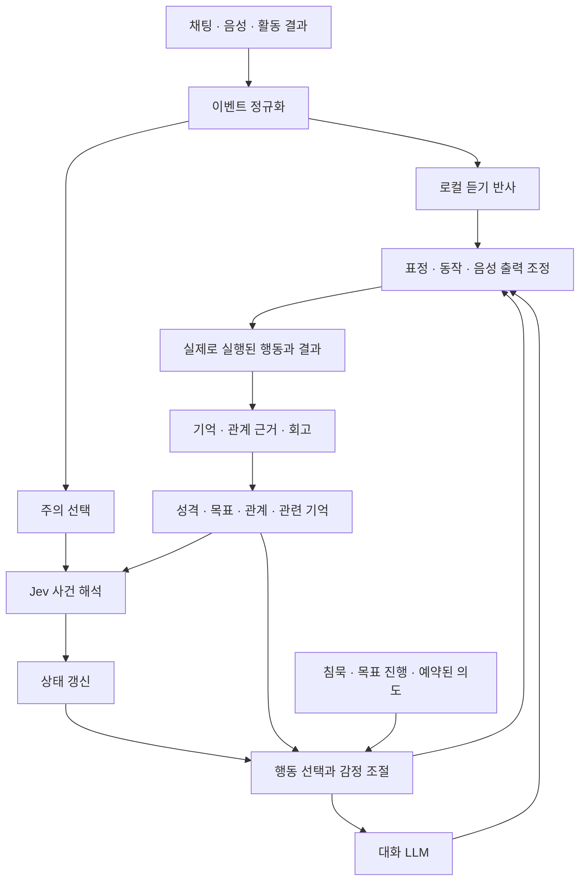

# 경험이 이어지는 AI 캐릭터 런타임 — 기획 발전안 v2

> 2026-10-04 범위 수정: Jev 사건 해석은 MVP 필수다. 정상 경로는 Jev → Core → 로컬 Qwen → Stage다. 원격 Jev의 비용·합성 입력 전송은 별도 승인 조건이며, 승인 전에는 차단 상태로 개발·모의 검증한다. 아래 최초 작성일의 설치·실행 기록은 당시 범위를 유지한다.

작성일: 2026-09-20  
기반 문서: `D:\다운로드\jev_ai_character_runtime_plan.md`  
성격: 원안의 방향을 이어받은 제안서. 구현 완료 사항이나 확정된 제품 사양은 아니다.

> 과거 2026-09-20 구현 조건 기록(2026-10-04 Jev 필수 요청으로 대체됨): 사용자 요청에 따라 **추가 API 비용 없이 기존 PC에서 실행**한다. 실제 스택은 [로컬 기술 설계](./technical_architecture_v1.md)를 우선한다. 사건 해석·대화는 설치된 Ollama 모델, TTS는 기존 OmniVoice, STT는 로컬 Whisper 계열을 사용한다. 아래 Jev 설명은 초기 후보 검토 기록이며 현재 구현의 필수 의존성이 아니다. 지연 목표도 로컬 추론 조건에서 다시 측정한다.

## 1. 제품의 중심을 더 선명하게

> **같이 겪은 일이 다음 만남의 말투, 선택, 관심사에 남는 AI 캐릭터.**

원안의 강점은 감정의 지속성, 감정과 표현의 분리, 관계에 따른 해석, 경험에 따른 변화다. 이 네 가지를 사용자가 실제로 알아차리는 장면으로 연결하는 것이 다음 과제다.

내부 상태가 복잡해지는 것만으로 캐릭터가 입체적으로 느껴지지는 않는다. 과거 경험이 현재의 **행동 선택**을 바꾸고, 그 선택이 캐릭터의 일관된 취향과 연결되어야 한다.

첫 제품은 한 캐릭터를 운영하는 제작자용 실험 런타임으로 잡는다. 제작자는 상태와 반응을 조정하고, 시청자는 방송을 통해 결과를 경험한다. 범용 캐릭터 제작 플랫폼, 마켓플레이스, AI 집사는 검증 이후의 확장 후보로 둔다.

성공의 첫 증거는 “감정이 다양하다”는 평보다 다음과 같은 말이다.

> “얘가 아까 일을 아직 신경 쓰네.”  
> “지난번에 같이 했던 일 때문에 저렇게 말하는구나.”  
> “내가 말을 안 걸어도 얘는 하고 싶은 게 있네.”

## 2. 먼저 만들 대표 경험: 세 번의 만남

하나의 연속된 시나리오로 핵심 기능을 검증한다. 아래 대사는 의도한 경험의 예시이며, 실제 데모에서 정해진 순서대로 재생할 스크립트는 아니다.

| 시점 | 함께 겪는 일 | 캐릭터에게 남는 것 | 다음 행동에서 보이는 변화 |
|---|---|---|---|
| 첫 방송 | 캐릭터가 퍼즐을 풀고, 시청자 A가 힌트를 준다 | 퍼즐 사건, 도움의 결과, A에 대한 첫 인상 | 곧바로 정답을 받기보다 “힌트만 줘”라고 요청 |
| 같은 방송 후반 | A가 같은 칭찬을 여러 번 한다 | 친숙함은 조금 증가, 칭찬의 새로움은 감소 | 처음에는 좋아하다가 나중에는 짧게 웃고 퍼즐로 복귀 |
| 두 번째 방송 | 같은 플랫폼 계정의 A가 들어온다 | 지난 공동 경험, 미완료 목표 | “오늘은 힌트 한 번만 쓰고 풀어볼 거야.” |
| 두 번째 방송 후반 | 캐릭터가 오답을 확신했다가 틀린다 | 자신의 실제 발언과 결과의 불일치 | 머쓱해하고, 이후에는 확인한 뒤 답하기 |
| 세 번째 방송 | 비슷한 퍼즐을 다시 만난다 | 실패에서 남은 대응 방식 | “잠깐, 지난번에 여기서 너무 빨리 말했어.” |

이 경험에는 악플, 배신, 강한 상처가 없어도 된다. **공동 성취, 익숙한 농담, 작은 실수, 다음에 해보고 싶은 일**만으로도 개인사를 만들 수 있어야 한다.

## 3. 원안에 더할 핵심: 캐릭터 자신의 목적

현재 원안은 외부 자극을 잘 해석하는 구조다. 여기에 “지금 무엇을 하려는가”를 명시하면 감정과 자발성이 연결된다.

목적을 세 층으로 나눈다. 초기에는 각각 하나씩만 있어도 된다.

| 층 | 예시 | 변화 속도 |
|---|---|---|
| 가치 | 스스로 이해해서 해내고 싶다 | 제작자가 정하며 초기에는 고정 |
| 세션 목표 | 오늘 퍼즐을 힌트 한 번 이하로 풀고 싶다 | 방송 단위 |
| 현재 의도 | 답을 듣기 전에 20초만 더 생각하고 싶다 | 대화·행동 단위 |

같은 도움도 목적에 따라 다르게 해석된다. 막막할 때의 힌트는 고맙고, 스스로 풀려는 순간의 정답 공개는 아쉬울 수 있다. 이 차이가 있어야 캐릭터가 모든 친절에 동일하게 웃지 않는다.

초기 캐릭터 예시:

- 호기심이 많고, 알아가는 과정을 좋아한다.
- 도움받는 것은 좋아하지만 바로 정답을 듣는 것은 싫어한다.
- 방송 분위기를 챙겨 짜증을 바로 드러내지 않는다.
- 틀렸을 때 잠깐 허세를 부리지만, 진정하면 인정한다.

이 설정은 프롬프트뿐 아니라 도움 요청, 답변 보류, 화제 유지, 사과 등의 행동 선택에 반영한다. 이름과 외형은 별도 제작 선택이다.

## 4. 행동 선택 계층을 아키텍처의 중심에 둔다

감정이 올라갔다고 바로 표정을 만들거나 대답하지 않는다. 현재 목표, 상대, 대화 차례, 표현 전략을 함께 보고 행동을 선택한다.



초기 행동 후보는 작게 시작한다.

`listen`, `acknowledge`, `answer`, `ask`, `continue_activity`, `change_topic`, `pause`, `ignore`

예를 들어 높은 분노가 항상 반박을 뜻하지는 않는다. 방송 목표와 감정 조절 성향에 따라 잠깐 멈추거나, 짧게 경계를 말하거나, 진행하던 활동으로 돌아갈 수 있다.

LLM에는 상태 숫자 전체보다 **이번 발화의 의도와 제약**을 전달한다.

```yaml
intent: ask_for_hint
target: viewer_A
context: 현재 퍼즐을 스스로 풀고 싶지만 진행이 막힘
affect: 조금 답답하지만 의욕은 남아 있음
delivery: 짧게 말하고 상대 답을 기다림
grounded_memory: 지난 세션에서 A가 준 힌트가 도움이 됨
constraints:
  - 정답 전체를 요청하지 않음
  - 근거 없는 과거 대화를 추가하지 않음
```

대사는 이 의도를 표현한다. LLM이 임의로 친밀도를 올리거나, 새 과거를 만들거나, 차단 같은 외부 동작을 실행하지 않는다.

## 5. 사건 해석: 무엇을, 누구에게, 왜 중요하게 느꼈는가

`hostility`만 높다고 분노를 올리면 인용, 농담, 게임 속 적에 대한 말도 자신에 대한 공격이 된다. 최소한 다음 구분이 필요하다.

| 필드 | 역할 |
|---|---|
| 대상 | 캐릭터 자신, 다른 사람, 활동, 인용문, 불명확 |
| 발화 행위 | 질문, 칭찬, 비판, 장난, 제안, 정정, 기타 |
| 목표와의 관계 | 현재 목표를 돕는지, 막는지, 관계없는지 |
| 중요도 | 캐릭터 가치·관심사와 얼마나 관련 있는지 |
| 해석 불확실성 | 장난과 공격 등 여러 해석이 가능한지 |
| 근거 | 원문 이벤트와 실제 관측 결과 |

감정에도 대상을 남긴다. “퍼즐 실패 때문에 답답함”과 “A에게 실망함”을 구분해야 다음에 들어온 B에게 이유 없이 화풀이하지 않는다. 전체 기분이 말투에 약하게 영향을 주는 것은 별도 조절한다.

신뢰하는 사람이 부정적인 말을 했다고 바로 배신으로 처리하지 않는다. 먼저 장난, 실수, 비판, 오해 가능성을 검토한다. **예상 위반은 주의를 높이는 신호**이며, 부정적 의도를 확정하는 근거가 아니다.

불명확한 해석은 잠정 상태로 보관하고 “그거 나한테 한 말이야?”처럼 확인할 수 있다. 해석 불확실성과 감정 강도는 다른 값이다.

## 6. Jev의 역할을 실제 인터페이스에 맞춰 구체화

공식 문서에서 Jev는 상태와 질문을 받아 `Choice`, `Score`, `Noul` 형태로 판단을 반환한다. 여러 질문은 같은 상태를 대상으로 독립적으로 평가되며, Choice·Score에는 confidence가 제공된다. [TypeSafe 공식 문서](https://docs.typesafe.ai/introduction)

따라서 원안의 “빠른 사건 해석” 용도로 실험할 근거는 있다. 다만 이것이 한국어 방송의 반어·은어·친한 사이의 장난을 정확하게 구분한다는 증거는 아니다.

제안하는 분담:

| Jev가 해석할 것 | 런타임 코드가 계산할 것 |
|---|---|
| 주어진 맥락에서 누구를 향한 말인가 | 계정 ID, 등장 횟수, 마지막 상호작용 시각 |
| 질문·장난·비판 중 무엇에 가까운가 | 반복 자극의 횟수와 감쇠 |
| 현재 목표에 도움이 되는가 | 감정 변화량, hold, decay |
| 발언의 공격적 강도는 어느 정도인가 | 주의 우선순위, 발화 가능 여부, 쿨다운 |

“이 사람은 영구 차단할 악플러인가”처럼 장기 평가와 실행 권한을 합친 질문은 피한다. 관측 가능한 발언 특성을 해석하고 운영 정책이 행동을 결정한다.

질문 간 의존성도 명확히 한다. 같은 호출 안의 두 번째 질문이 첫 번째 질문의 결과를 읽는다고 가정하지 않는다. 대상 후보 등은 공통 입력에 제공하고 결과를 코드에서 결합한다. 꼭 필요한 의존 판단만 다음 호출로 분리한다.

`hostility 0.8`의 의미를 정의해야 한다. “공격적이라는 확률”과 “공격의 강도 80%”는 다르다. 강도는 명시적인 등급 기준으로 평가하고, 불확실성은 별도로 처리한다.

정상 AppraisalProvider는 `jev-1.13.0`으로 고정한다. 한국어 품질·지연은 실제 평가로 확인하며 접근 불가/기준 미달이면 미완료로 남긴다. 다른 평가기 비교는 별도 실험이며 MVP 필수 Jev를 대체하지 않는다.

## 7. 실시간 반응은 두 단계로 나눈다

**듣고 있다는 신호**와 **뜻을 이해한 반응**을 분리한다.

| 단계 | 입력 | 가능한 출력 | 제한 |
|---|---|---|---|
| 로컬 반사 | 발화 시작, 음성 활동, 입력 도착 | 시선 이동, 듣는 자세 | 내용에 동의하거나 놀랐다고 확정하지 않음 |
| 의미 반응 | 안정된 부분 전사 또는 최종 전사와 해석 | 미소, 의문 표정, 맥락에 맞는 짧은 추임새 | 수정될 수 있는 전사로 장기 상태를 확정하지 않음 |
| 본격 응답 | 확정된 사건과 행동 계획 | LLM 대사, TTS, 동작 | 현재 대화 차례와 최신 상태를 확인 |

“싫어…”라는 부분 전사가 “싫어하는 건 아니고…”로 바뀔 수 있다. 부분 전사는 가벼운 임시 반응에만 쓰고, 최종 발화 하나를 감정·기억 갱신에 한 번 반영한다. 수정·취소된 해석이 영구 기록으로 남지 않게 한다.

음성 출력은 한 곳에서 조정한다. 추임새와 TTS가 겹치지 않게 하고, 사용자가 다시 말하기 시작하면 진행 중 응답을 중단하거나 보류한다. 이전 응답의 늦은 조각은 응답 ID와 취소 상태로 버린다.

초기 측정 목표는 로컬 입력 감지→듣기 동작 p95 150ms 이하, 최종 전사 수신→의미 반응 p95 800ms 이하, 발화 종료→첫 응답 음성 p95 2초 이하로 제안한다. 이는 성능 실측이나 인간 반응의 정답이 아닌 조정용 목표다. STT·해석·LLM·TTS·네트워크 시간을 나누어 기록한다.

TypeSafe가 공개한 70–500ms 수치는 공급자 측 조건의 결과다. 공급자는 평가를 주로 미국 서부에서 수행했다고 밝히므로, 한국의 실제 접속 환경과 방송 입력으로 따로 측정해야 한다. [TypeSafe 발표](https://typesafe.ai/blog/introducing-system-one-models-and-jev)

## 8. 감정·기분·표현은 작은 모델로 시작

첫 버전은 원안의 상태를 모두 구현하기보다 다음 정도로 시작한다.

| 상태 | 초기 범위 | 갱신 방식 |
|---|---|---|
| 단기 감정 | joy, frustration, surprise, embarrassment | 선택된 사건과 실제 활동 결과 |
| 기분 | pleasantness 하나 | 단기 사건의 제한된 누적과 기본값 복귀 |
| 활성도 | arousal 하나 | 사건·활동으로 증가, 시간에 따라 감소 |
| 표현 | 듣기, 중립, 기쁨, 당황, 불편함 | 행동 계획과 감정 조절에서 도출 |

sadness, fear, stress 등은 구분했을 때 행동이 실제로 달라지는 시점에 추가한다. 수치는 인간 심리를 재현한 측정값이 아니라 캐릭터 연출을 위한 내부 변수다.

시간 경과는 실제 경과 시간으로 계산한다. 프레임 수나 댓글 수가 감정의 반감기를 바꾸면 안 된다.

```text
hold 종료 후:
새 강도 = 기존 강도 × 2^(-경과 시간 / 반감기)
사건 반영 후:
강도 = clamp(새 강도 + 사건 자극, 0, 1)
```

감정의 증가와 자연 감소는 분리한다. 반대 감정이 들어왔다고 기존 감정을 즉시 삭제하지 않는다. 다만 모든 감정이 계속 최대치에 붙지 않도록 사건별 증가량과 누적량에 상한을 둔다.

동일 스팸이 hold를 영구 연장하지 않게 한다. 기분에 반영한 사건을 매 프레임 새 자극처럼 다시 더하지 않는다. 회상이 원래 사건의 감정을 재점화해도 새로운 외부 사건으로 다시 학습시키지 않는다.

극단 감정은 짧은 말, 응답 보류, 시선 회피, 주의 축소로 먼저 표현한다. 사실을 고의로 틀리거나 도구 권한 판단을 약화하는 방식은 사용하지 않는다. 집사 확장에서는 감정이 말투와 제안 시점에 영향을 주더라도, 일정·금전·파일 작업의 정확성 및 실행 권한은 별도로 유지한다.

## 9. 관계는 호감보다 공동 경험으로 발전

`familiarity`, `affinity`, `trust`의 분리는 유지한다. 첫 버전의 신뢰는 근거 목록과 제한된 집계로 시작하고, 충분한 경험이 쌓인 뒤 benevolence·integrity·reliability로 세분화한다.

칭찬은 호감의 근거가 될 수 있어도, 신뢰 증가에는 실제 행동과 결과가 필요하다. 힌트가 도움 되었는지, 잘못된 내용을 정정했는지, 함께 정한 약속을 지켰는지 등을 기록한다. 확인할 수 없는 결과는 신뢰 근거로 확정하지 않는다.

같은 사람의 반복 입력은 하루·사건 단위로 증가량을 제한한다. 한 사건을 실시간 갱신과 회고에서 두 번 적용하지 않는다. 단순 부재나 답변 없음은 배신으로 해석하지 않는다.

낯익은 이름만으로 동일 인물이라 판단하지 않고 플랫폼 계정 ID를 사용한다. 플랫폼 간 동일인 연결은 별도 확인이 없으면 하지 않는다.

관계의 재미는 점수 상승보다 **서로에게 익숙해진 방식**에서 나온다. “A는 정답보다 힌트를 주는 편”, “B와는 특정 농담이 통했다” 같은 근거 있는 경험이 대화에 드러나게 한다. 이를 고정된 인물 평가로 굳히지 않고 새 근거로 수정할 수 있게 한다.

## 10. 기억은 ‘함께 아는 것’과 ‘미완료된 것’을 포함

원안의 기억 분류에 두 가지 용도를 추가한다. 반드시 별도 DB나 엔진일 필요는 없다.

**공유 맥락:** 함께 만든 농담, 공동 성취, 이미 서로 확인한 사실. 개인 기억이 있어도 상대가 그 장면에 있었는지는 별도로 확인한다.

**미완료 의도:** 이어서 풀 퍼즐, 다음에 보여주기로 한 결과, 캐릭터가 다시 물어보고 싶은 것. 이 항목이 Agenda의 근거가 된다.

최소 기억 정보:

```yaml
memory_id: episode_017
source_event_ids: [event_101, event_108]
participants: [character, viewer_A]
observed_fact: A의 힌트 이후 캐릭터가 퍼즐을 해결함
subjective_meaning: 도움받는 방식이 편안하게 느껴짐
visibility: public_stream
status: supported
open_loop: 다음에는 힌트를 한 번만 써보기
```

관측 사실, 타인의 주장, 캐릭터 해석을 분리한다. “A가 우승했다고 말했다”는 기록으로 “A가 우승했다”를 자동 확정하지 않는다. 별명이나 요약이 원래 근거를 대체하지 않게 한다.

주의에서 선택되지 않은 채팅은 운영 로그에 남을 수 있지만 캐릭터가 본 기억으로 쓰지 않는다. LLM이 생성만 하고 재생하지 못한 대사도 말한 기억으로 저장하지 않는다. 방송이 꺼져 있던 동안의 경험을 만들어내지 않는다.

초기 검색은 사람·세션·활동·최근 시각으로 시작한다. 의역된 주제 때문에 필요한 기억을 찾지 못하는 사례가 생기면 의미 검색을 추가한다. 원안의 PostgreSQL 방향은 유지할 수 있지만 pgvector와 복잡한 재순위화는 첫 데모의 필수 조건으로 두지 않는다.

공개 방송과 개인 대화의 기억 범위를 구분한다. 삭제·정정된 근거에서 파생된 요약, 관계 근거, Agenda도 함께 무효화할 수 있도록 출처 ID를 연결한다.

## 11. Scar를 확장해 긍정적 경험에도 오래가는 흔적을

원안의 Emotional Scar는 강한 부정 경험을 표현하기 좋다. 같은 구조를 **정서적 흔적(Emotional Trace)**으로 넓히면 캐릭터의 역사가 풍부해진다.

| 종류 | 예 | 이후 행동에 남는 것 |
|---|---|---|
| 자신감 | 함께 어려운 문제를 해결함 | 유사한 도전에 먼저 참여 |
| 편안함 | 특정 활동에서 반복해서 즐거웠음 | 쉬고 싶을 때 해당 활동을 제안 |
| 민망함 | 실제로 성급하게 장담했다가 틀림 | 비슷한 장면에서 잠깐 확인 |
| 경계 | 명확한 부정 경험이 반복됨 | 특정 맥락에서 거리를 두거나 확인 |

새 엔진 네 개를 만들자는 제안이 아니다. 기존 사건 기억에 정서적 잔여와 행동 연결을 부여하는 확장이다.

초기에는 영구적인 부정 감정 바닥값보다 유효기간, 재활성화 쿨다운, 강도 상한을 둔다. 한 번의 오해가 캐릭터를 계속 불쾌하게 만들지 않아야 한다. 긍정 경험과 활동 전환으로 회복되는 경로도 함께 설계한다.

## 12. 자발성은 공동 활동에서 시작

관심사 목록만으로 먼저 말을 만들면 비슷한 잡담이 반복될 수 있다. “지금 진행 중인 일”을 갖게 하면 발화할 이유가 생긴다.

첫 활동은 퍼즐이나 간단한 퀴즈 하나로 충분하다. 활동 adapter가 시작, 힌트 사용, 정답 확인, 실패, 완료 이벤트를 제공한다. 결과를 확인할 수 없는 자유 대화에서는 성공·실패를 임의로 만들지 않는다.

Agenda 항목에는 내용뿐 아니라 **언제 말할지와 언제 포기할지**를 저장한다.

```yaml
intent: continue_previous_puzzle
source_memory: episode_017
activation: 방송 시작 후 인사가 끝나고 대화 차례가 비었을 때
expires: 이번 세션 종료
cooldown: 한 번 제안한 뒤 같은 세션에서 반복하지 않음
cancel_if: 상대가 거절하거나 다른 활동을 선택함
```

침묵은 발화 허가의 한 조건일 뿐이다. 생각 중인 상대, 게임 집중 구간, 감정적으로 무거운 대화에서는 먼저 말하지 않을 수 있다. 무응답을 친밀도 하락이나 추가 질문의 무한 반복으로 연결하지 않는다.

자발성의 첫 검증은 “혼자 얼마나 많이 말하는가”보다 **적절한 순간에 이전 경험을 이어가는가**다.

## 13. 상태를 바꾸는 주체와 시점을 명확히

개념적으로 모듈을 나누되 처음부터 별도 서비스로 배포하지 않는다. 하나의 프로세스와 하나의 순차 상태 갱신 경로로 시작한다.

| 구성요소 | 책임 |
|---|---|
| 입력 adapter | 입력 ID, 발화 수정 번호, 출처, 시각 부여 |
| AppraisalProvider | 관측된 사건에 대한 해석 반환 |
| Character Core | 감정·관계·활동 상태를 승인된 이벤트로 갱신 |
| 행동 선택 | 다음 행동과 발화 의도 결정 |
| 출력 조정 | 음성·표정·동작의 실행과 취소 |
| 기억·회고 | 근거에 연결된 기억과 변경 제안 생성 |

핵심 규칙:

1. 같은 확정 이벤트를 재수신해도 상태 변화는 한 번만 적용한다.
2. 모델 응답에는 입력 수정 번호를 연결해 오래된 해석을 버린다.
3. 회고는 상태 DB를 임의로 덮어쓰지 않고 근거가 있는 변경 제안을 Core에 전달한다.
4. 발화는 실제 출력된 범위를 기록한다. 중단된 문장의 뒷부분에서 한 약속을 기억하지 않는다.
5. 재시작 시 단기 감정에는 경과 시간을 반영하고 장기 기억·관계는 보존한다. 꺼져 있던 시간을 경험한 것처럼 회고하지 않는다.

저장된 이벤트, 해석 결과, 설정 버전, 난수 seed로 **Core의 상태와 행동 선택**을 재생할 수 있게 한다. 외부 모델을 다시 호출했을 때 같은 대사가 나오는 것까지 보장하는 것은 아니다.

## 14. 첫 구현 범위와 단계별 통과 기준

원안의 1차 MVP는 음성·아바타·해석·감정·관계·관심사·기억을 한 번에 포함한다. 다음처럼 가설을 나눠 검증하는 편이 실패 원인을 찾기 쉽다. 일정은 인력·모델 접근·에셋 준비에 따라 달라지므로 여기서는 고정하지 않는다.

| 단계 | 만들 것 | 통과 기준 |
|---|---|---|
| 0. 한국어 해석 실험 | 명확한 발언·장난·반어·인용·STT 오류를 담은 약 120개 예시, Jev와 기준 평가기 비교 | 해석 실패 유형·실제 지연·불확실성 처리 방식을 파악. 임계값 조정용과 최종 평가용 예시 분리 |
| 1. 상태가 보이는 텍스트 실험실 | 캐릭터 1명, 테스트 계정 3명, 활동 1개, 주의 선택, 4개 감정, 행동 선택, 최소 관계·기억 | 반복·대상 구분·시간 경과·재접속 시나리오가 예상대로 작동하고 이유를 추적 가능 |
| 2. 방송 가능한 상호작용 | 아바타 방식 하나, 마이크, STT/TTS, 로컬 반사, 추임새, 끼어들기 처리 | 긴 침묵·중복 음성·지난 응답 재생 없이 20분 시연. 단계별 p50/p95 기록 |
| 3. 세 번의 만남 | 미완료 의도, 이전 사건 검색, 공유 맥락, 간단한 세션 회고 | 사용자가 과거 경험과 현재 선택의 연결을 알아차리고 허위 기억이 없음 |
| 4. 장기 확장 | 세분화한 신뢰, 정서적 흔적, 취향 변화, 더 풍부한 회고 | 추가한 상태가 체감 품질을 개선하는지 개별 비교 |

표현 조절과 Agenda는 원안에서 단계 배치가 나뉘어 있으므로 범위를 정리한다. **최소한의 표현 조절은 단계 1부터**, **근거 있는 Agenda 한 종류는 단계 3부터** 넣는다. 복잡한 억제 실패, 상처, 성격 변화는 뒤로 둔다.

실험실의 제작자 화면에는 입력 타임라인, 선택·무시한 이유, 감정 곡선, 현재 목표, 선택 행동, 사용한 기억만 보여준다. 디버깅에 필요한 화면이며 시청자용 방송 화면과는 분리한다.

## 15. ‘자연스럽다’를 검증 가능한 질문으로

통제 시나리오의 자동 검사와 실제 사람이 느끼는 품질을 나눈다.

| 상황 | 확인할 동작 |
|---|---|
| 칭찬 한 번 뒤 무관한 질문 | 기쁨이 즉시 초기화되지 않음 |
| 같은 칭찬 20회 | 감정·관계 변화가 횟수에 비례해 끝없이 커지지 않음 |
| 부분 전사가 반대 의미로 수정됨 | 초기 해석으로 장기 기억·관계가 바뀌지 않음 |
| 제삼자 비판 또는 인용문 | 자신에 대한 공격으로 처리하지 않음 |
| 실패 직후 다른 사람이 인사 | 답답함의 원인을 새 시청자에게 잘못 귀속하지 않음 |
| 캐릭터가 읽지 않은 채팅 | 다음 세션에 본 것처럼 회상하지 않음 |
| 음성 생성 중 사용자가 끼어듦 | 이전 응답의 뒤늦은 음성이 재생되지 않음 |
| 동일 이벤트·회고 재시도 | 신뢰·감정 근거가 중복 적용되지 않음 |
| 세션 종료 후 재접속 | 중요한 경험은 이어지고 일시적 놀람은 경과 시간만큼 감소 |
| 기억 정정 또는 삭제 | 연결된 기억·Agenda·관계 근거가 갱신됨 |

체감 비교에서는 다음 세 조건을 사용한다.

- A: 성격 프롬프트와 일반 대화 이력만 사용.
- B: A에 지속 감정과 행동 선택 추가.
- C: B에 근거 기반 기억과 세션 간 이어지는 의도 추가.

동일한 대화 모델·음성·아바타·입력 시나리오·전체 문맥 예산을 사용한다. 각 조건에 제공할 수 있는 원본 경험 이력도 같게 하고, 상태·기억 요약을 사용한 경우도 같은 문맥 예산에 포함한다. 제시 순서는 바꾸고 조건 이름은 숨긴다.

소규모 탐색 평가로 8–12명에게 반응의 일관성, 과거 연결감, 발화 타이밍, 불쾌한 과잉 반응을 묻는다. “어느 쪽이 더 인간적인가”만 묻지 말고 그렇게 느낀 장면을 짚게 한다. 이 규모는 개선 방향을 찾는 용도이며 일반적인 효과를 입증하는 표본은 아니다.

기술 통과 조건은 통제 시나리오에서 중복 상태 갱신, 미관측 사건 회상, 취소 응답 재생이 0건인 것으로 잡는다. 체감 향상이 확인되지 않으면 새 심리 변수를 늘리기 전에 해석·행동·타이밍 중 원인을 찾는다.

## 16. 첫 데모 이후에 결정할 것

초기 범위의 제안은 **한국어, 캐릭터 1명, 작은 방송, 공동 활동 1개, 세 번의 만남**이다. 이후 선택은 실제 사용에서 얻은 근거에 따라 정한다.

| 미정 사항 | 언제 결정하는가 |
|---|---|
| Jev의 실제 채택 | 한국어 해석과 지연 측정 후 |
| Live2D 또는 VRM | 사용할 캐릭터 에셋과 필요한 동작을 확인한 뒤 하나 선택 |
| 운영 비용 상한 | 처리한 채팅 수·해석 호출 수·LLM 문맥·TTS 사용량을 기록한 뒤 시간당 비용으로 판단 |
| 의미 검색 도입 | 인물·활동·최근 시각 검색만으로 필요한 기억을 놓치는 사례가 확인될 때 |
| 회고 workflow 도구 | 단순 세션 종료 작업에 재시도·분기 관리가 실제로 필요해질 때 |
| 집사 확장 | 경험 지속성이 검증되고, 실행 권한과 작업 정확성을 독립적으로 설계할 때 |

첫 데모가 전달해야 할 장면은 명확하다. 함께 작은 일을 해내고, 다음 만남에 그 일이 자연스럽게 이어진다. 그 경험이 성립한 뒤 감정의 종류와 성장의 폭을 넓힌다.
