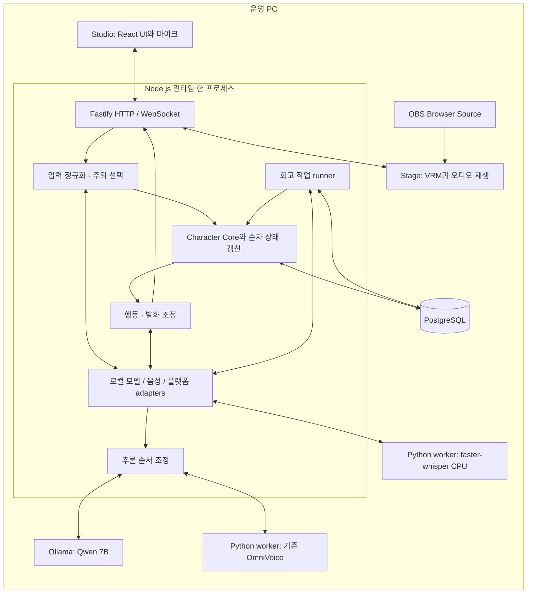
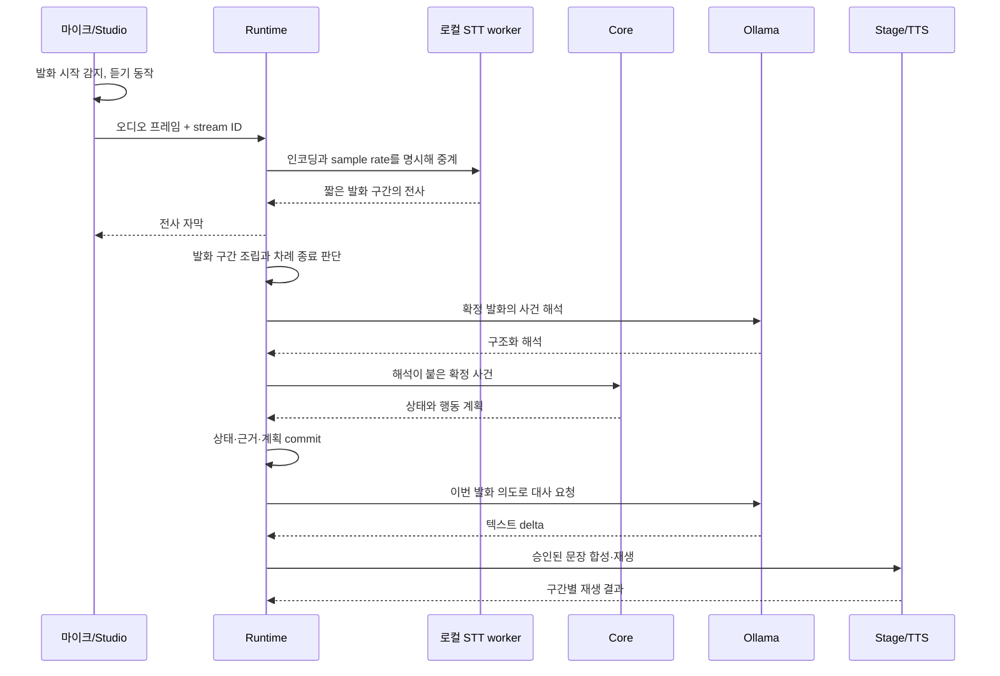
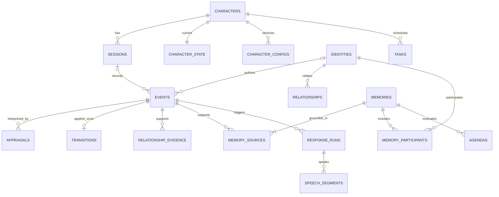

# AI Character Runtime 기술 설계 v1 — 필수 Jev와 로컬 생성

> 2026-10-04 범위 수정: Jev 사건 해석은 MVP 필수다. 정상 경로는 Jev → Core → 로컬 Qwen → Stage다. 원격 Jev의 비용·합성 입력 전송은 별도 승인 조건이며, 승인 전에는 차단 상태로 개발·모의 검증한다. 아래 최초 작성일의 설치·실행 기록은 당시 범위를 유지한다.

작성일: 2026-09-20  
기획 기준: [기획 발전안 v2](./jev_ai_character_runtime_plan_v2.md)  
문서 상태: 구현을 시작하기 위한 권장 설계. 실제 설치·API 호출·성능 검증을 완료한 명세는 아니다.

첫 구현의 기능 범위와 완료 조건은 [MVP 범위](./MVP_SPEC.md)를 따른다. 이 기술 설계에는 후속 확장을 위한 항목도 포함되어 있으며, 모든 테이블·기능을 첫 버전에 구현하지 않는다.

MVP의 상태 의미·수치·행동 우선순위는 [도메인 규칙](./CHARACTER_DOMAIN_SPEC.md), 말투·캐릭터 의도는 [캐릭터 preset](./CHARACTER_PRESET.md)을 기준으로 한다. 아래 예시 schema는 실제 구현에서 이 계약에 맞춰 구체화한다.

Ollama·OmniVoice·STT의 요청·출력·취소·자원 제한은 [로컬 AI 연동 명세](./LOCAL_AI_INTEGRATION.md)에서 구체화한다. 이 문서의 개략적인 adapter 예시와 차이가 있으면 해당 명세를 우선한다.

MVP 테이블·키·트랜잭션·삭제·복구는 [DB 설계 명세](./DATABASE_SPEC.md)를 따른다. 아래 넓은 논리 모델에서 private/semantic 기억·일반화 의존 그래프 등 MVP 밖의 컬럼과 테이블은 구현하지 않는다.

브라우저 전송·API·출력 소유권은 [런타임 통신 명세](./RUNTIME_PROTOCOL.md)를 우선한다. 아래 11.1의 초기 API 표에 있는 범용 events 입력 대신 통신 명세의 제한된 입력·활동 API를 사용한다.

구체적인 개발 순서와 첫 착수 범위는 [구현 계획](./IMPLEMENTATION_PLAN.md)을 따른다. 기존 명세는 루트에 유지하고 필요한 코드 디렉터리만 작업별로 생성한다.

예산 조건: 기존 PC·설치 모델을 재사용한다. Jev는 필수지만 API 비용·합성 입력 외부 전송은 별도 승인 후에만 허용한다. 나머지 유료 서비스·체험 크레딧과 자동 fallback은 금지한다. 실제 Jev를 차단한 모의 개발 상태는 MVP 완료가 아니다.

## 1. 설계 결론

**TypeScript로 웹 화면과 런타임을 만들고, PostgreSQL을 유일한 영구 저장소로 사용한다.** 사건 해석은 Jev, 대화·풀이 후보는 설치된 Ollama 모델, TTS는 설치된 OmniVoice, STT는 로컬 Whisper 계열로 처리한다. 캐릭터 상태를 계산하는 Core는 자체 코드다.

첫 배포 단위는 웹 화면, Node.js 런타임 하나, PostgreSQL 하나, Ollama, 로컬 Python 음성 worker다. 회고는 런타임 내부의 비동기 작업으로 시작한다. 상태 갱신은 캐릭터별 단일 실행 경로로 모으고, 오래 걸리는 추론은 그 경로 밖에서 수행한다.

초기 전제:

- Windows 개발 PC에서 운영하는 캐릭터 1명, 한국어, 운영자 1명.
- 테스트 채팅과 마이크 입력, 퍼즐 활동 하나, 이후 방송 플랫폼 하나 연동.
- STT·대사 LLM·TTS는 로컬 추론, 사건 해석은 승인된 Jev만 사용한다. 해석 장애 시 Qwen으로 자동 전환하지 않는다.
- 아바타는 별도 기존 에셋이 없는 전제로 VRM을 먼저 선택한다. 준비된 Live2D 에셋이 있다면 renderer만 교체한다.
- 아래 처리량·타이밍·기억 수는 초기 설정안이다. 공급자의 성능 보장이나 측정 결과가 아니다.

### 1.1 현재 PC에서 확인한 구성

| 항목 | 확인 결과 | 설계에 반영할 점 |
|---|---|---|
| GPU | NVIDIA RTX 5070 Ti, VRAM 16,303MiB | LLM·TTS·아바타가 GPU 자원을 공유 |
| RAM / CPU | OS 보고 총 물리 메모리 약 31.1GiB, Ryzen 7 7700X | STT CPU 실행을 첫 설정으로 검토. 현재 여유 RAM을 의미하지 않음 |
| Ollama 모델 | `qwen2.5:7b` 4.7GB, `llama3.1:8b` 4.9GB 등 설치 | 새 모델 다운로드 없이 Qwen부터 평가 |
| 더 큰 로컬 모델 | `gemma4:12b` 7.6GB, `gemma4:latest` 9.6GB | 설치는 확인했지만 초기 동시 상주 후보에서는 제외 |
| TTS | OmniVoice 0.1.5, Python 3.11.9, torch 2.8.0+cu128 | 기존 가상환경과 모델 재사용 |
| TTS 실행 파일 | `J:\ai\omnivoice tts\run_omnivoice.bat` | Gradio 데모를 8001 포트에서 실행하는 배치 파일 |
| TTS Python | `J:\ai\omnivoice tts\omnivoice-env\Scripts\python.exe` | UI 자동 클릭 대신 이 환경에서 API wrapper 실행 |
| 모델 캐시 디렉터리 | `D:\AI_Cache\hub\models--k2-fsa--OmniVoice`, `models--openai--whisper-large-v3-turbo` | 디렉터리 존재만 확인. 실제 snapshot 완전성은 로딩 전 검사 |

하드웨어는 CIM과 `nvidia-smi`, 모델 목록은 `ollama list`, TTS는 설치된 소스·패키지 metadata를 읽어 확인했다. 모델 파일 크기를 VRAM 사용량으로 간주하지 않는다. 목록 조회 과정에서 Ollama 서비스가 시작됐으며, 이번 문서 작업에서 모델 다운로드·추론·TTS 실행은 하지 않았다.

## 2. 권장 스택

### 2.1 애플리케이션과 저장소

| 영역 | 선택 | 역할과 선택 이유 |
|---|---|---|
| 언어 | TypeScript | 화면·서버·이벤트 계약을 같은 언어로 관리 |
| 런타임 | 설치된 Node.js 22.19.0 LTS로 초기 개발 | 로컬 모델 프로세스와 I/O 처리. 추론은 별도 프로세스에서 실행. Node 24는 후속 호환성 확인 후 전환 가능 |
| 패키지 관리 | pnpm workspace | UI·Core·DB·adapter를 한 저장소에서 관리 |
| 제작자 화면 | React + Vite | 채팅 실험실, 상태 타임라인, 모델 설정, 기억 확인 |
| 서버 | Fastify + `@fastify/websocket` | 설정용 HTTP API와 지속적인 양방향 연결 |
| 입력 검증 | Zod | 네트워크 이벤트·모델 출력·저장 JSON의 런타임 검증 |
| 캐릭터 로직 | 순수 TypeScript 함수 | 감정·습관화·관계·행동 선택. DB와 모델 SDK를 직접 참조하지 않음 |
| DB | PostgreSQL 18 | 상태·근거·기억·작업의 트랜잭션 처리 |
| DB 접근 | Drizzle ORM + `pg` + Drizzle Kit | 타입 있는 쿼리, 연결 풀, 검토 가능한 SQL migration |
| 의미 검색 | pgvector, 후속 단계 | 기존 PostgreSQL 안에 임베딩 저장. 첫 텍스트 데모에는 미사용 |
| 백그라운드 작업 | PostgreSQL `tasks` 테이블 + 내부 worker | 회고·임베딩·정리 작업의 재시도와 재시작 복구 |
| 로그 | Pino 구조화 로그 | trace ID로 입력부터 출력까지 연결 |
| 테스트 | Vitest + 실제 PostgreSQL 통합 테스트 + Playwright | Core 규칙, 트랜잭션, 음성 취소·재접속 흐름 검증 |
| 로컬 인프라 | PostgreSQL 로컬 설치, Docker Compose 선택 | 기존 Docker 사용 환경이 있으면 컨테이너 재사용. 유료 Docker 구독을 전제하지 않음 |

초기 구현은 현재 PC의 Node 22.19.0과 pnpm 11.9.0에서 시작했다. Node 22·24는 작성 시점 LTS이며 PostgreSQL 18은 지원 중인 메이저 버전이다. 설치할 때 패치 버전을 확인한 뒤 lockfile과 이미지 태그 또는 digest를 고정한다. [Node 릴리스](https://nodejs.org/en/about/previous-releases), [PostgreSQL 지원 정책](https://www.postgresql.org/support/versioning/)

Fastify의 WebSocket 플러그인과 Drizzle의 `node-postgres` 연결을 사용한다. Zod 스키마를 직접 파싱하는 것으로 시작하고, HTTP 문서 자동 생성을 위한 추가 변환 계층은 필요해질 때 넣는다. [Fastify WebSocket](https://github.com/fastify/fastify-websocket), [Drizzle PostgreSQL](https://orm.drizzle.team/docs/get-started-postgresql)

### 2.2 AI·음성·아바타

| 영역 | 초기 후보 | 적용 방식 |
|---|---|---|
| 사건 해석 | 필수 Jev `jev-1.13.0` | Choice 3개 + Score 2개. 형식·분포 검증과 confidence gate 후 기존 Appraisal로 매핑 |
| 대화 생성 | Ollama `qwen2.5:7b` | 설치 모델 재사용. `/api/chat`의 텍스트 스트림 사용 |
| 회고 생성 | MVP는 구조화 사건 템플릿, LLM 사용 시 동일 Qwen | 선택적 LLM 작업은 세션 종료 후 실행. 방송 중 GPU 추론과 경쟁하지 않음 |
| STT | faster-whisper, CPU int8, 한국어 고정 | 첫 목표는 VAD로 자른 짧은 발화의 전사. `small` 다국어 모델이 없으면 무료 로컬 모델 다운로드 필요 |
| TTS | 기존 OmniVoice 0.1.5 | 기존 Python 환경에서 짧은 문장을 합성하고 완성된 waveform 전달 |
| 아바타 | Three.js + `@pixiv/three-vrm` | VRM 로드, 표정·시선·고개·입 움직임 제어 |
| 브라우저 오디오 | Web Audio API + AudioWorklet | 마이크 프레임 처리, 재생 큐, 음량 분석, 즉시 재생 중단 |
| 방송 출력 | OBS Browser Source | 투명 배경의 `/stage` 화면을 방송 장면으로 사용 |

Jev는 정상 runtime의 필수 AppraisalProvider다. Coordinator에는 생성 공급자와 해석 공급자를 별도 주입한다. Score 평균을 반올림하지 않고 유일 최빈 등급을 사용하며 confidence 0.80 미달/동률이면 의미 자극을 유보한다. threshold는 검증 전 초기 정책이다.

Ollama Chat API는 대화와 구조화 풀이 후보에 사용한다. 과거 Ollama 해석 함수는 명시적 로컬 비교 평가에만 남기며 정상 사건 해석에 사용하지 않는다. 문법적으로 유효한 JSON이어도 해석은 틀릴 수 있어 한국어 평가 데이터로 확인한다. [Ollama Chat API](https://docs.ollama.com/api/chat), [설치 모델과 동일한 Qwen 태그](https://ollama.com/library/qwen2.5:7b)

faster-whisper는 CPU int8 실행을 지원한다. 먼저 짧은 발화를 묶어 전사하고 `language=ko`를 지정한다. 기존 캐시의 `whisper-large-v3-turbo`가 Hugging Face 원본 가중치라면 CTranslate2 형식이 필요한 faster-whisper에서 그대로 쓸 수 있는 파일이라고 가정하지 않는다. 원본을 지원하는 실행기 또는 로컬 형식 변환·별도 모델 다운로드가 필요하다. [faster-whisper 공식 저장소](https://github.com/SYSTRAN/faster-whisper)

설치된 OmniVoice `generate()`는 완성된 오디오 배열을 반환한다. 따라서 최초에는 문장별 합성으로 구현하고 모델 내부의 진짜 스트리밍을 전제하지 않는다. 생성한 오디오를 네트워크 chunk로 나누어 보내는 것과 추론 중 오디오를 내보내는 것은 구분한다. [OmniVoice 원본 저장소](https://github.com/k2-fsa/OmniVoice)

VRM과 OBS를 연결하는 방법은 웹 renderer를 방송 소스로 띄우는 것이다. 마이크 권한은 일반 브라우저의 제작자 화면에서 받고, OBS는 출력만 맡긴다. [three-vrm](https://github.com/pixiv/three-vrm), [AudioWorklet](https://developer.mozilla.org/en-US/docs/Web/API/AudioWorklet), [OBS Browser Source](https://obsproject.com/kb/browser-source)

### 2.3 초기에 넣지 않을 구성

| 구성 | 도입하지 않는 이유 | 도입을 검토할 조건 |
|---|---|---|
| Redis / BullMQ | 소수의 회고 작업은 PostgreSQL로 처리 가능 | 작업량·브로드캐스트 부하가 DB와 충돌할 때 |
| Kafka | 단일 캐릭터에 분산 이벤트 버스 불필요 | 여러 프로세스·서비스의 이벤트 소비가 실제 요구될 때 |
| 별도 vector DB | 관계 필터·출처와 같은 DB에서 관리 가능 | 검색 규모와 지연이 PostgreSQL 한계를 넘을 때 |
| LangGraph | 초기 회고는 짧은 순차 작업 | 복잡한 분기·승인·장시간 재개 요구가 생길 때 |
| 범용 Python 웹 서버 | 음성 worker는 처음에 표준입출력으로 Node와 연결 가능 | 여러 클라이언트가 음성 서비스를 공유해야 할 때만 HTTP화 |
| Next.js / SSR | 검색 노출보다 지속 연결과 로컬 작업 화면이 중심 | 별도의 공개 웹 서비스가 필요할 때 |
| Electron | 브라우저와 OBS로 초기 동작 확인 가능 | OS 상주·트레이·데스크톱 제어를 제품화할 때 |

## 3. 실행 구조



개발 중에는 Studio에 Stage 미리보기를 넣을 수 있다. 방송 모드에서는 OBS의 Stage가 유일한 음성 재생 주체가 되고 Studio 미리보기는 음소거한다. 서버는 활성 `playback_client_id` 하나만 인정해 이중 재생과 중복 완료 보고를 막는다.

Stage를 브라우저에서 재생하는 개발 모드에서는 클릭으로 AudioContext를 활성화한다. OBS에선 소스의 오디오 설정을 확인하고, 출력이 마이크로 다시 들어오는 루프를 피하도록 헤드폰·오디오 라우팅으로 검증한다.

## 4. 코드 모듈과 책임

```text
ai-character-runtime/
├─ apps/
│  ├─ studio/                  # React, /studio와 /stage
│  └─ runtime/                 # Fastify 서버, Core 실행 조정, 작업 runner
├─ packages/
│  ├─ contracts/               # Zod 이벤트·provider 출력·설정 스키마
│  ├─ character-core/          # 순수 상태 전이, 감정·관계·행동 선택
│  ├─ database/                # Drizzle 스키마, migrations, repositories
│  └─ adapters/                # Ollama, 로컬 STT/TTS, 테스트 채팅, 퍼즐
├─ workers/
│  ├─ tts/                     # 기존 OmniVoice 환경에서 실행할 JSONL wrapper
│  └─ stt/                     # 별도 환경의 faster-whisper wrapper
├─ character-presets/          # 초기 성격·관심사·표현 매핑
├─ evals/                      # 한국어 예시와 녹화된 provider 결과
├─ infra/                      # DB용 compose 설정
└─ docs/                       # 후속 명세 문서
```

이는 앞으로 만들 구조이며 현재 디렉터리가 구현되었다는 뜻은 아니다. 처음부터 모든 폴더를 채우지 않는다.

| 모듈 | 책임 | 하지 않는 일 |
|---|---|---|
| Perception | 입력 출처·발화 ID·수정 번호 정규화 | 감정 상태 변경 |
| Attention | 후보 선택, 동일 사용자 독점 제한, 오래된 입력 만료 | 미선택 댓글을 기억으로 넘기기 |
| Appraisal adapter | 작은 맥락에 대한 구조화 해석 | 관계 DB 수정, 플랫폼 차단 |
| Core | 상태 전이와 행동 의도 산출 | 네트워크·파일·DB 직접 호출 |
| Runtime coordinator | 비동기 결과 수신, 유효성 확인, 트랜잭션 commit | 모델 호출을 기다리며 상태 락 유지 |
| Dialogue | 선택된 의도를 한국어 대사로 표현 | 상태 숫자 임의 변경, 외부 작업 실행 |
| Output coordinator | 표정·음성 스케줄, 중단, 재생 상태 추적 | 생성 완료를 발화 완료로 간주 |
| Memory service | 범위 필터, 근거 검색, 제한된 기억 묶음 구성 | 검색 문서를 시스템 명령으로 취급 |
| 종료 정리 runner | 관측 사건을 템플릿으로 묶고 미완료 의도 정리 | 같은 감정·관계 효과를 다시 적용 |

Core의 개념적 인터페이스는 다음과 같다. 실행 시각과 설정을 외부에서 넣어 재생 가능하게 하며, MVP에서는 난수를 사용하지 않는다.

```typescript
type TransitionResult = {
  nextState: CharacterState;
  effects: DomainEffect[];
  proposedActions: ActionPlan[];
};

function reduceCharacter(
  state: CharacterState,
  event: AcceptedDomainEvent,
  context: { nowMs: number; config: CharacterConfig }
): TransitionResult;
```

## 5. 입력에서 발화까지의 흐름

### 5.1 채팅 한 건

1. 서버가 플랫폼 ID와 계정 ID를 정규화하고 중복 여부를 확인한다.
2. 수용한 확정 입력을 `events`에 저장한다. 저장 성공 후 수신 확인을 보낸다.
3. Attention이 읽을지 선택한다. 미선택 입력은 운영 기록에만 남는다.
4. 선택된 사건에 현재 목표·관련 상대·최근 확정 대화·관련 기억을 붙여 로컬 해석기를 호출한다.
5. 결과를 `appraisals`에 저장하고, 요청 시점과 현재 맥락이 여전히 맞는지 확인한다.
6. Core가 감정·관계 변화와 행동 의도를 계산한다.
7. 한 DB 트랜잭션에서 상태, 적용 근거, 행동 계획을 저장한다.
8. commit 후 표현을 전송하고, 말할 행동이면 대화 LLM을 호출한다.
9. 초기에는 1–2문장 생성이 끝나면 LLM 추론 슬롯을 반환한다. 문장을 나누고 발화 계획과의 불일치를 검사한 뒤 TTS로 보낸다.
10. Stage가 실제 재생한 구간을 보고한다. 이 결과가 캐릭터의 ‘내가 한 말’ 기록이 된다.

표현이 먼저 움직일 수 있지만 감정 상태와 어긋나는 의미 반응은 commit 전에 확정하지 않는다. 입력 도착에 대한 단순 시선 이동은 로컬에서 바로 가능하다.

### 5.2 음성 발화



초기 STT는 진짜 streaming recognizer가 아니라 VAD로 잘라낸 짧은 발화의 로컬 전사다. 발화 종료와 전사 완료를 구분하고, 추가 발화가 들어오는 짧은 간격을 차례 관리기가 처리한다. 이후 필요할 때 겹치는 창으로 부분 전사를 만들되 같은 음성을 두 번 확정하지 않도록 안정화 로직을 추가한다.

부분 전사는 메모리에만 유지하고, 원칙적으로 감정·관계·장기 기억에 반영하지 않는다. 초기는 부분 전사 의미 반응을 생략하고 로컬 듣기 동작만 구현해도 된다.

음성의 ‘발화자 이름’은 STT가 알아냈다고 가정하지 않는다. 초기 마이크는 등록된 운영자 identity와 연결한다. 향후 다중 화자 분리도 플랫폼 계정 인증과는 다른 문제로 처리한다.

## 6. 상태 갱신, 동시성, 시간

### 6.1 메모리와 DB의 역할

| 데이터 | 실시간 위치 | 영구 저장 시점 |
|---|---|---|
| 부분 STT, 오디오 프레임 | 제한된 메모리 버퍼 | 기본 저장하지 않음 |
| 표정 보간·립싱크·현재 오디오 큐 | Stage 메모리 | 프레임별 저장하지 않음 |
| 현재 감정·기분·목표·주의 | 서버 메모리의 상태 복사본 | 승인된 상태 전이마다 snapshot 갱신 |
| 관계·신뢰 근거 | DB + 현재 상대의 메모리 캐시 | 근거 반영 트랜잭션 |
| 확정 입력·실행 결과 | DB | 수용·실행 확인 시 |
| 장기 기억·Agenda | DB | 근거 확인 후 Core를 통해 반영 |

영구 상태의 기준은 **DB에 commit된 버전**이다. 메모리 상태는 계산과 읽기를 위한 복사본이다. commit 실패 시 계산한 새 상태를 버리고 이전 버전을 유지한다.

감정 decay는 마지막 기준 시각과 half-life에서 계산하므로 매 프레임 UPDATE할 필요가 없다. UI에는 예를 들어 10Hz로 상태를 보내고 아바타는 렌더링 프레임마다 보간한다. 침묵·Agenda 등 실제 의사결정이 발생하는 타이머 사건은 기록한다.

### 6.2 단일 상태 갱신 경로

캐릭터별 mailbox에서 상태 변경을 순차 처리한다. 추론은 작업으로 내보내고 결과를 새 메시지로 받는다. 초기 GPU 추론은 최대 1건이며 해석·대화·TTS가 같은 실행 슬롯을 공유한다. 선택된 입력의 순서대로 결과를 적용하고, 앞선 호출이 기한을 넘으면 `unknown` 결과로 처리한다. 실행 중인 GPU 작업이 실제 끝나기 전에는 다음 작업을 겹쳐 시작하지 않는다. 뒤늦은 결과는 같은 사건에 다시 적용하지 않는다.

단순 `state_version` 증가만으로 모든 모델 응답을 버리지는 않는다. 감정의 시간 경과는 현재 상태에 재적용할 수 있다. 반면 입력 수정, 대화 상대 변경, 세션 종료, 목표 변경은 해석이나 발화 계획을 무효화할 수 있다. 이를 `input_revision`, `context_epoch`, `response_id`로 구분한다.

상태 commit은 다음을 하나의 트랜잭션에서 수행한다.

```text
BEGIN
  character_state 행 잠금 및 예상 version 확인
  transitions의 source_event_id 중복 적용 확인
  상태 계산 결과와 관계 근거 등 도메인 변경 반영
  transitions 추가, character_state version 증가
  response_runs / tasks에 필요한 실행 계획 저장
COMMIT
  메모리 상태 교체, 실행 계획 dispatch
```

로컬 모델 호출과 Python 추론도 이 트랜잭션 안에서 하지 않는다. version이 달라졌다면 최신 상태로 다시 계산한다. DB 고유 제약은 재시도에서도 같은 근거를 두 번 반영하지 못하게 한다.

초기 서버 인스턴스는 하나로 제한한다. 여러 런타임 인스턴스를 띄우는 확장에서는 캐릭터 소유권 lease와 fencing을 추가해야 하며, 단순한 로컬 mutex만으로 충분하다고 보지 않는다.

### 6.3 복구와 재생

- 프로세스 재시작 시 최신 commit 상태와 미완료 작업을 읽는다.
- 진행 중이던 음성은 재생하지 않고 `interrupted` 또는 `delivery_unknown`으로 종료한다.
- 대화 작업은 deadline이 지났으면 버리고, 회고 등 비실시간 작업만 재시도한다.
- 감정은 저장 시각부터 지난 시간을 적용한다. 방송이 꺼진 동안 새 경험을 생성하지 않는다.
- 사건, 채택한 해석, Core 설정 버전, 시각, 난수 결과를 기록하면 해당 Core 버전의 상태 전이를 재생할 수 있다.
- 기억 삭제 등으로 근거가 제거된 구간은 완전 재생 불가로 표시한다. 삭제된 개인 데이터를 replay 목적으로 몰래 유지하지 않는다.

## 7. 실시간 통신과 음성 중단

구체적인 전송 계약은 [런타임 통신 명세](./RUNTIME_PROTOCOL.md)를 따른다. MVP는 `/ws/control`의 JSON 제어 메시지와 HTTP의 완성 WAV 전송을 사용한다. 누르고 말하기와 완성형 TTS에 맞춰 별도 audio WebSocket·부분 전사·40ms 오디오 frame 전송은 첫 구현에서 제외한다.

HTTP는 세션·활동·기억 관리 및 음성 업로드/다운로드, WebSocket은 입력 시작·종료·상태·표현·취소·전달 보고를 담당한다. Studio는 운영 권한, Stage는 제한된 출력 권한을 가진다. 활성 Stage 하나만 자막·음성을 전달하며 기존 소유자의 중지 확인 뒤 출력 권한을 넘긴다.

DB bigint에 해당하는 stateVersion·generationEpoch·outputEpoch·sequence는 JSON에서 십진 문자열로 전송한다. 이벤트 적용 순서·출력 취소 세대·Stage 소유권 세대·연결 메시지 순서는 서로 다르다. 실제 envelope와 type별 필드는 통신 명세를 원본으로 사용한다.

입력 WAV는 16kHz mono PCM16이며 최대 15초다. 출력 WAV는 실제 TTS sample rate를 명시한다. 완성 음성은 응답당 최대 2문장·30초를 유지하되 한 문장이 끝나기 전에 다음 문장을 장시간 예약하지 않는다. 네트워크 다운로드와 모델의 음성 streaming을 구분한다.

취소 시 서버는 출력 금지 장벽을 세우고 Stage에 중단을 전달한 뒤 DB 취소를 확정한다. Stage는 현재·예약 소스, fetch, 대기 decode 결과·자막을 모두 정리한다. DB가 실패하면 성공 ACK 없이 출력을 멈추고 복구를 기다린다. 별도 OBS 프로세스의 중지에는 제어 경로 지연이 있으므로 같은 화면의 로컬 중지와 나누어 측정한다.

OmniVoice 계산이 계속돼도 취소된 결과는 폐기한다. 음성 수신·decode 완료는 전달 완료가 아니며 자막 표시, 음성 시작·진행·정상 완료·취소를 각각 기록한다. 재생을 멈춰 발생한 ended callback을 정상 완료로 보고하지 않는다. 정확한 단어 정렬이 없으면 중간에 끊긴 문장을 전체 전달로 추정하지 않는다.

재접속은 최신 snapshot만 복구하고 과거 음성 큐는 복구하지 않는다. 아직 확인되지 않은 전달 보고만 같은 서버·세션·원래 소유권을 검증해 보완할 수 있다. 모델 원문이나 token을 로그·오류에 노출하지 않는다.
## 8. PostgreSQL 데이터 모델

이 절은 초기 논리 모델과 후속 확장 후보다. 실제 MVP 저장 계약은 DATABASE_SPEC을 우선하며, 상태 epoch는 `generation_epoch`, 종료 정리 task는 `consolidate_session`으로 구체화한다. 입력·선택·해석 채택·출력 보고는 별도 단계 사건을 사용한다.

### 8.1 테이블 구성 원칙

세 종류를 구분한다.

- **사건과 근거:** 어떤 입력을 받았고 무엇을 실제로 관측·실행했는가.
- **현재 상태:** 지금의 감정, 상대별 관계, 진행 중 응답처럼 바로 읽어야 하는 값.
- **경험에서 만든 자료:** 장기 기억, 일반화, 다음에 하고 싶은 일.

사람·세션·시각·상태·출처처럼 조인과 필터에 쓰이는 값은 일반 컬럼으로 둔다. 자주 조정하는 감정 벡터·성격 설정·행동 계획은 JSONB로 둔다. 모든 것을 JSONB 한 칸에 넣거나 감정 하나마다 테이블을 만들지 않는다.

공통 규칙은 UUID 식별자, `timestamptz` 시각, UTC 저장이다. 의미가 있는 숫자에는 범위 제약을 둔다. JSONB는 `schema_version`에 맞는 Zod 스키마로 검사한다. 원문 데이터는 정상 동작에서 덮어쓰지 않되, 정정은 연결된 새 사건으로 남기고 삭제 요청은 원문 제거까지 지원한다.

아래는 논리 스키마다. 실제 migration에서는 모든 PK·FK·CHECK·NOT NULL을 명시한다. 표에 적힌 `character_id`를 가진 자식은 가능한 곳에서 `(character_id, parent_id)` 복합 FK를 사용해 다른 캐릭터의 데이터를 참조하지 못하게 한다.

### 8.2 설정·세션·사건·상태

| 테이블 | 주요 컬럼 | 키·역할 |
|---|---|---|
| `characters` | `id`, `name`, `created_at` | 캐릭터의 고정 ID |
| `character_configs` | `character_id`, `version`, `schema_version`, `config jsonb`, `created_at` | PK `(character_id, version)`. 성격·감정 계수·표현 규칙의 불변 버전 |
| `sessions` | `id`, `character_id`, `visibility`, `conversation_key`, `status`, `started_at`, `ended_at` | 방송 또는 개인 대화 세션. 하나의 캐릭터에 초기 활성 세션 하나 |
| `identities` | `id`, `platform`, `platform_subject_id`, `display_name` | UNIQUE `(platform, platform_subject_id)`. 표시 이름으로 관계를 연결하지 않음 |
| `events` | `id`, `character_id`, `session_id`, `identity_id`, `source_namespace`, `source_key`, `kind`, `occurred_at`, `received_at`, `attention_status`, `data_status`, `payload jsonb` | 입력, 활동 결과, 재생 결과, 회고 승인, 타이머 사건. 중복 수용 방지의 기준 |
| `appraisals` | `id`, `character_id`, `event_id`, `provider`, `model`, `rubric_version`, `context_epoch`, `context_refs jsonb`, `result jsonb`, `status`, `latency_ms`, `usage jsonb` | 실제 반환된 판단과 사용 맥락. 채택·폐기 여부 기록 |
| `character_state` | `character_id`, `version`, `config_version`, `schema_version`, `context_epoch`, `snapshot_at`, `body jsonb` | PK `character_id`. 최신 commit 상태 |
| `transitions` | `id`, `character_id`, `state_version`, `source_event_id`, `appraisal_id`, `config_version`, `core_version`, `evaluated_at`, `random_draws jsonb`, `effects jsonb` | 상태 전이 근거와 결과. 동일 확정 사건의 중복 적용 방지 |

`source_namespace`에는 adapter와 원본 채널/stream 범위를 넣고 `source_key`에는 그 범위에서 안정적인 메시지 ID를 넣는다. STT 최종 발화는 내부 `utterance_id`를 사용한다. 메시지 원문 해시는 중복 키로 쓰지 않는다. 같은 사람이 같은 말을 다시 한 것은 새로운 사건일 수 있다.

`attention_status`는 `pending`, `observed`, `ignored`를 구분한다. 운영자가 조회할 수 있는 원문과 캐릭터가 회상할 수 있는 원문을 이 값으로 구분한다. 캐릭터 자신이 완료한 행동도 관측 사건으로 기록한다.

`character_state.body` 예시:

```json
{
  "affect": {
    "joy": { "value": 0.45, "asOfMs": 0, "holdUntilMs": 0 },
    "frustration": { "value": 0.2, "targetEventId": "event-id", "asOfMs": 0 }
  },
  "mood": { "pleasantness": 0.6, "asOfMs": 0 },
  "goal": { "kind": "solve_puzzle", "hintBudget": 1 },
  "attention": { "focusedEventIds": ["event-id"] },
  "habituation": { "competence_praise": { "count": 3, "lastSeenMs": 0 } },
  "interests": { "puzzle": { "enabled": true } },
  "workingMemoryEventIds": ["event-id"],
  "turn": { "mode": "listening", "activeResponseId": null }
}
```

ID와 시각은 형식 설명을 위한 자리표시자다. 실제로는 유효한 UUID와 시각을 저장한다. `workingMemoryEventIds`는 크기가 제한된 목록이고 채팅 원문 전체를 snapshot에 반복 복사하지 않는다. 장기 관계와 기억은 별도 테이블에서 읽는다.

### 8.3 관계와 장기 기억

| 테이블 | 주요 컬럼 | 키·역할 |
|---|---|---|
| `relationships` | `character_id`, `identity_id`, `familiarity`, `affinity`, `trust jsonb`, `interaction_days`, `updated_at` | PK `(character_id, identity_id)`. 근거에서 계산한 현재 관계 |
| `relationship_evidence` | `id`, `character_id`, `identity_id`, `source_event_id`, `evidence_key`, `kind`, `status`, `values jsonb`, `config_version`, `created_at` | 칭찬·도움의 결과·정정 등 변화의 근거. `values`에 정규화한 관측 특징과 적용 delta 기록 |
| `memories` | `id`, `character_id`, `session_id`, `kind`, `status`, `content_version`, `visibility`, `conversation_key`, `fact_kind`, `content`, `interpretation`, `confidence`, `salience`, `topics text[]`, `occurred_at`, `created_at` | episodic·semantic 통합 테이블. 사실/주장/추론과 주관적 해석을 구분 |
| `memory_sources` | `character_id`, `memory_id`, `event_id` | PK `(memory_id, event_id)`. 기억을 지지하는 원본 사건 |
| `memory_participants` | `character_id`, `memory_id`, `identity_id`, `role` | PK `(memory_id, identity_id)`. 특정 사람의 기억 검색 |
| `memory_dependencies` | `character_id`, `child_memory_id`, `parent_memory_id` | 일반화·요약이 어떤 기존 기억에 의존하는지 기록. 순환 참조 금지 |
| `agendas` | `id`, `character_id`, `source_memory_id`, `config_version`, `visibility`, `conversation_key`, `dedupe_key`, `intent jsonb`, `trigger jsonb`, `status`, `priority`, `not_before`, `expires_at` | 경험 기반의 다음 의도. 고정 초기 의도는 기억 대신 config 버전을 근거로 사용 |

`familiarity`와 `affinity`는 초기 0–1로 통일하고 affinity의 중립은 0.5로 정의한다. 신뢰에는 근거량도 보존한다. 근거가 없는 중립과 충분히 관측한 중립을 같은 확신으로 취급하지 않는다.

MVP의 `trust` JSON은 통합 점수 대신 유효한 도움의 근거 수·날짜·참조를 보관한다. `evidence_key`에는 첫 관측 날짜 또는 검증된 도움의 문제 ID 같은 업무상 중복 기준을 넣고 `(character_id, identity_id, evidence_key)`를 UNIQUE로 제한한다. 다른 이벤트 ID로 같은 도움을 전달해도 관계를 중복 증가시키지 않는다.

`relationships`는 읽기를 위한 집계이며 `relationship_evidence`가 갱신 이유다. 실시간과 회고가 같은 사건을 다시 평가해도 같은 종류의 근거를 추가로 적용하지 못하도록 고유 키를 둔다. 관계 계산 설정을 바꿀 때는 과거 delta를 무작정 합산하지 않고 원래 관측 특징에서 새 정책으로 재계산한다.

기억 `status`는 `active`, `superseded`, `invalidated`, `deleted`를 구분한다. `fact_kind`는 `observed`, `reported`, `inferred`다. confidence가 높아도 타인의 주장을 관측 사실로 바꾸지 않는다.

`memory_sources`에 연결할 수 있는 사건은 캐릭터가 관측했고 삭제되지 않은 사건이다. 원래 비공개 사건으로 만든 기억과 Agenda의 공개 범위가 넓어지지 않도록 저장 시 검사한다.

### 8.4 발화와 작업 관리

| 테이블 | 주요 컬럼 | 키·역할 |
|---|---|---|
| `response_runs` | `id`, `character_id`, `session_id`, `trigger_event_id`, `context_epoch`, `plan jsonb`, `memory_refs jsonb`, `status`, `deadline_at`, `provider_request_id`, `usage jsonb` | Core가 승인한 발화 계획이자 실행 대기 기록 |
| `speech_segments` | `id`, `response_id`, `segment_index`, `text`, `status`, `duration_ms`, `played_ms`, `playback_client_id`, `updated_at` | UNIQUE `(response_id, segment_index)`. 생성과 실제 재생을 구분 |
| `tasks` | `id`, `character_id`, `kind`, `dedupe_key`, `payload jsonb`, `status`, `available_at`, `lease_until`, `lease_token`, `attempts`, `max_attempts`, `result jsonb`, `last_error` | 회고·임베딩 작업. payload는 가능한 한 원문 대신 ID 참조 |

감정별 테이블, Scar 전용 DB, Interest 전용 DB는 초기에는 만들지 않는다. 관심사는 작은 상태 JSON으로, 정서적 흔적은 후속 단계의 기억 metadata로 시작한다.

### 8.5 주요 관계도



그림은 주요 관계만 나타낸다. semantic 기억은 직접 원문 출처 또는 `memory_dependencies`를 따라가는 유효한 근거 경로를 필수로 갖는다. 초기 버전에서는 관계를 단순하게 유지하도록 semantic 기억에도 최종 원본 `memory_sources`를 함께 저장한다.

### 8.6 반드시 둘 제약과 인덱스

아래 SQL은 설계 예시이며 아직 실행 가능한 전체 migration은 아니다.

```sql
-- 같은 원본 입력의 재전송을 새 경험으로 만들지 않는다.
CREATE UNIQUE INDEX events_source_uq
  ON events (character_id, source_namespace, source_key);

-- 하나의 확정 사건은 Core에 한 번 적용한다.
CREATE UNIQUE INDEX transitions_event_uq
  ON transitions (character_id, source_event_id);
CREATE UNIQUE INDEX transitions_version_uq
  ON transitions (character_id, state_version);

CREATE UNIQUE INDEX relationship_evidence_uq
  ON relationship_evidence
  (character_id, identity_id, source_event_id, kind);

CREATE UNIQUE INDEX sessions_one_active_uq
  ON sessions (character_id) WHERE status = 'active';

CREATE INDEX events_session_time_idx
  ON events (character_id, session_id, received_at DESC);
CREATE INDEX memories_active_recent_idx
  ON memories (character_id, occurred_at DESC)
  WHERE status = 'active';
CREATE INDEX memory_participants_identity_idx
  ON memory_participants (character_id, identity_id, memory_id);
CREATE UNIQUE INDEX tasks_dedupe_uq
  ON tasks (character_id, kind, dedupe_key);
CREATE INDEX tasks_due_idx
  ON tasks (available_at) WHERE status = 'pending';
```

`source_namespace`와 `source_key`는 NOT NULL이어야 중복 제한에 구멍이 생기지 않는다. snapshot version은 0 이상이며 감정·호감 값은 정의한 범위를 벗어나지 않게 검사한다. `private` 기억·세션에는 `conversation_key`를 필수로 요구한다.

## 9. 기억 검색과 pgvector 도입

### 9.1 첫 버전: 관계형 검색

검색 순서는 다음과 같다.

1. 서버에서 현재 캐릭터와 공개/개인 대화 범위를 결정한다.
2. 삭제·무효화된 기억을 제외한다.
3. 현재 상대, 활동, 주제, 최근 사건으로 후보를 가져온다.
4. 최근성·중요도·현재 목표 관련성으로 정렬한다.
5. 처음에는 최대 5개와 정해진 토큰 예산만 LLM에 전달한다.

```sql
SELECT m.id, m.content, m.interpretation, m.fact_kind, m.confidence
FROM memories m
WHERE m.character_id = $1
  AND m.status = 'active'
  AND (
    m.visibility = 'public'
    OR (m.visibility = 'private' AND m.conversation_key = $2)
  )
  AND EXISTS (
    SELECT 1 FROM memory_participants p
    WHERE p.memory_id = m.id
      AND p.character_id = m.character_id
      AND p.identity_id = $3
  )
ORDER BY m.salience DESC, m.occurred_at DESC
LIMIT 5;
```

이는 특정 상대의 기억을 찾는 예시다. 활동 관련 기억과 최근 사건은 별도 질의로 합친다. 공개 방송에서는 `$2`를 NULL로 고정해 개인 기억이 후보에 들어가지 않게 한다. 관련성이 부족하면 기억을 억지로 끼워 넣지 않는다.

### 9.2 의미 검색이 필요해진 뒤

pgvector를 활성화하고 `memory_embeddings` 테이블을 추가한다.

```text
memory_embeddings
  memory_id
  content_version
  embedding_model
  embedding_schema_version
  embedding vector(D)
  created_at

UNIQUE (memory_id, content_version, embedding_model, embedding_schema_version)
```

`D`는 채택할 로컬 임베딩 모델의 출력 차원으로 migration 시 확정한다. 초기에는 임베딩을 생성하지 않는다. 설치된 `nomic-embed-text`가 있다고 한국어 검색 품질이 충분하다고 가정하지 않는다. 한국어 예시로 검증한 무료 로컬 모델을 선택하고 모델·차원별 물리 컬럼 또는 테이블을 분리한다. 다른 모델의 벡터를 섞어 비교하지 않는다.

pgvector는 정확 검색과 HNSW·IVFFlat 같은 근사 검색을 지원한다. 처음에는 범위가 제한된 기억에 정확 검색을 적용하고, 실제 지연이 문제일 때 인덱스를 추가한다. 근사 검색의 필터링은 결과 부족을 일으킬 수 있어 recall을 따로 확인한다. [pgvector 공식 문서](https://github.com/pgvector/pgvector)

공개 범위와 유효성 필터는 순위 계산보다 먼저 적용한다. 벡터 후보와 사람·활동 후보를 합친 뒤 중복 제거와 점수 정규화를 한다. 의미 유사도는 진실성이나 출처의 유효성을 대체하지 않는다.

임베딩은 비동기로 만들며 최신 `content_version`이 일치할 때만 사용한다. 임베딩이 늦거나 실패해도 관계형 검색은 계속 동작한다.

## 10. 회고 worker와 기억 정정

MVP의 사실 기억·종료 정리는 도메인 규칙에 따라 구조화 사건을 템플릿으로 묶는다. 아래 LLM 변경 제안 흐름은 선택적 확장이다. LLM을 사용하지 않아도 task 중복 방지·출처 검증·트랜잭션 반영은 동일하게 적용한다.

세션 종료 트랜잭션에서 `tasks(kind=reflect_session)`를 추가한다. dedupe key는 세션 ID와 회고 정책 버전을 묶는다.

```text
세션 종료
→ 관측된 사건·실제 발화·활동 결과 조회
→ 이미 처리한 근거와 기존 기억 확인
→ LLM에 기억/해석/Agenda 변경 제안 요청
→ 출처 ID, 공개 범위, 중복, schema 검증
→ 결과를 tasks.result에 저장
→ Core에 reflection.apply 사건 전달
→ Core가 메모리·Agenda·근거를 한 트랜잭션으로 반영
```

회고 입력에 미관측 채팅을 넣지 않는다. 모델에 원문 사건 ID를 제공하고, 반환된 출처가 실제 제공 목록에 포함되는지 검증한다. 형식 검증만으로 요약의 사실성이 보장되지는 않으므로 검증용 대화에서 근거 없는 추론을 별도로 평가한다.

worker는 `FOR UPDATE SKIP LOCKED`로 실행 가능한 작업을 잡고, 상태와 lease를 갱신한 뒤 곧바로 commit한다. 모델 호출 중에는 행 락을 유지하지 않는다. 장기 작업은 lease를 연장하며, 결과 반영 시 lease token을 확인해 만료된 worker가 새 실행의 결과를 덮어쓰지 못하게 한다. [PostgreSQL SELECT 잠금](https://www.postgresql.org/docs/current/sql-select.html)

작업은 **최소 한 번 실행될 수 있다**고 설계한다. 최초 한 번만 호출된다고 가정하지 않는다. 반영 이벤트에는 task ID 기반 고유 source key를 사용해 실제 상태 변화는 한 번만 적용한다. 결과의 Core 반영과 task 완료 표시는 같은 트랜잭션에서 처리한다. 이미 `result`가 저장돼 있으면 모델을 다시 호출하지 않고 적용 단계부터 재개한다.

삭제·정정 시에는 원본 사건, 이를 참조한 기억, 파생 기억, 관계 근거, Agenda를 따라 무효화한다. 범위가 크면 우선 해당 캐릭터의 장기 기억 사용과 관계 집계 사용을 보류하고 재계산을 마친 뒤 재개한다. 동시에 실행 중인 발화 계획도 `memory_refs`를 확인해 취소한다. 이미 공개된 음성을 되돌릴 수 있다고 가정하지 않는다.

원문 삭제는 DB payload·관련 요약·임베딩·작업 결과·로그 및 백업 보존 정책까지 연결해 처리한다. 재생 및 진단에 필요했던 데이터가 삭제되면 해당 재현 자료도 함께 무효화한다.

## 11. API와 로컬 adapter 계약

### 11.1 제작자용 HTTP API 초안

| API | 목적 |
|---|---|
| `POST /api/sessions` | 세션 시작, 공개 범위와 활동 선택 |
| `POST /api/sessions/:id/stop` | 입력 종료, 발화 취소, 회고 예약 |
| `POST /api/sessions/:id/events` | 테스트 채팅·테스트 활동 입력. 실제 플랫폼 입력과 동일한 정규화 경로 사용 |
| `GET /api/characters/:id/state` | 최신 commit 상태와 version |
| `GET /api/sessions/:id/timeline` | 이벤트·해석·상태 전이 조회, cursor pagination |
| `GET /api/characters/:id/memories` | 범위가 제한된 기억 조회 |
| `POST /api/memories/:id/corrections` | 정정 사건 생성 및 영향 자료 갱신 |
| `DELETE /api/memories/:id` | 삭제 요청 수용과 파생 자료 정리 |
| `GET /health/live`, `GET /health/ready` | 프로세스 생존과 DB·세션 처리 가능 상태 구분 |

제어 화면은 운영자용이며 시청자가 이 API를 직접 호출하지 않는다. 브라우저 Stage에는 상태 변경 권한을 주지 않고, 지정된 출력·재생 보고만 허용한다.

### 11.2 책임별 최소 인터페이스

```typescript
interface AppraisalProvider {
  readonly name: string;
  readonly model: string;
  readonly promptVersion: string;
  readiness(): AppraisalReadiness;
  evaluate(event: AppraisalEvent, context: object): Promise<AppraisalEvaluation>;
}

interface DialogueProvider {
  stream(plan: DialoguePlan, signal: AbortSignal): AsyncIterable<TextDelta>;
}

interface SpeechRecognizer {
  transcribe(audio: AsyncIterable<AudioFrame>, signal: AbortSignal):
    AsyncIterable<TranscriptEvent>;
}

interface SpeechSynthesizer {
  synthesize(segment: SpeechSegment, signal: AbortSignal): AsyncIterable<AudioFrame>;
}
```

각 adapter는 SDK 특유의 반환형을 내부 계약으로 바꾼다. 모든 provider의 기능을 포괄하는 큰 추상화는 만들지 않는다. 초기 테스트용 Fake provider도 같은 인터페이스를 사용한다.

Jev 원래 typed 판단·confidence·분포는 검증한 뒤 metadata로 보존한다. 적대적 강도는 기존 0–3 등급을 유지하고 불확실하면 0으로 유보한다. confidence가 높다는 이유로 호감이나 신뢰를 직접 더하지 않는다. 위 음성·stream 인터페이스는 후속 설계 예시이며 현재 Appraisal 계약의 원본은 packages/contracts와 packages/adapters/src/appraisal.ts다. 대화 LLM에는 발화 의도·현재 감정·허용된 기억·길이 제한을 전달한다. 자동 도구 실행은 사용하지 않는다.

모델 설정·프롬프트·해석 rubric은 버전을 남긴다. 평가를 거쳐 바꾼 모델도 Core나 DB 의미를 바꾸지 않고 교체할 수 있게 한다.

### 11.3 설치된 OmniVoice 연결 방법

기존 배치 파일은 가상환경을 활성화하고 `omnivoice-demo --ip 0.0.0.0 --port 8001`로 Gradio UI를 실행한다. 제공된 `run\_omnivoice.bat` 경로는 없었고 상위 폴더에서 `run_omnivoice.bat`와 `2run_omnivoice.bat`를 확인했다.

런타임에서는 이 UI를 자동 클릭하지 않고 프로젝트 안에 작은 Python wrapper를 만든다. Node가 다음 인터프리터로 wrapper를 자식 프로세스로 실행하고 모델을 한 번 로드한다.

```text
Python executable:
  J:\ai\omnivoice tts\omnivoice-env\Scripts\python.exe

프로젝트에 새로 만들 파일:
  workers/tts/omnivoice_worker.py

입력: stdin의 JSON Lines
  {requestId, responseId, segmentId, text, language, voicePresetId}

출력: stdout의 JSON Lines
  {requestId, status, relativeAudioPath, sampleRate, durationMs}

진단 로그: stderr
```

wrapper는 설치된 `OmniVoice.from_pretrained()`와 `generate()`를 사용한다. 캐시가 완전한지 검사한 뒤 로컬 snapshot 경로로 로드하며, 누락 파일을 추론 중 자동 다운로드하지 않게 한다. 참조 목소리는 `J:\ai\omnivoice tts\ref_voices` 아래의 사용자가 선택한 파일과 전사문으로 preset을 만든다. 파일 내용을 이번 문서 작업에서 열거나 목소리를 임의로 선택하지 않았다.

설치 소스가 제공하는 `create_voice_clone_prompt()` 결과는 메모리에 재사용할 수 있다. 참조 오디오의 전사문을 제공해 TTS 내부의 추가 ASR 실행을 피한다. 실제 출력 sample rate는 `model.sampling_rate`를 읽는다.

오디오는 프로젝트의 `runtime-data/tmp/tts` 아래에 생성한다. wrapper가 반환한 경로가 이 디렉터리 안인지 검사한 뒤 Node가 읽어 Stage에 전송한다. 재생·취소 완료 후 임시 파일을 지운다. 표준출력에 라이브러리 로그가 섞이지 않게 wrapper에서 stderr로 돌린다.

기존 TTS 가상환경을 다시 설치하거나 자동 업그레이드하지 않는다. wrapper는 기존 환경에서 실행하고, STT는 별도 환경으로 관리해 의존성 충돌을 피한다. Gradio 데모와 wrapper를 동시에 켜서 TTS 가중치를 두 번 올리지 않는다.

### 11.4 GPU 메모리와 추론 순서

GPU 16GB가 있다고 세 모델을 무제한 동시 실행하지 않는다. 먼저 Qwen 7B와 OmniVoice의 **유휴 및 추론 피크 VRAM**을 각각 측정하고, OBS·VRM·Windows 사용분을 남긴다.

초기 실행안은 다음과 같다.

```text
CPU: VAD/짧은 STT + DB + 런타임
Remote: Jev 사건 해석(승인 조건)
GPU: Qwen 7B 1–2문장 생성 → OmniVoice 문장 합성
GPU: VRM 렌더링과 OBS 인코딩은 계속 실행
세션 종료 후: Qwen 회고 → 필요할 때 로컬 임베딩
```

Jev 해석은 원격이며 로컬 GPU 슬롯을 점유하지 않는다. 대사·풀이 후보는 같은 Qwen 모델을 재사용하고 Ollama 병렬 추론을 1로 둔다. 초기 context window는 4,096 tokens부터 시작해 메모리·대화 이력·출력 예산을 모두 포함시킨다. 장기 기억이 많아져도 모든 기록을 context에 넣지 않는다.

**추론을 순차로 실행해도 모델 가중치의 상주 메모리는 줄지 않는다.** 두 모델이 함께 올라가지 않으면 다음 순서로 조정한다.

1. 불필요한 모델과 TTS 데모 인스턴스를 닫고 context·출력 길이를 줄인다.
2. Qwen의 일부 또는 전체 CPU 실행을 실제 속도와 함께 평가한다.
3. 필요하면 더 작은 무료 로컬 대화 모델을 비교한다.
4. 마지막 수단으로 LLM unload 후 TTS를 로드하는 교대 실행을 사용한다. 첫 음성 지연 증가를 기록한다.

LLM의 글자 스트리밍은 UI에 보여줄 수 있지만, 초기에는 LLM이 끝난 다음 TTS를 시작해 GPU 경쟁을 단순화한다. 동시 상주와 실행이 측정상 충분히 안정적일 때만 문장별 pipeline을 허용한다. 기존 로컬 추임새는 미리 한 번 합성해 캐시하면 생성 대기 중에도 추가 추론 없이 쓸 수 있다.

## 12. 로컬 실행, 설정, 접근 경계

개발 모드는 PostgreSQL과 Ollama를 로컬에서 실행하고 Vite·Node 서버를 띄운다. Node가 음성 worker를 시작한다. PostgreSQL은 Windows 로컬 설치를 기본으로 하고 기존 Docker 환경이 있으면 Compose를 선택할 수 있다. 방송 모드는 React 결과물을 빌드해 Fastify가 정적으로 제공한다.

```text
개발 제안 포트
  Studio / Stage: http://localhost:5173
  Runtime API:    http://127.0.0.1:3001
  PostgreSQL:     127.0.0.1:5432
  Ollama:         http://127.0.0.1:11434
  Python workers: 표준입출력 연결, 별도 공개 포트 없음

방송 모드
  http://127.0.0.1:3001/studio
  http://127.0.0.1:3001/stage
```

개발 중에는 Vite proxy로 HTTP·WebSocket 요청을 런타임에 연결한다. 실제 방송은 화면을 개발 서버에 의존하지 않게 한다.

환경 변수 초안:

```dotenv
DATABASE_URL=postgresql://<user>:<password>@127.0.0.1:5432/character_runtime
LOCAL_ONLY=true
ALLOW_PAID_PROVIDERS=false
OLLAMA_BASE_URL=http://127.0.0.1:11434
DIALOGUE_MODEL=qwen2.5:7b
APPRAISAL_MODEL=jev-1.13.0
TYPESAFE_API_KEY=
OLLAMA_CONTEXT_TOKENS=4096
OMNIVOICE_PYTHON="J:/ai/omnivoice tts/omnivoice-env/Scripts/python.exe"
OMNIVOICE_MODEL_PATH=<확인된 로컬 snapshot 경로>
STT_MODEL_PATH=<설치할 CTranslate2 다국어 small 모델 경로>
STT_DEVICE=cpu
STT_COMPUTE_TYPE=int8
STT_LANGUAGE=ko
HF_HUB_OFFLINE=1
TRANSFORMERS_OFFLINE=1
```

`LOCAL_ONLY`, `ALLOW_PAID_PROVIDERS`, `OLLAMA_CONTEXT_TOKENS`는 이 프로젝트에서 구현할 설정이며 관련 프로그램이 자동으로 이해하는 공식 환경 변수는 아니다. 런타임은 context 값을 Ollama 요청 옵션으로 매핑하고, 정상 appraiser에는 고정 Jev를 주입한다. LOCAL_ONLY=false와 ALLOW_PAID_PROVIDERS=true 및 키가 모두 있어야 Jev 요청을 허용한다. Ollama/DB 원격 URL이나 cloud 모델 태그는 시작 시 거부하고 누락된 모델은 준비되지 않았다고 표시한다.

Ollama 자체에는 서버 실행 환경의 `OLLAMA_NO_CLOUD=1`, `OLLAMA_NUM_PARALLEL=1`을 적용한다. 앱의 `.env`만 바꾸면 이미 실행 중인 Ollama 설정도 바뀌는 것은 아니다. 설정 후 해당 서버를 재시작하고 적용 여부를 확인한다. 공식 문서는 cloud 기능을 끄는 설정과 기본 loopback 바인딩을 설명한다. [Ollama FAQ](https://docs.ollama.com/faq)

무료 모델 다운로드가 필요한 경우 개발 준비 단계에서 명시적으로 수행한다. 실행 중에는 로컬 파일만 읽고 캐시 누락 시 중단한다. 오프라인 설정과 로컬 주소 제한을 검증하되, 이는 PC 전체의 모든 프로그램을 네트워크 차단했다는 의미는 아니다. 이번 문서 작성에서 실제 설정을 변경하지 않았다.

초기는 loopback 주소로만 바인딩한다. 로컬이어도 허용 Origin과 WebSocket handshake를 검사하고, Studio 세션과 Stage 연결을 각각 제한된 토큰으로 식별한다. Stage 연결 토큰은 교환 후 짧은 세션 자격으로 전환하며 로그에 남기지 않는다. 외부 공개 시에는 TLS·정식 인증·접근 제어를 추가하는 별도 배포 단계가 필요하다.

DB 데이터는 로컬 PostgreSQL 데이터 디렉터리 또는 Docker named volume에 두고 migration은 개발·운영 모두 버전 관리한다. 파괴적인 schema 변경 전에는 백업을 만들고, 주기적인 `pg_dump`와 복원 검증을 둔다. 초기 원본 음성은 영구 저장하지 않는다. 로컬 STT 전달용 임시 파일은 처리 후 제거하고, 진단용 녹음은 별도 선택 기능으로만 둔다.

Jev API 외 자체 외부 서버와 유료 호스팅은 포함하지 않는다. PostgreSQL도 PC 안에서 실행하므로 DB 사용료가 없다. 단일 파일 DB가 꼭 필요해지면 SQLite로 축소할 수 있지만, 이 설계는 출처 조인·작업 lease·후속 pgvector를 고려해 로컬 PostgreSQL로 통일한다.

## 13. 처리량, 지연, 비용, 장애 동작

### 13.1 초기 부하 제어값

| 항목 | 초기 설정안 | 의도 |
|---|---|---|
| 채팅 후보 창 | 최근 20초, 최대 100개 | 로컬 추론 중 후보를 제한적으로 유지하되 만료된 채팅에 뒤늦게 답하지 않음 |
| 의미 해석 대상 | Jev 최대 1개 요청, 오래된 후보는 만료 | 모든 댓글을 무제한 요청하지 않음 |
| GPU 추론 | 대화·풀이·TTS 통합 최대 1개 | 기존 GPU에서 추론 부하 관리 |
| 발화 생성 | 캐릭터당 활성 응답 1개 | 서로 다른 답변의 TTS가 섞이지 않음 |
| 원문 수용량 | 지속 50건/초를 테스트 목표로 시작 | 실제 장비·DB에서 부하 시험 |
| 마이크/재생 큐 | 각각 제한된 시간 버퍼 | 네트워크 단절 뒤 오래된 음성이 쌓이지 않음 |
| 회고 실행 | 방송 종료 후 동시 1개 | 방송의 실시간 추론과 경쟁하지 않음 |

수용한 입력은 기록하지만, 큐 상한 때문에 거절한 입력까지 저장했다고 주장하지 않는다. 거절·중복·미선택 수를 별도로 집계한다. 전체 방송 분위기 기능을 나중에 넣더라도 감정 판단과 채팅 수 집계를 구분한다.

기획 v2의 로컬 듣기 동작 p95 150ms 목표는 유지한다. 의미 반응 800ms·첫 음성 2초는 원래의 장기 목표로 남기되, Jev 해석·로컬 7B 대사와 완성형 OmniVoice 합성을 연결했을 때 충족한다고 가정하지 않는다. 처음에는 발화 길이별 실제 p50/p95와 TTS의 생성시간/음성길이 비율을 측정하고 첫 음성이 2초·5초·10초를 넘는 비율을 기록한다. 지연이 크면 문장 길이·context·해석 빈도를 줄이고 모델 배치를 바꾼다. 해결을 위해 유료 API로 전환하지 않는다.

### 13.2 장애 시 행동

| 실패 | 런타임 동작 |
|---|---|
| Jev 해석 지연/실패 | 해당 해석을 unknown으로 처리. 공격성·관계 변화의 강한 근거로 쓰지 않음 |
| 대화 LLM 실패 | 현재 응답 취소. 짧은 사전 준비 안내 또는 침묵. 같은 질문 무한 재시도 금지 |
| TTS 실패 | 가능한 대사는 자막으로 전달하되 음성 전달 완료로 저장하지 않음. 전달 modality도 기록 |
| STT worker 실패 | 듣기 오류 표시 후 새 stream. 불완전한 발화를 확정 기억으로 만들지 않음 |
| DB 연결 실패 | 새 의미 상태 변경과 확정 답변을 보류. 로컬 기본 동작만 유지 |
| Stage 단절 | 재생 중단, 미확인 구간은 delivery unknown. 재접속 뒤 최신 상태만 동기화 |
| 회고 실패 | backoff 후 제한 횟수 재시도. 원래 사건과 실시간 관계 상태는 유지 |
| GPU 메모리 부족 | 현재 추론 정리, context 축소 또는 CPU 경로. 반복 실패 시 음성 기능 보류 |
| 로컬 모델 누락 | 준비 상태 오류 표시. 자동 다운로드·유료 fallback 없음 |

### 13.3 관측과 비용

모든 단계에 `trace_id`, `event_id`, `response_id`, `model`, `config_version`을 연결한다. 로그에는 기본적으로 원문·음성·API key를 넣지 않고 ID와 처리 결과를 남긴다. 상세 원문은 권한 있는 실험실에서 DB 기록을 조회한다.

측정할 지표는 해석 오분류율, provider별 p50/p95, 첫 음성 지연, 발화 중단 반영 시간, DB commit 지연, 큐 길이, 드롭 수, 재시도 수, 기억 인용 오류다.

```text
서비스 사용료 목표 = 0원

유료 LLM API = 사용하지 않음
유료 STT/TTS = 사용하지 않음
클라우드 GPU / 호스팅 / DB = 사용하지 않음

관리할 자원 = VRAM 피크 + 시스템 RAM + CPU/GPU 사용률
              + 응답 지연 + 캐시/DB 디스크 사용량
```

새 모델을 추가하기 전에 설치 모델로 실패한 한국어 사례와 자원 측정 결과를 남긴다. 구매·구독으로 성능을 해결하는 경로는 기본 설계에 넣지 않는다. 아바타도 기존 보유 또는 무료로 사용 가능한 에셋으로 시작한다.

## 14. 구현 순서와 완료 기준

| 단계 | 구현 범위 | 검증 |
|---|---|---|
| A. 저장 가능한 텍스트 Core | contracts, 상태 reducer, characters/configs/sessions/events/state/transitions, 가짜 해석, 텍스트 UI | 같은 이벤트 재전송과 재시작에서 감정이 중복 증가하지 않음. 실제 시간에 따른 decay 재현 |
| B. 실제 해석·대화·관계 | Ollama Qwen, appraisals, response_runs, 관계 및 근거 | 한국어 평가 데이터, 대상 구분, 느린 신뢰, 상태와 발화 의도 일치 |
| C. 음성·VRM | 로컬 STT, 기존 OmniVoice wrapper, Stage, speech_segments | 20분 대화, GPU 메모리·첫 음성 지연, 끼어들기·취소 결과 폐기 |
| D. 다음 만남 | memories/sources/participants, agendas, tasks, 간단한 회고 | 세 번의 만남 시나리오, 미관측 사건 회상 없음, 근거 정정 반영 |
| E. 의미 검색·장기 성장 | embeddings, semantic dependencies, 정서적 흔적 | 추가 전후 기억 검색 recall과 행동 품질 비교 |

Core 단위 테스트는 가상 시계와 고정 난수로 빠르게 실행한다. DB 통합 테스트는 실제 PostgreSQL에서 고유 제약, 트랜잭션 rollback, 작업 lease 만료, 삭제·정정을 확인한다. Playwright에서는 가짜 음성 프레임과 provider를 사용해 재생 취소를 검사하고, 실제 로컬 모델·마이크·OBS 동작은 별도의 소규모 수동 실험으로 검증한다. 최종 로컬 모드에서는 유료 provider 등록·cloud 모델·원격 추론 URL이 거부되는지도 확인한다.

DB schema 파일과 migration이 구현 이후의 저장 계약 원본이 된다. 이 문서의 표·예시를 바꾸기 위해 실제 schema를 억지로 맞추지 않고, 구현된 계약 변경 시 문서도 함께 갱신한다.

첫 개발 목표는 **확정 사건 하나가 Core에 한 번 적용되고, 그 결과가 저장되며, 재시작 후에도 이어지는 것**이다. 이 경로가 검증되면 실시간 음성과 장기 경험을 같은 구조 위에 얹는다.
